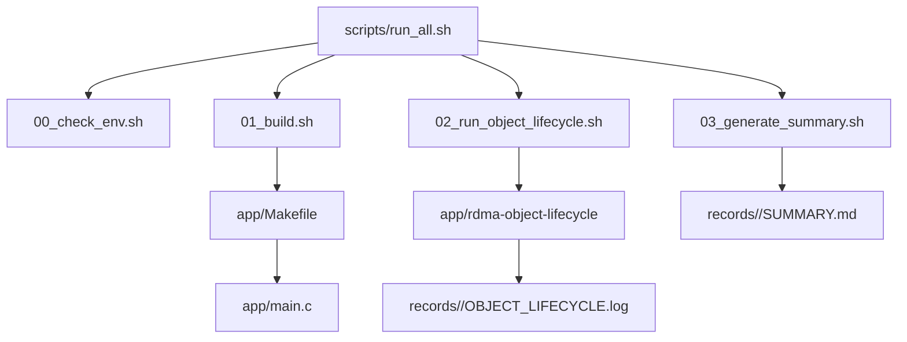

# 01_OVERVIEW

## 这个 lab 到底要学什么

这个 lab 不做 RDMA 收发，只学 RDMA verbs 的“对象地基”。

你要把下面这条链条记住：

```text
device -> context -> PD -> MR -> CQ -> QP
```

这条链条跑通后，后面才能做：

```text
QP state machine -> RC ping-pong -> RDMA READ/WRITE
```

## 先看一张图

```mermaid
flowchart LR
    A["STEP 00: get device list"] --> B["STEP 01: print device"]
    B --> C["STEP 02: open context"]
    C --> D["STEP 03: query device"]
    D --> E["STEP 04: query port"]
    E --> F["STEP 05: alloc PD"]
    F --> G["STEP 06: alloc buffer"]
    G --> H["STEP 07: register MR"]
    H --> I["STEP 08: create CQ"]
    I --> J["STEP 09: create QP"]
    J --> K["STEP 10: reverse destroy"]
```



## 只需要一个入口

推荐只跑：

```bash
bash scripts/run_all.sh
```

它会自动完成：

| 阶段 | 脚本 | 作用 |
| --- | --- | --- |
| 1 | `00_check_env.sh` | 检查 gcc/make/libibverbs/header/RDMA device |
| 2 | `01_build.sh` | 编译 `app/main.c` |
| 3 | `02_run_object_lifecycle.sh` | 运行 verbs 对象生命周期程序 |
| 4 | `03_generate_summary.sh` | 生成 `SUMMARY.md` |

## app 和 scripts 怎么对应



你不用先理解所有脚本。先记住：

- `app/main.c` 是学习代码。
- `scripts/run_all.sh` 是执行入口。
- `records/<timestamp>/` 是证据。
- `reports/` 是阶段总结。

## main.c 怎么读

按 `STEP` 读，不要从 C 语法细节陷进去：

| STEP | API | 学习点 |
| --- | --- | --- |
| 00 | `ibv_get_device_list` | libibverbs 能看到几个 RDMA device |
| 01 | `ibv_get_device_name` | 当前 device 是谁，本 lab 是 `rxe0` |
| 02 | `ibv_open_device` | 打开 device，得到 context |
| 03 | `ibv_query_device` | 看 device 能力上限 |
| 04 | `ibv_query_port` | 看 port 状态、MTU、GID 表 |
| 05 | `ibv_alloc_pd` | 分配 Protection Domain |
| 06 | `posix_memalign` | 准备用户态 buffer |
| 07 | `ibv_reg_mr` | 注册 MR，得到 `lkey/rkey` |
| 08 | `ibv_create_cq` | 创建 Completion Queue |
| 09 | `ibv_create_qp` | 创建 RC Queue Pair |
| 10 | destroy APIs | 按反向顺序销毁对象 |

## 当前成功结果

最新成功记录：

```text
records/20260630-233328-verbs-object/
```

核心结论：

```text
BUILD_PASS
OBJECT_LIFECYCLE_PASS
```

关键对象：

```text
device = rxe0
MR lkey/rkey = 0x2d6 / 0x2d6
QP qp_num = 17
```

这些值不是要背，而是要知道它们从哪里来、后面会怎么用。
