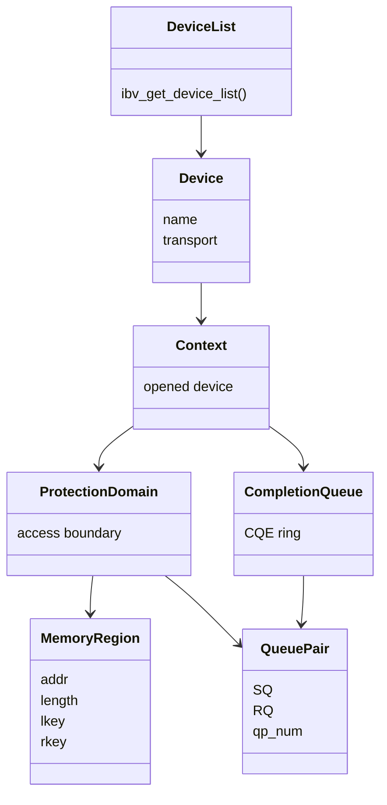
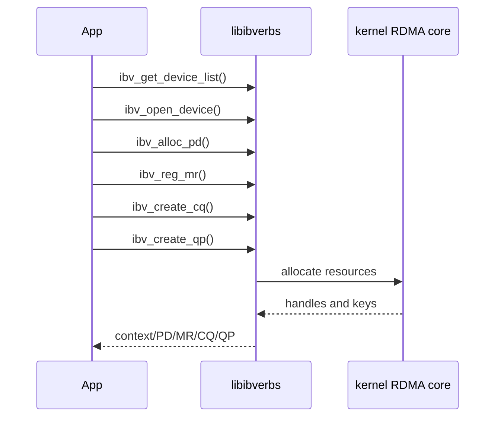
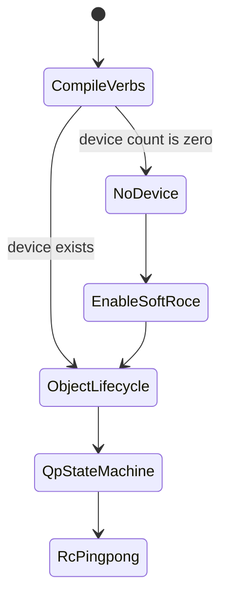

# 04_DEEP_LEARNING

## 对象生命周期为什么重要

RDMA verbs 编程不是从收发数据开始，而是从资源对象开始。每个对象都依赖上游对象：



## 创建顺序和销毁顺序

创建顺序通常是从上到下：



销毁顺序必须反过来：

```text
QP -> CQ -> MR -> buffer -> PD -> context -> device list
```

原因是下游对象引用上游对象。如果先销毁 PD，再销毁 QP/MR，资源依赖会变乱。

## 当前程序打印什么

| 输出 | 含义 |
| --- | --- |
| `GET_DEVICE_LIST_OK count=N` | libibverbs 可运行，并返回 device 数量 |
| `NO_RDMA_DEVICES_FOUND` | 当前没有 verbs device |
| `OPEN_DEVICE_OK` | context 创建成功 |
| `REG_MR_OK lkey/rkey` | MR 注册成功，key 已生成 |
| `CREATE_CQ_OK` | CQ 创建成功 |
| `CREATE_QP_OK qp_num=...` | RC QP 创建成功 |
| `OBJECT_LIFECYCLE_PASS` | 对象链条创建和销毁成功 |

## 和后续实验的关系



这个 lab 是后续 QP 状态机和 RC ping-pong 的地基。没有对象生命周期，就不要急着做 send/recv。
