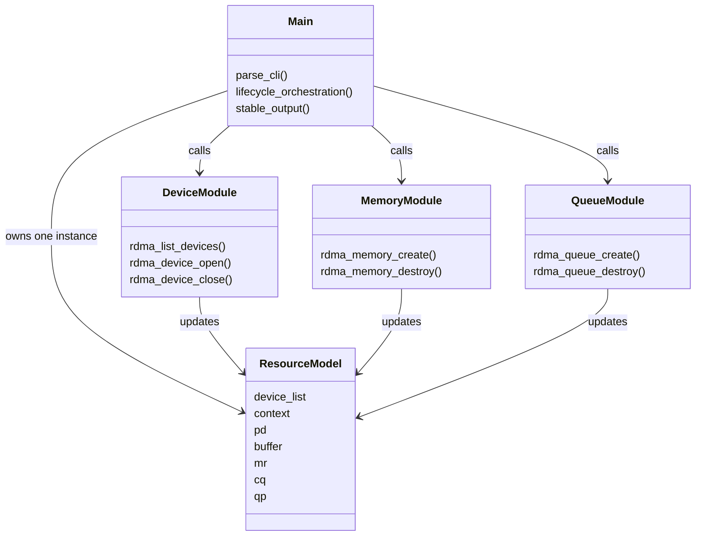
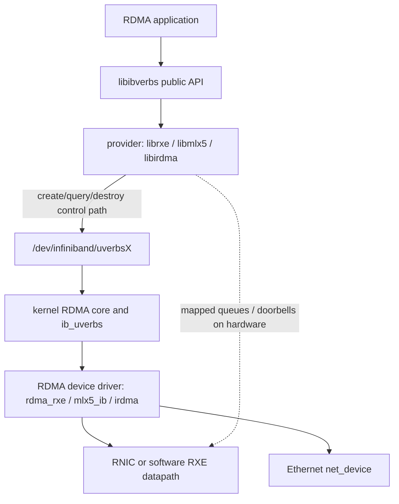
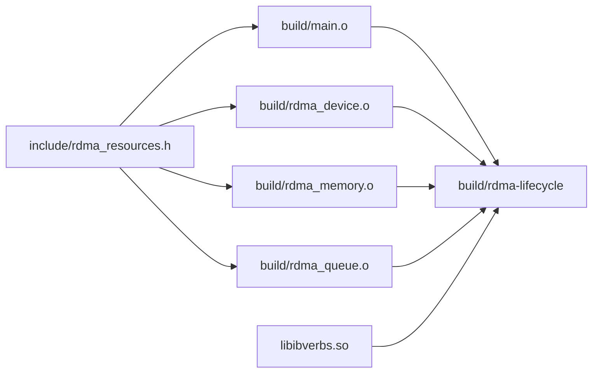
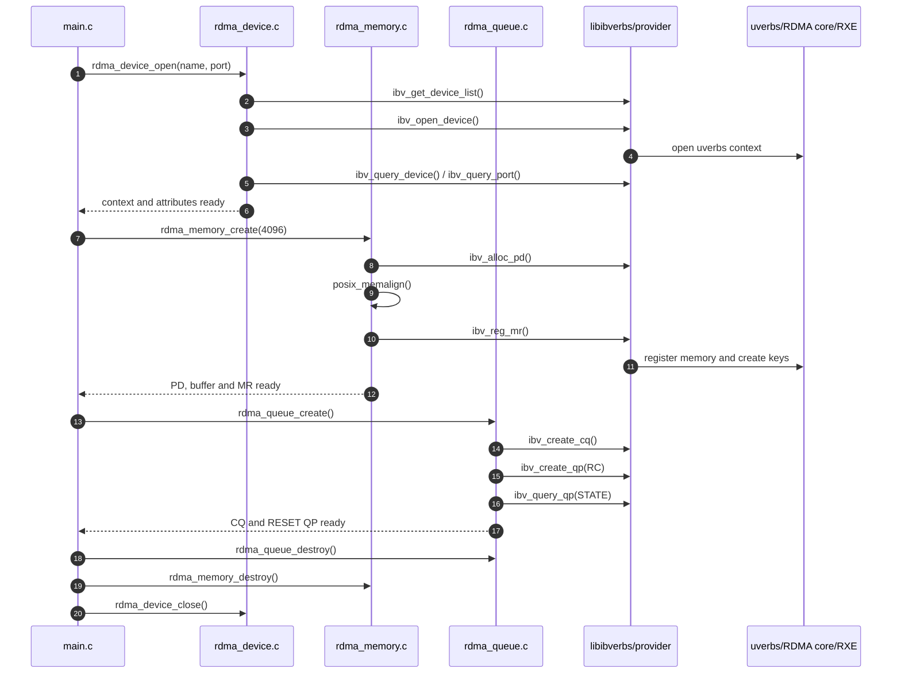
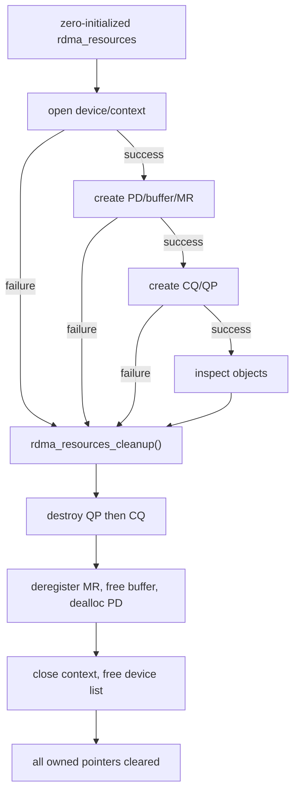
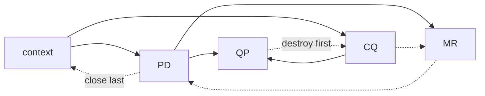
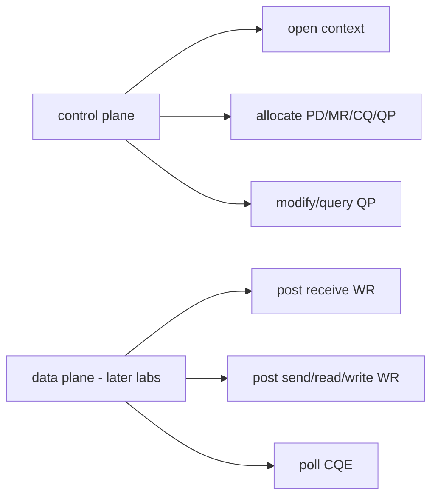

# 工程架构与 Linux RDMA 调用路径

## 1. 项目为什么这样拆分

RDMA 程序的复杂度主要来自两件事：

1. 对象有严格依赖关系。
2. 用户态 API 背后跨越 provider、内核 uverbs、RDMA core 和具体驱动。

因此本项目不按“第几个脚本”拆分，而按资源职责拆分。`main.c` 只编排业务流程，各模块分别拥有一类资源知识。



### 模块边界

| 模块 | 知道什么 | 不知道什么 |
| --- | --- | --- |
| `main.c` | CLI、执行顺序、最终结果 | provider 细节、对象构造参数细节 |
| `rdma_device.c` | device list、context、device/port attributes | MR、CQ、QP 创建参数 |
| `rdma_memory.c` | PD、buffer、MR 和 access flags | 设备选择、QP 状态机 |
| `rdma_queue.c` | CQ、RC QP、QP state query | CLI、GID 交换、数据收发 |

这种边界让后续项目可以复用资源管理，而不是复制一整个大 `main.c`。

## 2. RDMA 在系统中的位置

应用调用 `libibverbs`，但不同调用并不一定走同一条路径。控制面操作通常需要内核参与；已经建立好的数据面操作尽量直接触达硬件队列或 provider 实现。



### 当前测试机的具体实例

```text
application
  -> libibverbs
  -> RXE userspace provider
  -> /dev/infiniband/uverbs0
  -> ib_uverbs + RDMA core
  -> rdma_rxe
  -> ens34
```

RXE 是软件实现，因此它仍然经过 Linux 网络栈和以太网设备；真实 RNIC 则由硬件执行更多传输、可靠性和 DMA 工作。两者暴露相同 verbs 抽象，所以适合先用 RXE 学 API 和对象模型。

## 3. 构建与链接发生了什么



`pkg-config --cflags --libs libibverbs` 提供头文件与链接参数。如果 pkg-config 没返回库参数，Makefile 回退到 `-libverbs`。

编译标志包含：

```text
-std=c11 -Wall -Wextra -Wpedantic
```

它们用于尽早暴露类型、声明、隐式转换和非标准语法问题。

## 4. 完整运行时序



## 5. Ownership 与逆序清理

每次创建成功后，指针立即写入 `struct rdma_resources`。统一清理函数根据指针是否为空判断资源是否存在，因此创建过程可以在任意点失败。



为什么不是创建失败就直接 `return`？因为失败前可能已有部分资源成功创建。统一出口保证所有路径执行同一套回收逻辑。

### 依赖决定销毁顺序



QP 引用 PD 和 CQ，MR 引用 PD。先销毁上游对象会违反 provider 的资源约束，常见结果是 `EBUSY` 或更难诊断的残留资源。

## 6. 控制面与数据面边界

当前项目全部属于控制面准备：创建对象、查询属性、建立授权关系。尚未提交任何 Work Request。



下一项目首先解决 QP 状态迁移；再下一项目才进入 WR/WQE/CQE 数据路径。

## 7. 测试架构

`make test` 运行 `tests/lifecycle_test.sh`，测试的是编译后的公共行为，而不是 C 文件内部实现。

| 测试 | 验证内容 |
| --- | --- |
| `--help` | CLI 可发现性 |
| 未知参数 | 参数错误返回非零 |
| `--port 0` | 边界校验 |
| `--list` | provider 枚举路径 |
| 不存在的设备 | 明确的 device selection 错误 |
| 真实 device | context/PD/MR/CQ/QP、RESET、清理闭环 |

如果没有 provider-visible device，真实生命周期项显示 SKIP；它不会把环境缺失伪装成 PASS。
