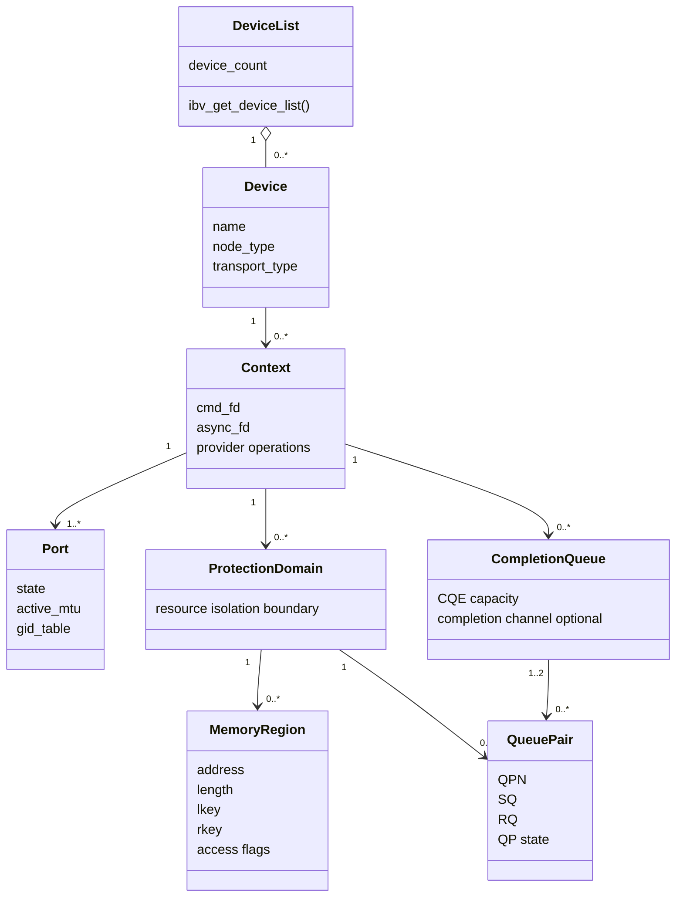
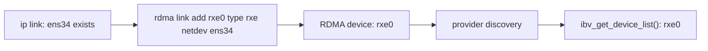
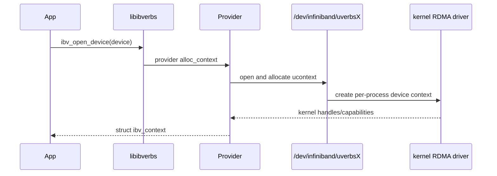
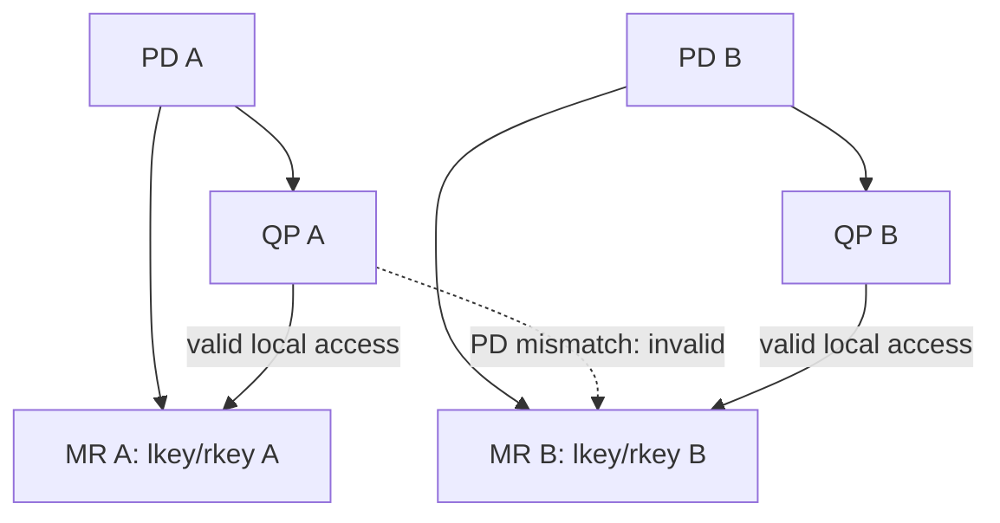
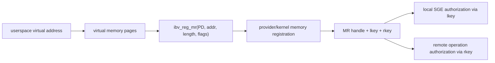
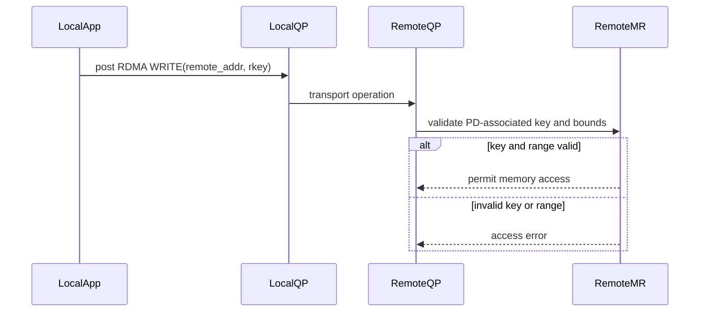
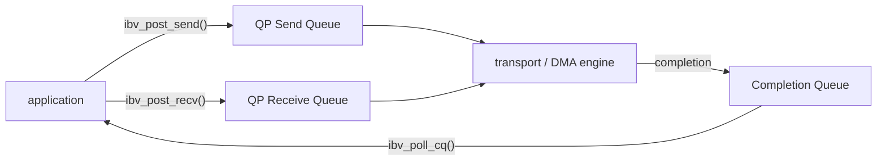
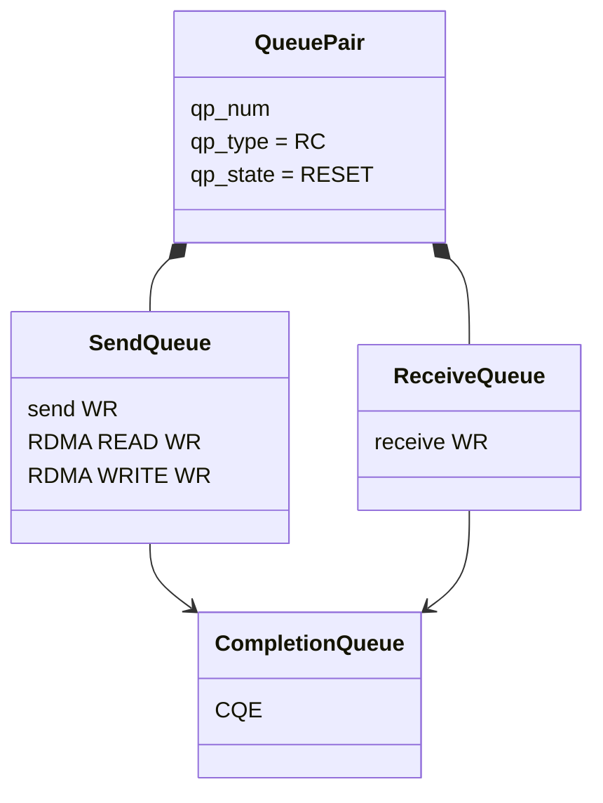
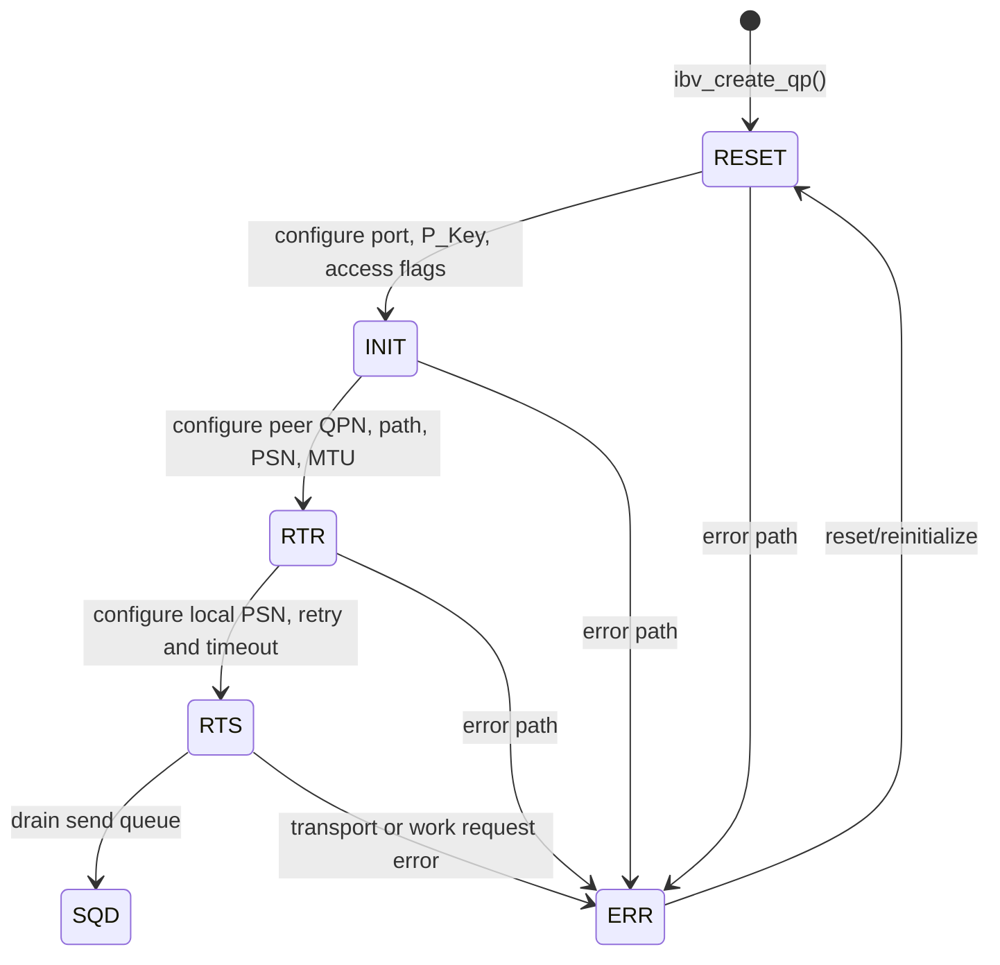
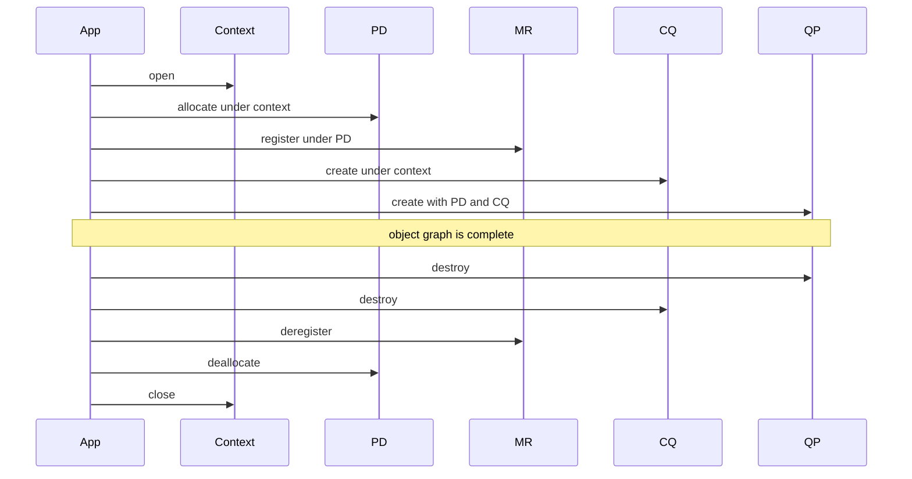

# RDMA Verbs 对象模型深度解析

## 1. 先建立整体心智模型

verbs 不是一组彼此独立的函数，而是一套有依赖关系的对象模型。



记忆方式不是背 API，而是回答三个问题：

1. 这个对象代表什么系统资源？
2. 它依赖哪些上游对象？
3. 它给后续数据路径提供什么能力？

## 2. Device 与 device list

`ibv_get_device_list()` 返回 provider 当前可见的 RDMA device 列表。它不是普通以太网接口列表，因此 `ip link` 中有 `ens34` 不代表 verbs 一定能看到设备。



在 Soft-RoCE 场景中，如果系统重启后没有重新创建 `rxe0`，会出现：

```text
ens34 exists
rdma link is empty
ibv_devices is empty
```

这说明网卡存在，但 RDMA device/provider 链尚未建立。

`struct ibv_device` 更接近“可打开设备的描述符”，真正的会话从 context 开始。

## 3. Context：进程与 RDMA 设备的会话

`ibv_open_device()` 返回 `struct ibv_context`。context 将一个进程连接到指定 provider/device，并成为大多数对象创建 API 的入口。



context 中通常包含：

- provider 操作函数表。
- uverbs command/async event file descriptor。
- 设备相关映射和 provider 私有数据。

它不是网络连接。创建 context 不会连接远端，也不会产生 QP。

## 4. Device attributes 与 Port attributes

`ibv_query_device()` 查询能力上限，例如最大 QP、CQ、MR、WR 和 SGE 数量。它们描述设备/provider 能支持的资源规模。

`ibv_query_port()` 查询某个物理端口的运行状态：

| 字段 | 含义 |
| --- | --- |
| `state` | `DOWN/INIT/ARMED/ACTIVE` 等逻辑状态 |
| `active_mtu` | 当前路径使用的 MTU 枚举值 |
| `lid` | InfiniBand Local Identifier；RoCE 常为 0 |
| `gid_tbl_len` | GID table 长度 |

RoCE 使用 GID 表示三层/以太网环境中的地址身份。当前项目只查询 port；后续 QP 状态机项目才查询并填入 GID。

## 5. Protection Domain：资源隔离边界

PD 本身不传输数据，也不直接指向内存。它的作用是把 QP 和 MR 放进同一个授权域。



即使应用进程拥有两个 MR 的虚拟地址，QP 使用的 SGE key 仍必须与其 PD 匹配。PD 因而是 provider/RNIC 验证资源关联的重要边界。

## 6. Buffer 与 Memory Region 不是同一个概念

`posix_memalign()` 只得到普通用户态虚拟内存。`ibv_reg_mr()` 才把这段地址范围注册为 RDMA 可访问的 MR。



不同设备和内核机制在页固定、ODP、DMA mapping 的具体实现上可能不同，因此不能把 MR 简化成“锁页函数”。稳定抽象是：

- 注册一个地址范围。
- 声明访问权限。
- 把该范围关联到 PD。
- 获得 provider/RNIC 可验证的 key。

### Access flags

本项目使用：

```c
IBV_ACCESS_LOCAL_WRITE |
IBV_ACCESS_REMOTE_READ |
IBV_ACCESS_REMOTE_WRITE
```

| flag | 授予的能力 |
| --- | --- |
| `LOCAL_WRITE` | 本地设备可把接收或操作结果写入 MR |
| `REMOTE_READ` | 远端在拥有正确 rkey/address 时可读取 |
| `REMOTE_WRITE` | 远端在拥有正确 rkey/address 时可写入 |

授予 flag 不等于立即发生远端访问。远端还需要建立可通信 QP，并获得正确的 address、length 和 rkey。

## 7. lkey 与 rkey

### lkey

本地进程构造 SGE 时填写：

```text
address + length + lkey
```

设备/provider 据此验证本地 buffer 是否已注册、是否属于正确 PD、访问是否符合权限。

### rkey

执行 RDMA READ/WRITE 的远端需要：

```text
remote virtual address + length + rkey
```

rkey 是能力凭证的一部分，不应无边界泄露。撤销 MR 注册后，旧 key 不应继续作为有效授权使用。



这个时序属于后续项目；当前项目只生成并观察 key。

## 8. CQ、CQE 与完成语义

CQ 是 Completion Queue，保存完成事件 CQE。它不保存待执行请求；请求进入 QP 的 SQ/RQ。



CQE 通常包含：

- `wr_id`：应用放入 WR 的标识。
- `status`：成功或错误原因。
- `opcode`：完成的操作类型。
- `byte_len`：接收等操作的字节数。

一个 CQ 可以被多个 QP 使用；一个 QP 的 send CQ 和 recv CQ 也可以指向同一个 CQ。本项目为了聚焦生命周期，使用一个共享 CQ。

## 9. QP：Send Queue 与 Receive Queue 的组合

QP 是数据传输核心对象，逻辑上包含 SQ 和 RQ，并通过 QPN 标识。



本项目创建 `IBV_QPT_RC`：Reliable Connection。RC 提供可靠、有序、面向连接的传输语义，并支持 Send/Recv、RDMA READ/WRITE 和 atomic（受设备能力限制）。

## 10. 为什么新建 QP 是 RESET

`ibv_create_qp()` 只分配 QP 资源，并不会自动建立通信参数。新 QP 从 RESET 开始。



当前项目调用 `ibv_query_qp(..., IBV_QP_STATE, ...)` 验证 RESET。这样可以明确区分：

- 对象生命周期项目：QP 存在、资源依赖正确。
- QP 状态机项目：给 QP 填入本地与远端连接属性。
- 收发项目：提交 WR 并轮询 CQE。

## 11. 创建与销毁为何必须对称



严格逆序有两个原因：

1. 下游对象持有上游对象的引用或句柄。
2. 失败回滚可以复用同一清理路径，而不需要为每个失败点编写一套分支。

`rdma_resources` 先零初始化；每个 destroy 函数检查非空指针并在销毁后清零。因此 cleanup 具有“可处理部分初始化状态”的性质。

## 12. 从本项目过渡到 QP 状态机

下一项目需要在当前资源基础上补充：


到这里应当掌握的不是“运行成功”四个字，而是能够解释：

- 为什么 QP 与 MR 必须共享 PD。
- 为什么普通 malloc buffer 不能直接等价于 MR。
- lkey 与 rkey 分别由谁使用。
- WR、WQE、CQE 分别位于哪一段路径。
- 为什么 QP 创建后仍然不能发送。
- 为什么销毁顺序必须与创建顺序相反。
