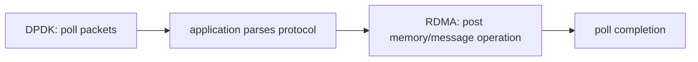

# DPDK To RDMA Comparison

| 维度 | DPDK | RDMA |
| --- | --- | --- |
| 核心抽象 | port/queue/mbuf/burst | context/PD/MR/QP/CQ/WR |
| 数据单位 | packet/mbuf | message 或 memory operation |
| 内存授权 | mempool/IOVA/DMA mapping | MR + lkey/rkey + PD |
| 提交方式 | rx/tx burst | post WR |
| 完成方式 | burst 返回/descriptor | poll CQE |
| 对端语义 | 应用解析 packet | RC/UD transport 与 one-sided |
| 内核绕过 | PMD 轮询 NIC queue | provider/RNIC queue + verbs control |

## 可迁移的理解

- mbuf 与 MR 都解决设备可访问内存，但 MR 增加 PD 和 key 授权语义。
- DPDK descriptor completion 与 RDMA CQE 都是异步队列完成模型。
- burst API 强调批量 packet I/O；verbs 强调 WR/SGE 和 transport operation。
- 两者都需要关注 NUMA、queue ownership、busy polling、内存生命周期和错误状态。

## 关键区别

DPDK 通常把协议和可靠性留给应用，应用看到完整 packet。RDMA transport 可由 RNIC/RXE 处理可靠连接、序列号、重试和远端内存操作；应用看到的是 WR 与 CQE，而不是逐包协议处理。

one-sided 并非“远端完全不知道”，而是远端 CPU 不处理每次数据请求。远端仍负责连接建立、MR 注册、address/rkey 交换和授权撤销。
