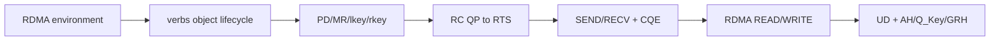
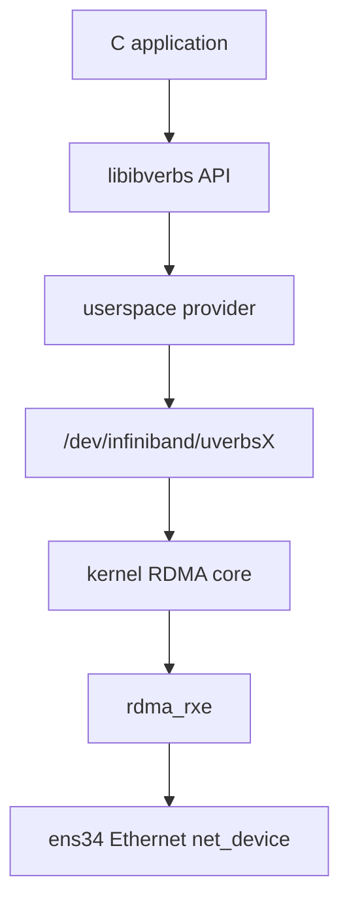
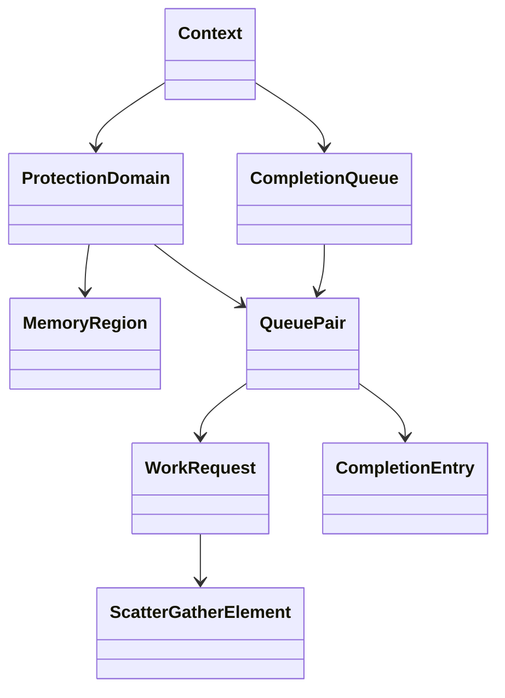

# RDMA Core Final Report

## 1. 学习成果

本路线从环境能力开始，逐步完成 verbs 对象、MR、QP 状态机、RC SEND/RECV、one-sided READ/WRITE 和 UD/RoCEv2。



| Phase | 实验 | 关键结果 |
| --- | --- | --- |
| 1 | environment capability | `rxe0/1 ACTIVE`，RoCE v2 provider 可见 |
| 2 | object lifecycle | context/PD/MR/CQ/QP 创建及逆序销毁 |
| 3 | MR deep dive | flags、对齐、lkey/rkey、预期失败 |
| 4 | QP state machine | 两个 RC QP 完成 RESET/INIT/RTR/RTS |
| 5 | RC ping-pong | SEND/RECV CQE 与双向 payload |
| 6 | one-sided | RDMA WRITE 修改远端，READ 拉回本地 |
| 7 | UD/RoCEv2 | AH/Q_Key/QPN、GRH 40-byte offset |

## 2. 系统架构



应用通过统一 verbs API 操作 provider。控制面创建/修改对象时进入 uverbs 与内核 RDMA core；真实 RNIC 数据面可通过映射队列和 doorbell 减少系统调用。当前 RXE 以软件实现 transport，适合验证对象和协议语义，不代表硬件 offload 性能。

## 3. 对象模型



- Context：进程与 provider/device 的会话。
- PD：QP 与 MR 的资源隔离边界。
- MR：注册地址范围、权限，并产生 lkey/rkey。
- QP：SQ/RQ 和 transport 状态。
- CQ/CQE：操作完成及错误反馈。
- WR/SGE：描述操作和本地内存。

销毁顺序由依赖决定：`QP -> CQ -> MR -> PD -> context`。

## 4. 三条数据路径

### SEND/RECV

接收端必须提前 post Receive WR。发送端和接收端各产生 CQE，payload 进入接收端提供的 MR。

### One-sided READ/WRITE

发起端 WR 携带本地 SGE/lkey 和远端 address/rkey。远端应用不为每次操作 post receive，也没有远端 CQE，但必须提前注册、授权并交换 MR 元数据。

### UD

UD 不绑定唯一 peer。每个 SEND WR 携带 AH、remote QPN、Q_Key。接收 buffer 前 40 字节保留 GRH，应用从 offset 40 读取 payload。UD 不提供 RC 的可靠、按序和重试语义。

## 5. 真实调试结论

1. `REMOTE_WRITE` 缺少 `LOCAL_WRITE` 时，RXE 返回 `EINVAL`。
2. 非页对齐地址在当前 RXE/provider 可注册，但不代表所有 RNIC 的性能和约束相同。
3. QP 不能跳过 INIT 直接 RESET -> RTR。
4. RoCE GID 必须对应 netdev 当前已生效地址；IPv6 地址仍 tentative 时，RTR 路径解析会超时。
5. Soft-RoCE 配置可能在重启或网络管理刷新后消失，需要恢复 rxe link 与固定测试地址。
6. CQE success 后仍需验证 payload，完成语义不等于业务语义。

## 6. 最终验收

测试机执行六个项目的 `make test`：

```text
object lifecycle: 6 pass, 0 fail, 0 skip
MR suite: 3 pass, 0 fail
QP state machine: PASS
RC ping-pong: PASS
one-sided READ/WRITE: PASS
UD/GRH: PASS
RDMA_TRACK_ACCEPTANCE_PASS
```

## 7. 能力边界

已经验证：libibverbs API、RXE provider、对象依赖、状态机、WR/CQE、RC/UD、one-sided 语义、RoCEv2 地址模型。

尚未验证：真实 RNIC/PCIe DMA、跨主机交换网络、PFC/ECN、拥塞、NUMA、吞吐/时延、硬件计数器和生产故障恢复。
