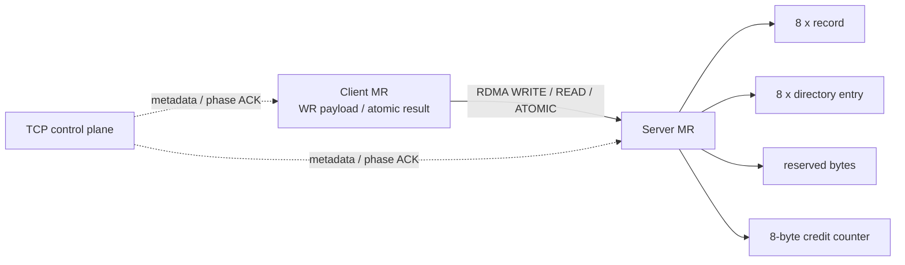
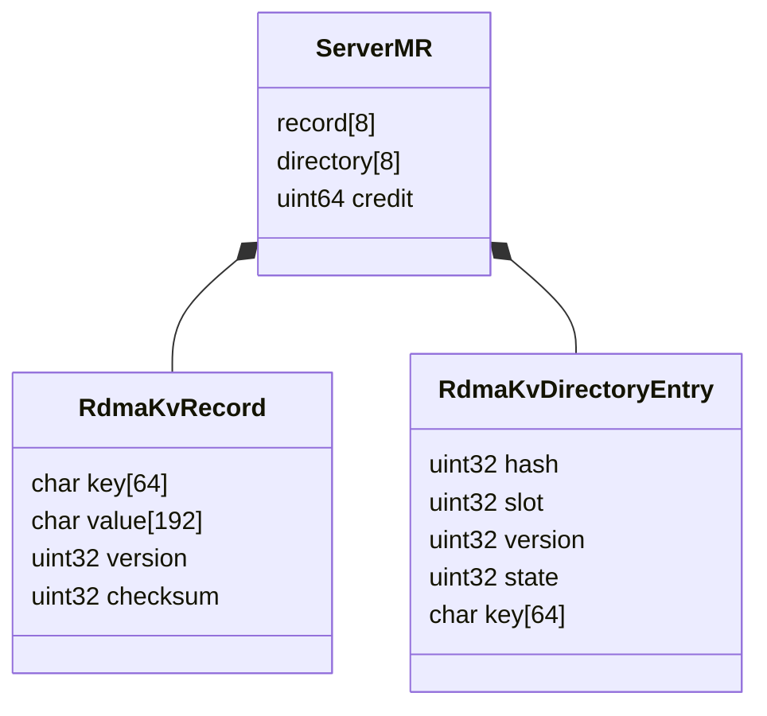
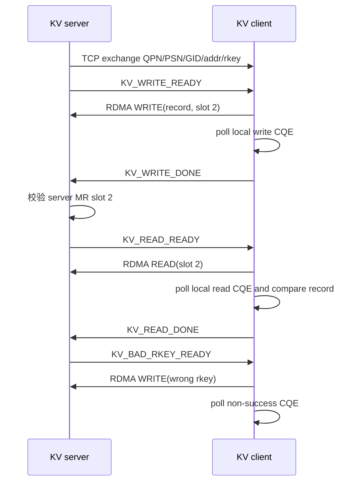
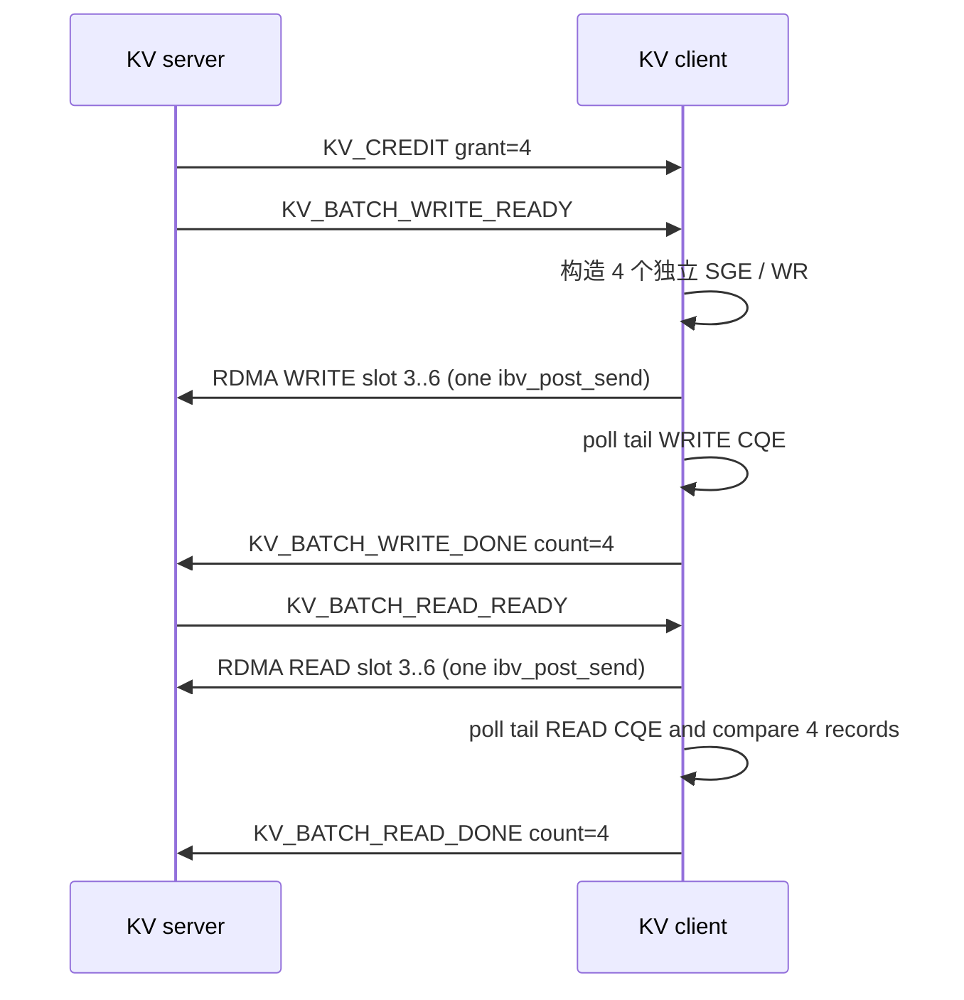
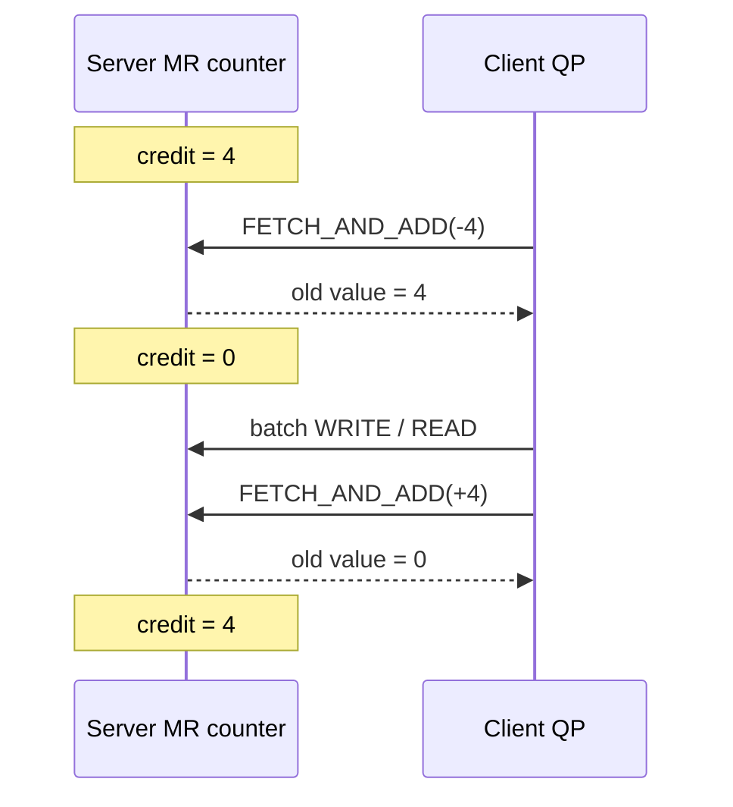
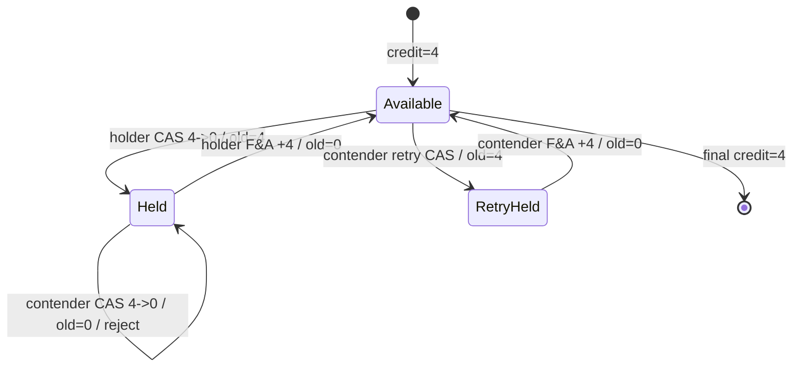
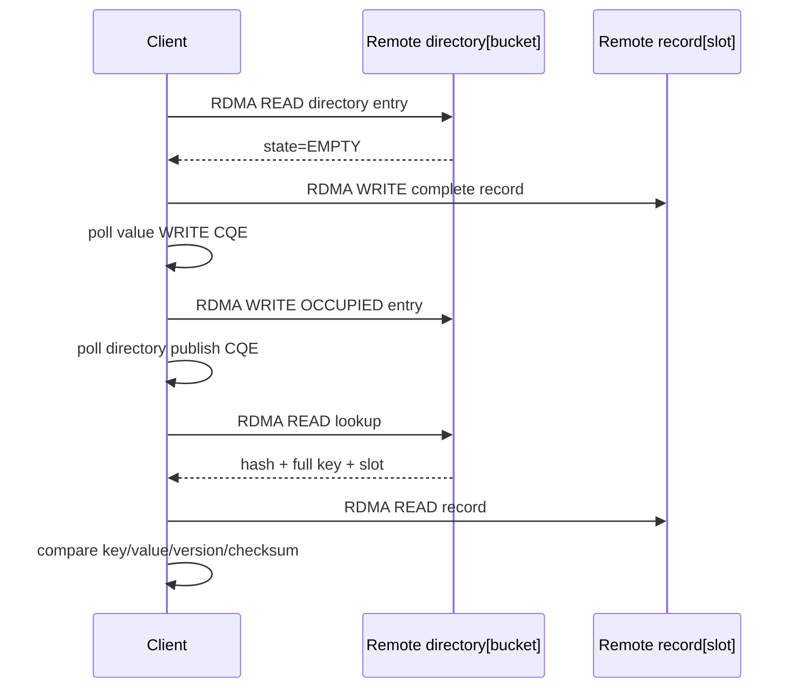
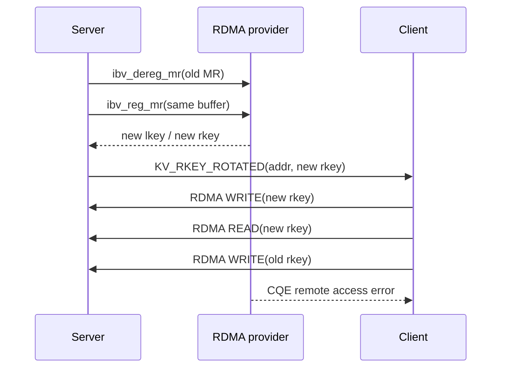

# ARCHITECTURE

## 1. 数据布局

server 将 record 数组、key directory 和 8 字节 atomic counter 注册为一个 4096 字节 MR。`addr` 是 MR 起始地址，client 根据公开的固定布局计算目标地址；`rkey` 是整块 MR 的远端访问授权。



```text
Server MR
+------------------------+  slot 0
| key | value | v | sum  |
+------------------------+  slot 1
| key | value | v | sum  |
+------------------------+  slot 2 <- client 操作目标
| key | value | v | sum  |
+------------------------+  slot 7 / record 区结束
| key | value | v | sum  |
+------------------------+
| directory entries[8]   |  hash/slot/version/state/key
+------------------------+
| reserved               |
+------------------------+
| atomic credit counter  |  offset 4088，8 字节对齐
+------------------------+
```



## 2. WRITE / READ 时序



WRITE 和 READ 的完成都只出现在 client CQ。server 不会因为 one-sided 操作自动得到 CQE，因此使用 TCP ACK 决定何时检查 MR 或进入下一阶段；ACK 不是 payload 数据面。

## 3. 为什么先做 fixed slot

固定槽位把问题分成两个层次：第一阶段证明 remote address offset、rkey、完整 record 搬运和 CQ completion；第二阶段才添加 key 到 slot 的索引、并发修改、credit 和多个 QP。这样测试失败时能明确是 verbs/MR 边界还是 KV 协议边界。

## 4. Phase 2：credit 与链式 WR

server 通过 TCP 控制面授予 4 个 credit，client 才允许对 slot 3-6 组成一个 4 WR 链。每个 WR 使用 `context->buf` 中独立的 264 字节区域，最后一个 WR 设置 `IBV_SEND_SIGNALED`；RC 的顺序语义使尾 CQE 成功时可作为整批传输完成的证据。



Phase 2 的 credit 是应用层协议。它先把额度、批量大小、CQE 回收和记录 buffer 生命周期变成可测语义，为 Phase 3 的远端原子 counter 提供对照。

## 5. Phase 3：remote atomic credit

server 在 MR 尾部预留 8 字节对齐 counter，初始值为 4，并为 MR/QP 开放 `IBV_ACCESS_REMOTE_ATOMIC`。client 使用 fetch-and-add 加上二进制补码 `-4` 获取额度，atomic 返回旧值 4；batch 结束后 fetch-and-add `+4`，返回旧值 0，server 最终观察到 counter 恢复为 4。



Phase 3 只有一个 client，因此“旧值为 4”足以证明本次获取成功。直接 `FETCH_AND_ADD(-4)` 不适合作为竞争拒绝算法：额度不足时仍会修改 counter，并可能发生无符号下溢。Phase 4 因此改用 CAS 获取，fetch-and-add 只负责持有者归还。

## 6. Phase 4：CAS 竞争与恢复

获取算法是 `COMPARE_AND_SWAP(compare=4, swap=0)`。CAS 的 CQE 为 success 只代表 atomic WR 被远端执行；真正的业务结果由返回的旧值决定：旧值为 4 表示获取成功，旧值为 0 表示比较失败且 counter 不变。



当前实现用一条 QP 顺序提交两个逻辑竞争者的 WR，精确验证“失败不改值、归还后可重试”的状态机。真实双 client 还需要 server 为每个连接创建独立 QP/CQ，并处理连接生命周期，不属于当前环境已完成项。

## 7. Phase 5：动态 key directory

key 使用 FNV-1a 计算 32 位 hash，`bucket = hash % 8`。directory entry 保存完整 key，因此 hash 和 bucket 只负责寻址，不能替代完整 key 比较。



发布顺序是 value 在前、directory 在后，避免读者先看到目录但 value 尚未完成。碰撞测试运行时搜索另一个落入同 bucket 的 key；client 读到 `OCCUPIED` 且完整 key 不同后拒绝 PUT，不提交覆盖 value 的 WR。当前目录使用单槽 bucket，没有实现开放寻址、链表或并发原子发布。

## 8. Phase 6：rkey 轮换

server 在所有成功 WR 的 CQE 已回收后执行 `ibv_dereg_mr()`，再对同一 buffer 和相同 access flags 调用 `ibv_reg_mr()`。内存地址和内容保持不变，但 provider 生成新的 lkey/rkey。server 通过控制面发布新 rkey，client 先用它完成 WRITE/READ，再以旧 rkey 发出最后一个 WR。



旧 rkey 失败可能令 RC QP 进入错误态，所以该 WR 必须位于测试末尾。此阶段证明 MR re-register 后旧授权失效，不等价于断线重连或 QP 重建。

## 9. 完成边界

当前 RXE 环境已经覆盖 fixed slot、batch、remote atomic、CAS 竞争状态机、动态目录、碰撞拒绝、MR re-register 和 stale rkey。以下是硬件/拓扑扩展，不计入当前项目缺陷：

1. 双 client、多 QP 和真实并发竞争。
2. directory 开放寻址、删除、版本 CAS 和崩溃恢复。
3. TCP 断线重连、QP 重建和 metadata epoch。
4. 双机、真实 RNIC、多 NUMA 和性能矩阵。
