# ARCHITECTURE

## 1. 项目定位

`project-rdma-performance-tuning` 不是重新发明控制面，而是在 `project-rdma-rc-client-server` 已经跑通的基础上，专注性能测量。

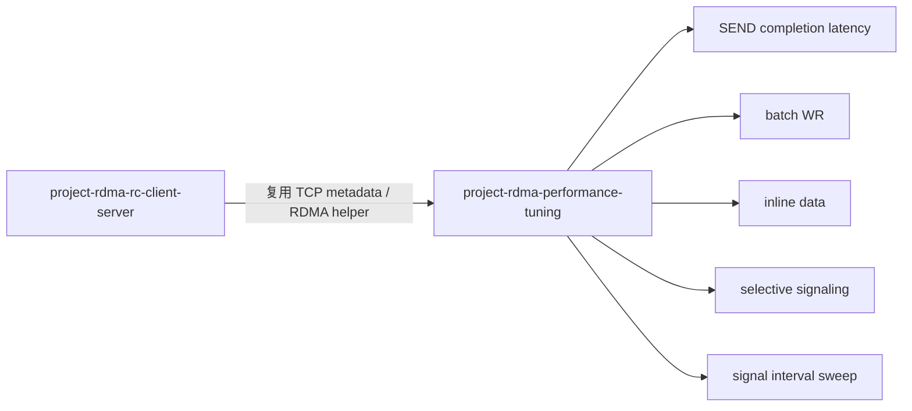

## 2. 第一版数据路径

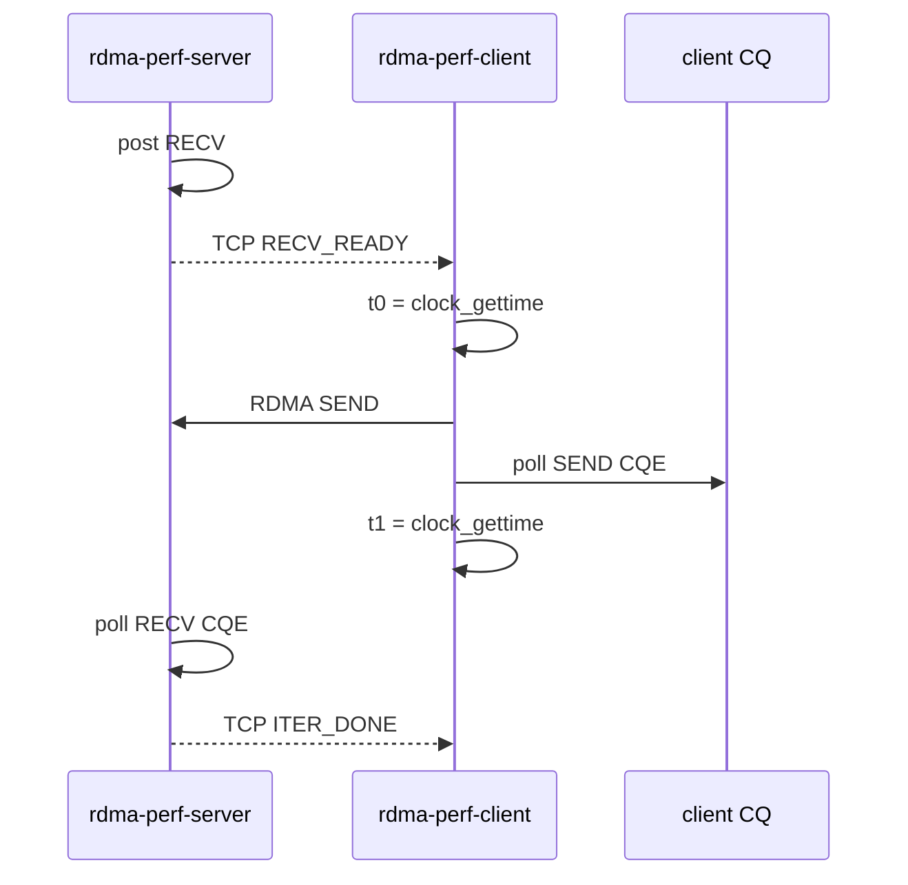

当前指标：

```text
send_completion_latency = client_send_cqe_time - client_post_send_time
```

它不包含：

- TCP 控制面耗时。
- server 业务处理耗时。
- 完整请求-响应 RTT。
- 真实 RNIC DMA/offload 能力。

## 3. 为什么第一版先测 SEND completion

因为 SEND/RECV 是最直观的 RC 双边语义：

- server 必须提前 post RECV。
- client post SEND。
- client 从 CQ 看到 SEND CQE。
- server 从 CQ 看到 RECV CQE。

这条路径适合后续逐步加入 batch、inline 和 selective signaling。

## 4. batch WR 阶段数据流

batch 阶段不改变控制面和建链方式，只改变数据面 WR 的提交颗粒度。server 仍然负责提前准备 RQ，client 仍然负责测量本地 SEND completion；区别是每个 batch 内有多条 WR 同时 outstanding。

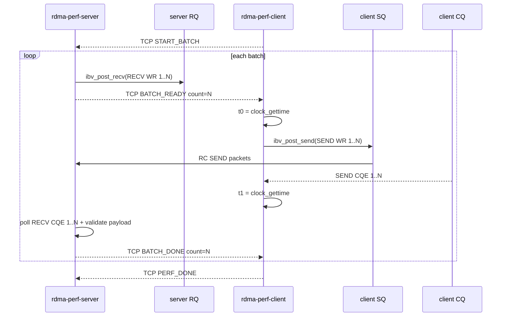

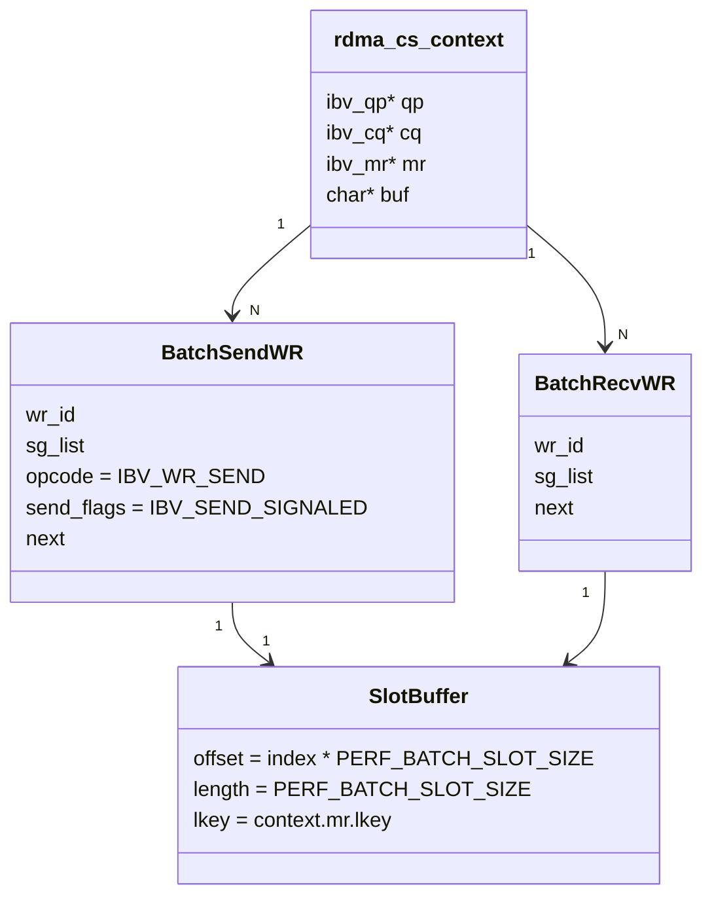

关键边界：

- batch size 默认 8，最大 16，因为当前 QP cap 是 `max_send_wr=16`、`max_recv_wr=16`。
- 每个 WR 使用 MR 中独立的 64 字节 slot，避免多个 outstanding SEND 共用同一段 payload 导致覆盖。
- 本阶段仍然每个 SEND WR 都设置 `IBV_SEND_SIGNALED`，方便对齐 CQE 数量；selective signaling 留到后续阶段。
- `perf_result test=batch_send` 的 `avg_batch_ns` 是一批 WR 从提交前到所有 SEND CQE 收齐的耗时，`avg_msg_ns` 是 batch 总耗时按消息数折算后的平均值。

## 5. inline data 阶段落点

inline 阶段不改控制面，也不改 server 的 RECV 语义，只改 client 侧 SEND WR 的 `send_flags`：

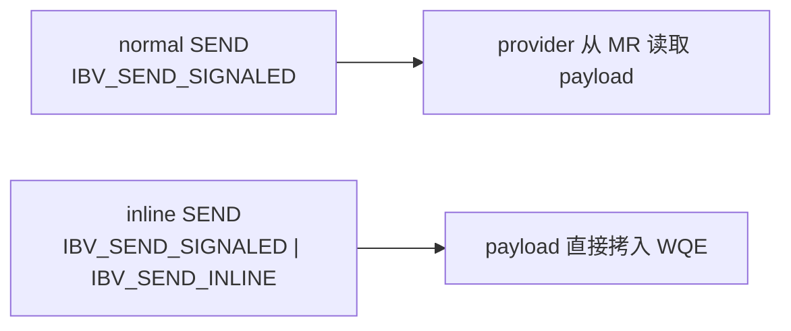

本项目当前实现策略：

- 通过环境变量 `PERF_USE_INLINE=1` 打开 inline 模式。
- single 结果名切到 `send_latency_inline`。
- batch 结果名切到 `batch_send_inline`。
- `perf_compare single_vs_batch` 追加 `inline=on/off`，便于复用现有 grep/export 脚本。

这样做的好处是：normal、batch、inline 三条路径共用同一套日志、CSV、sweep/summary 管线，后续继续做 selective signaling 或 polling 对比时不需要再拆脚本框架。

## 6. selective signaling 阶段落点

selective signaling 阶段仍然不改控制面，也不改 server 的 RECV 语义，只改 batch SEND 链表里哪些 WR 带 `IBV_SEND_SIGNALED`。

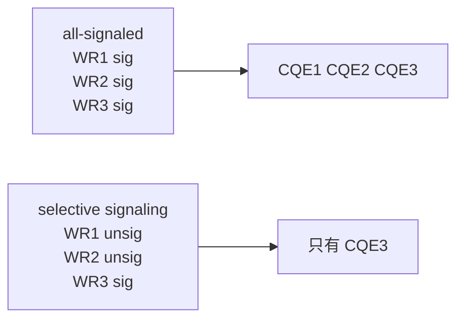

当前实现策略：

- 通过环境变量 `PERF_SIGNAL_INTERVAL=N` 控制 signal 间隔。
- `N=1` 表示保持 all-signaled。
- `N>1` 表示每 `N` 条 WR 产生一个 SEND CQE，同时批尾 WR 必定 signaled。
- batch 结果名切到 `batch_send_selective` 或 `batch_send_inline_selective`。
- `perf_result` / `perf_throughput` / `perf_compare` 追加 `signal_mode`、`signal_interval`、`signaled_total` 字段。

这里最关键的测量边界是：batch 计时不再等待“消息数个 CQE”，而是等待“本批应出现的 SEND CQE 数”。因为 RC SQ 上 WQE 完成有序，且批尾 WR 保证 signaled，所以最后一个 signaled CQE 仍可作为整批完成的时间锚点。

## 7. normal / inline / selective sweep 产物流水线

为了把 single SEND、batch SEND、inline SEND 的差异沉淀成可复核的证据，项目把测试产物分成“原始日志层”和“汇总层”。

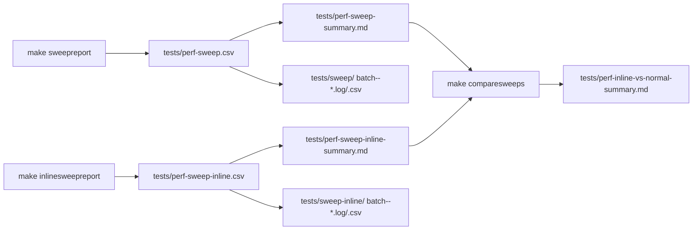

这里的分层含义是：

- `tests/sweep/` 与 `tests/sweep-inline/` 保留每个 `batch_size` 的原始 client/server 日志，方便回看 marker、CQE 和异常信息。
- `tests/perf-sweep.csv` 与 `tests/perf-sweep-inline.csv` 是结构化中间产物，后续做表格、画图、统计都应优先基于它们。
- `tests/perf-inline-vs-normal-summary.md` 只提炼 normal 与 inline 两套 sweep 的最佳点位，用来快速回答“当前环境下 inline 是否比 normal 更好、最佳 batch size 落在哪”。
- selective sweep 会按模式自动落到 `tests/perf-sweep-sig<N>.csv`、`tests/sweep-sig<N>/`、`tests/perf-sweep-sig<N>-summary.md`，避免覆盖 normal/inline 产物。
- selective 对比报告会额外沉淀为 `tests/perf-selective-vs-all-summary.md`；如果叠加 inline，则沉淀为 `tests/perf-inline-selective-vs-inline-summary.md`。

这也解释了为什么当前阶段先做 batch，再做 inline：batch 先回答“减少 post/poll 固定成本是否有收益”，inline 再回答“payload 进入 WQE 后，小消息路径是否还能继续缩短”。

## 8. signal interval 矩阵收口

当 selective signaling 已经接通后，剩下的关键问题不再是“能不能跑”，而是“哪个 interval 更合适”。

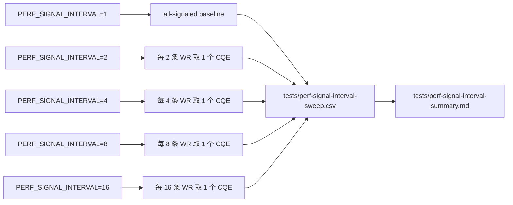

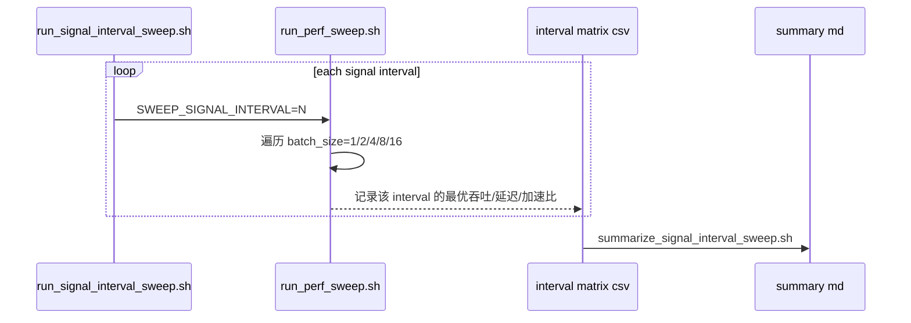

当前实现的关键点：

- 复用 `run_perf_sweep.sh`，避免为 interval 维度重新分叉一套测试框架。
- 用 `perf_mode_helpers.sh` 给 normal / inline / sig<N> 自动生成不同产物路径，防止覆盖。
- `check_signal_interval_summary.sh` 只校验矩阵与 summary 结构，不重扫全量原始日志。

135 上 2026-07-12 的 fresh 验证结果：

- normal：最佳 interval=`16`，最佳点位 `batch_size=16`，`msg_per_sec=258825`，`batch_avg_msg_ns=3863`，`speedup_x100=168`。
- inline：最佳 interval=`8`，最佳点位 `batch_size=16`，`msg_per_sec=276909`，`batch_avg_msg_ns=3611`，`speedup_x100=173`。

## 9. 当前阶段完成边界

当前项目到这里已经完成的实验矩阵：

- single SEND baseline
- batch SEND
- normal vs inline
- selective vs all-signaled
- inline+selective vs inline
- client-side CQ polling budget matrix
- signal interval matrix

后续若继续推进，建议另起专题：

- 双机跨主机测量
- CPU affinity / NUMA / 调度因素

## 10. client-side CQ polling budget 收口

这一段不是再加新协议，而是把 client 侧 `ibv_poll_cq()` 每次“最多拿多少个 CQE”做成实验参数。

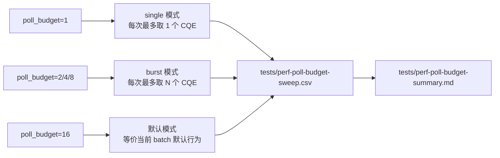

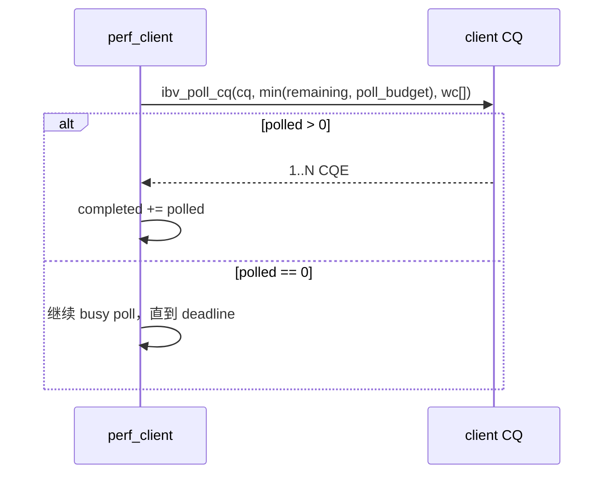

设计选择：

- 只测 client SEND CQE polling，避免同时把 server RECV 路径也变成变量。
- 只引入 `poll_budget`，不引入 event channel、sleep/backoff/adaptive，保持当前阶段解释简单。
- 默认 `poll_budget=16`，保证不显式开启时，仍然等价现有 batch 路径。

135 上 2026-07-12 fresh 验证结果：

- normal：最佳 throughput / latency budget=`16`，最佳点位 `batch_size=16`，`msg_per_sec=241605`，`batch_avg_msg_ns=4138`
- normal：最佳 speedup budget=`1`，最佳点位 `batch_size=16`，`speedup_x100=157`
- inline：最佳 budget=`1`，最佳点位 `batch_size=16`，`msg_per_sec=275508`，`batch_avg_msg_ns=3629`，`speedup_x100=170`
