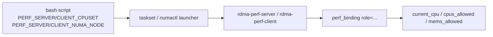

# CPU_AFFINITY_NUMA

## 1. 目标

这一阶段不是直接追求“跑得更快”，而是先把实验变量显式化：

- server/client 分别绑到哪些 CPU
- 进程实际看到的 `Cpus_allowed_list`
- 进程实际看到的 `Mems_allowed_list`
- 当前机器有没有多 NUMA 节点、`numactl` 是否可用

只有这些记录先稳定下来，后面的性能对比才不会变成猜谜。

## 2. 设计原则

采用“脚本层绑定 + 进程层自报”的双证据模式：



这比“只在命令行里写个 taskset”更稳，因为日志里能看到进程自己观察到的运行时状态。

## 3. 环境变量

当前支持：

- `PERF_SERVER_CPUSET`
- `PERF_CLIENT_CPUSET`
- `PERF_SERVER_NUMA_NODE`
- `PERF_CLIENT_NUMA_NODE`

语义：

- `CPUSET` 透传给 `taskset -c`
- `NUMA_NODE` 透传给 `numactl --cpunodebind=<node> --membind=<node>`
- 如果没设置，就保持当前默认行为

## 4. 运行时证据

server/client 启动后会各打印一行：

```text
perf_binding role=<server|client> requested_cpuset=<...> requested_numa_node=<...> current_cpu=<n> cpus_allowed=<list> mems_allowed=<list>
```

这行的意义：

- `requested_*`：这次实验本来想怎么绑
- `current_cpu`：进程启动后当前实际落在哪个 CPU 上
- `cpus_allowed`：内核允许它运行在哪些 CPU
- `mems_allowed`：内核允许它从哪些 NUMA node 分配内存

## 5. 为什么这阶段不直接做 NUMA 对比

NUMA 对比必须满足两个前提：

1. 机器本身有多个 NUMA node
2. 系统里有 `numactl`

2026-07-12 在 `192.168.65.135` 的 fresh 环境里：

```text
CPU(s): 8
On-line CPU(s) list: 0-7
CPU NODE SOCKET
0 0 0
1 0 0
2 0 0
3 0 0
4 0 1
5 0 1
6 0 1
7 0 1
numactl_missing
```

也就是说：

- 这台机器有 2 个 socket 的视角
- 但当前 Linux NUMA 视角只有 `node0`
- `numactl` 也没装

所以这轮只能老老实实做到“CPU affinity 记录 phase PASS”，还不能诚实地声称“NUMA 对比已经完成”。

## 6. 135 上的 fresh 绑核样本

执行命令：

```bash
cd /home/wq7/workspace/driver-lab/linux-driver-lab/track-rdma-core/project-rdma-performance-tuning
PERF_SERVER_CPUSET=0 PERF_CLIENT_CPUSET=1 \
PERF_ITERATIONS=16 PERF_BATCH_SIZE=4 PERF_SKIP_CLEAN=1 \
SUDO_PASSWORD='wq123456!' \
bash tests/perf_smoke_test.sh
```

关键结果：

```text
script_binding role=server requested_cpuset=0 requested_numa_node=auto
script_binding role=client requested_cpuset=1 requested_numa_node=auto

perf_binding role=server requested_cpuset=0 requested_numa_node=- current_cpu=0 cpus_allowed=0 mems_allowed=0
perf_binding role=client requested_cpuset=1 requested_numa_node=- current_cpu=1 cpus_allowed=1 mems_allowed=0

PERF_SEND_LATENCY_SERVER_PASS
PERF_BATCH_SEND_SERVER_PASS
PERF_SEND_LATENCY_CLIENT_PASS
PERF_BATCH_SEND_CLIENT_PASS
cleanup=complete result=pass
```

这说明：

- launcher 层的 `taskset` 已经生效
- 进程层看到的 CPU mask 与预期一致
- 原有 RDMA perf 主路径没有被绑核功能打坏

## 7. 当前边界

当前完成的是：

- CPU affinity 可配置
- affinity 证据可记录
- NUMA 能力边界可记录

当前未完成的是：

- 多 NUMA node 机器上的对比实验
- `numactl` 安装后的同节点 / 跨节点对比
- 双机 `134 -> 135` 上带绑核的 fresh 对比数据
