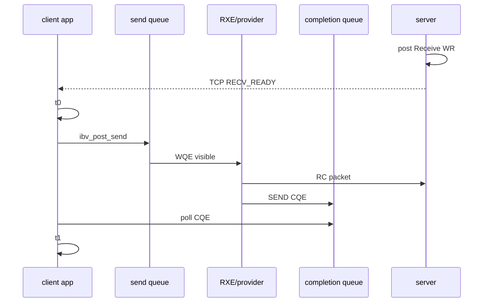
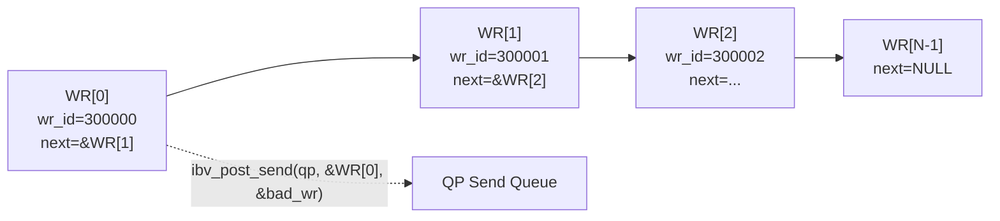
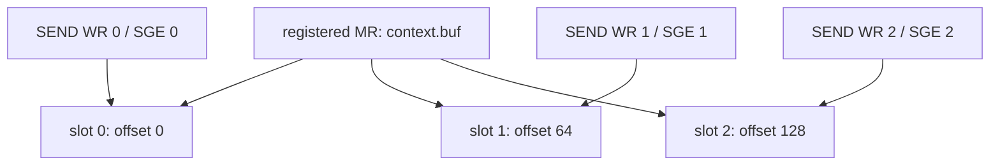
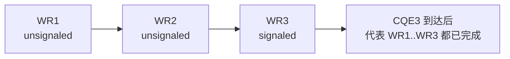
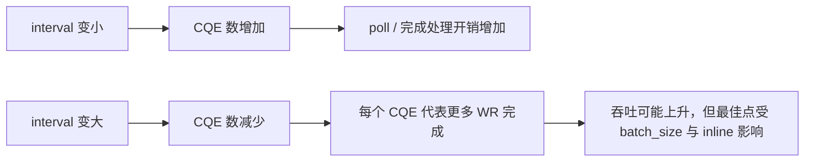
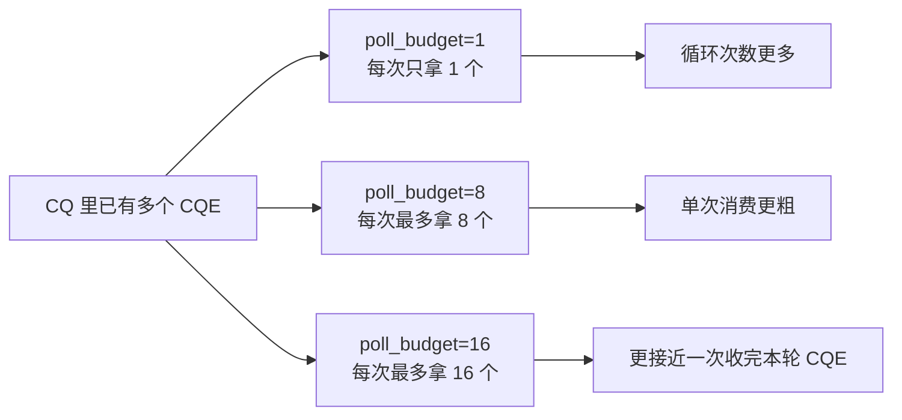

# DEEP_LEARNING

## 1. RDMA 性能到底在测什么

RDMA 性能不能只看“程序跑得快不快”。要先拆清楚路径：

```text
应用线程 -> WQE -> SQ -> provider/driver -> packet/DMA -> remote RQ/MR -> CQE -> 应用线程 polling
```

同一个“延迟”词，可能代表不同边界：

| 指标 | 起点 | 终点 | 含义 |
| --- | --- | --- | --- |
| post latency | 调用 `ibv_post_send()` | 函数返回 | 提交 WQE 成本 |
| completion latency | 提交 WR 前 | 本地 CQE 出现 | 本地完成视角 |
| RTT | 请求发出 | 响应回来 | 业务往返视角 |
| bandwidth | 批量传输开始 | 批量完成 | 持续搬运能力 |

本项目第一版测的是 completion latency。

## 2. SEND completion latency 模型



`t1 - t0` 受这些因素影响：

- userspace polling 开销。
- RXE 软件协议栈开销。
- CPU 调度。
- cache miss。
- CQ polling loop 写法。
- 是否 inline。
- 是否 batch。
- 是否每个 WR 都 signaled。

## 3. CQ polling 为什么重要

CQ polling 是 RDMA 程序的热路径。一个典型循环是：

```text
while no completion:
    ibv_poll_cq(cq)
```

它的特点：

- 延迟低，因为不睡眠。
- CPU 占用高，因为一直轮询。
- 如果线程被调度走，延迟会抖。

后续优化会比较：

- busy polling。
- poll 一批 CQE。
- selective signaling 降低 CQE 数量。

## 4. batch WR 的意义

单个 WR 模式：


batch 模式：


batch 能减少应用和 provider 之间的来回次数，但也可能增加单个请求排队时间。

## 5. inline data 的意义

普通 SEND：

```text
WQE SGE -> MR buffer -> provider 读取 payload
```

inline SEND：

```text
payload 直接放进 WQE
```

inline 对小消息常有帮助，因为减少一次读取 payload buffer 的成本。但 inline size 有设备限制，真实 RNIC 与 RXE 的表现会不同。

## 6. selective signaling 的意义

如果每个 WR 都 signaled：

```text
WR1 -> CQE1
WR2 -> CQE2
WR3 -> CQE3
```

CQ 压力大，但每个 WR 都容易定位。

如果每 N 个 WR signaled 一次：

```text
WR1 no CQE
WR2 no CQE
WR3 signaled -> CQE3
```

吞吐更友好，但错误定位和资源回收更复杂。

## 7. 当前结论边界

Soft-RoCE 能用于学习：

- verbs API 使用方式。
- CQ polling 模型。
- batch/inline/signaling 的程序结构。
- RoCEv2 UDP/IP 路径。

Soft-RoCE 不能证明：

- RNIC DMA 性能。
- PCIe 传输能力。
- 网卡 offload 延迟。
- PFC/ECN 真实拥塞行为。

## 8. batch WR 的可观测指标

batch WR 不是把单条消息的物理路径变短，而是减少“每条消息都单独进入 verbs/provider”的固定成本。single SEND 的节奏是：

```text
post 1 WR -> poll 1 CQE -> 下一条
```

batch SEND 的节奏是：

```text
post N WR as linked list -> poll N CQE -> 下一批
```

因此本项目同时记录三类指标：

| 指标 | 日志字段 | 含义 |
| --- | --- | --- |
| single 平均 completion latency | `perf_result test=send_latency avg_ns` | 单条 SEND 从提交前到本地 SEND CQE 的平均耗时 |
| batch 平均批耗时 | `perf_result test=batch_send avg_batch_ns` | 一次提交 N 条 WR 到 N 个 SEND CQE 全部收齐的平均耗时 |
| batch 折算单消息耗时 | `avg_msg_ns` | batch 总耗时除以消息数，用于和 single 的 `avg_ns` 粗略对比 |
| batch 吞吐 | `perf_throughput test=batch_send msg_per_sec` | 在该进程、RXE、polling 写法下的消息完成速率 |

`avg_msg_ns` 不是某一条消息的真实 tail latency。它是吞吐视角的折算值：如果一批 8 条耗时 16 us，则折算每条 2 us，但批内第一条可能等待更久，最后一条可能更接近批完成时刻。

## 9. batch WR 链表结构

verbs 的 batch 不是一个新的 opcode，而是把多个 WR 通过 `next` 指针串成链表，再把链表头交给 `ibv_post_send()` 或 `ibv_post_recv()`。



每个 WR 仍然有自己的 SGE：



这样设计有两个原因：

- provider 可能在 `ibv_post_send()` 返回后才读取 payload；多个 outstanding WR 不能都指向同一段会被覆盖的 buffer。
- server 侧每个 RECV WR 也指向独立 slot，可以校验 `rdma-perf-batch-send-<batch>-<index>`，证明不是只收到了“某些 CQE”。

## 10. selective signaling 当前落点

现在项目已经把 selective signaling 接到 batch SEND 路径里，但保留了两个很重要的约束：

- single SEND baseline 仍然每条都 signaled，不改历史对照口径。
- batch SEND 的最后一条 WR 必定 signaled，保证整批有完成锚点。



当前实验入口：

```text
PERF_SIGNAL_INTERVAL=1   -> all-signaled
PERF_SIGNAL_INTERVAL=4   -> 每 4 条 WR 一个 SEND CQE
```

日志会额外给出：

- `signal_mode=all/selective`
- `signal_interval=<N>`
- `signaled_total=<n>`

这几个字段的意义分别是：

- `signal_mode`：当前 batch 路径是传统 all-signaled，还是 selective。
- `signal_interval`：每隔多少条 WR 放一个 signaled 标记。
- `signaled_total`：整轮 batch 实验里，client 实际等待了多少个 SEND CQE。

因此 selective signaling 阶段真正回答的问题不是“消息数变少了”，而是“在消息数不变的前提下，把 CQE 数量降下来后，batch completion latency 和 throughput 会发生什么变化”。

## 13. 为什么还要做 signal interval 扫描

selective signaling 接通之后，系统里其实多了一根新的旋钮：

- interval 小：CQE 更多，软件更容易及时感知完成，但 CQ polling 与 CQE 处理开销更高。
- interval 大：CQE 更少，polling 压力更小，但批内更多 WR 需要“借最后一个 signaled CQE”来代表完成。

在 RC SQ 完成有序的前提下，这种“用更少 CQE 代表更多 WR”的做法是成立的，但收益大小取决于三个因素：

1. batch size 本身有多大。
2. payload 是否 inline。
3. 当前 provider / RXE / polling 写法里，CQE 软件处理成本占比有多高。



因此本项目没有把 `PERF_SIGNAL_INTERVAL=4` 写死成“最终答案”，而是追加了矩阵扫描。

在 135 的 RXE 实验里，2026-07-12 fresh 结果显示：

- normal 最佳 interval 为 `16`
- inline 最佳 interval 为 `8`

这两个结果不一样，恰好说明 signal interval 不是孤立参数，而是会和 inline 路径一起改变最优点位。

## 14. 为什么 CQ poll budget 也值得单独扫一轮

signal interval 解决的是“要不要让每条 WR 都产生 CQE”；poll budget 解决的是“既然 CQE 已经在 CQ 里了，每次 `ibv_poll_cq()` 要拿回多少个”。

这两个问题看起来接近，但测量边界不同：

- signal interval：改变的是完成事件的生产密度。
- poll budget：改变的是完成事件的消费粒度。



本项目当前实现里：

- `poll_budget=1` 对应 `poll_mode=single`
- `poll_budget>1` 对应 `poll_mode=burst`
- 默认 `poll_budget=16`，保持历史 batch 路径兼容

135 上 2026-07-12 fresh 结果显示：

- normal 模式下，`budget=16` 在 throughput 与折算延迟上更好，但 `budget=1` 拿到了最高 speedup
- inline 模式下，`budget=1` 同时拿到了最佳 throughput / latency / speedup

这说明 CQ polling 的最优消费粒度也会和 inline 路径发生耦合，不能直接从 normal 结果外推到 inline。
