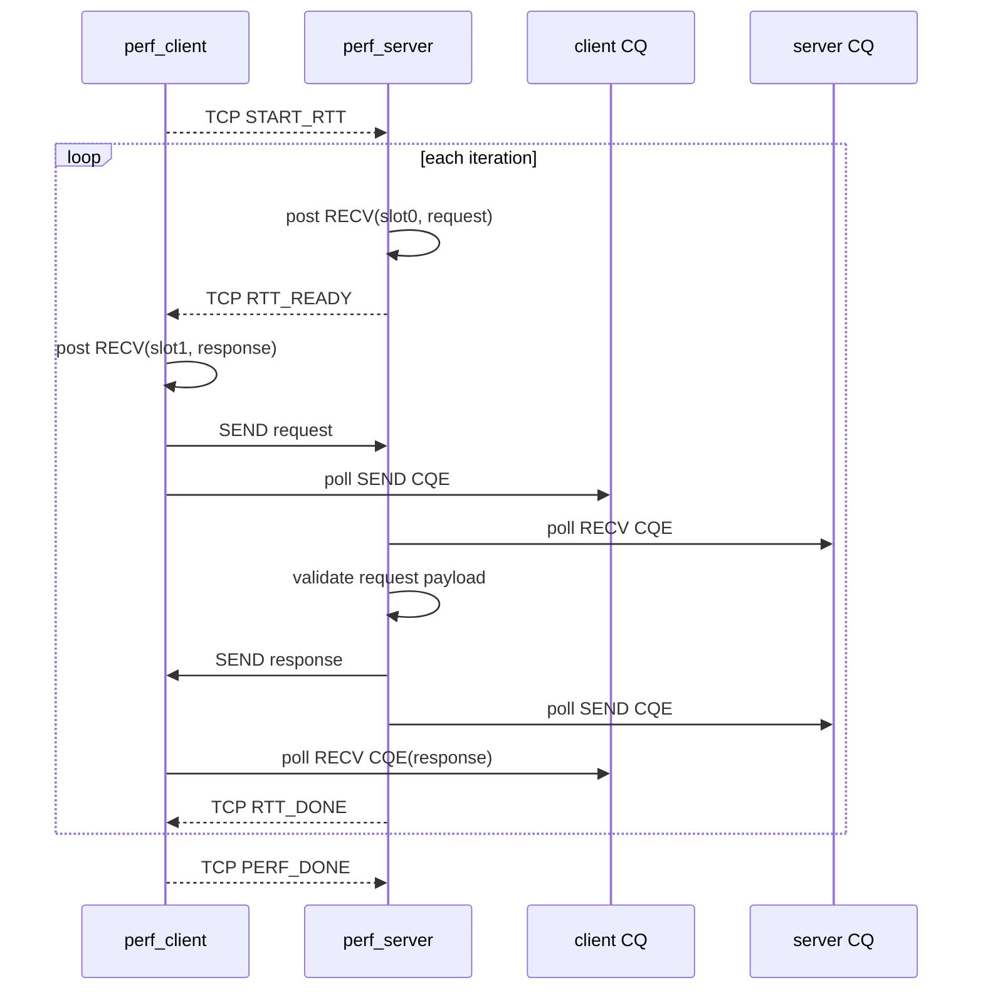
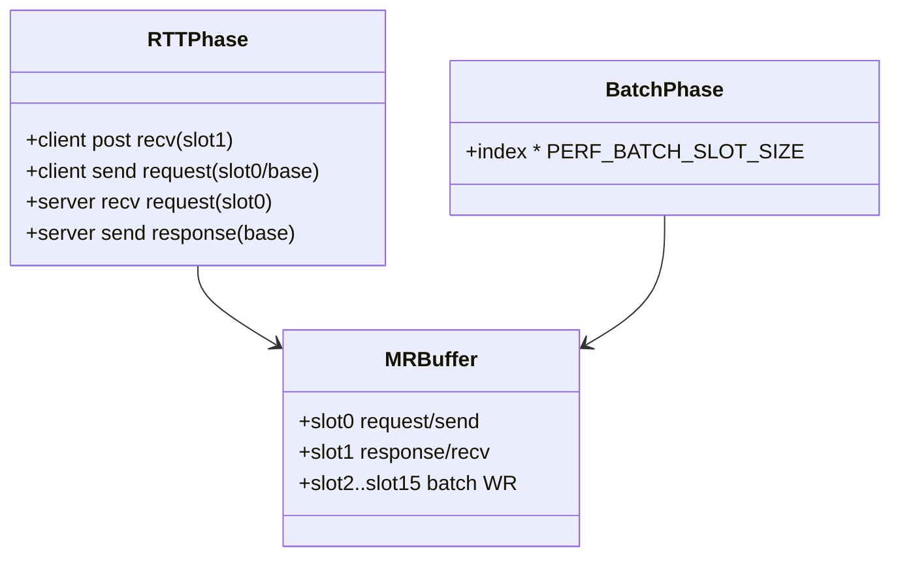
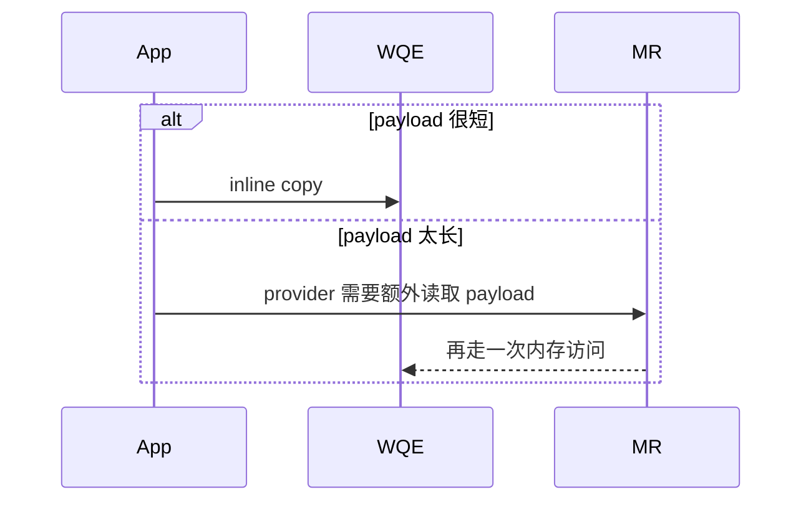
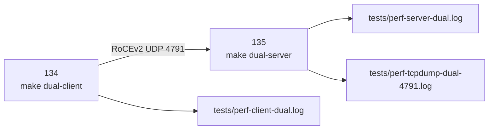

# RTT_DUAL_HOST

## 1. 目标

这一阶段补的是两件事：

- 在原有 completion latency 之外，追加可选 RTT phase
- 把 `ens33 + gid-index=1 + rxe0` 的双机执行入口沉淀成脚本

这里不改变原有 batch/inline/selective/poll 的实验口径，只是在其外层增加新的观测面。

## 2. completion latency 和 RTT 的边界


- `send_latency*` 仍然只回答“本地 SEND 提交后多久看到本地 SEND CQE”
- `rtt_latency*` 回答“请求发出去、对端收到并回包、我方收完响应，总共多久”

因此当前项目里两种指标并行存在，而不是前者被后者替换。

## 3. RTT phase 协议节拍



关键设计点：

- TCP 只用于 phase 边界同步，不进入 RTT 计时窗口
- client 在 RTT phase 中先 post `slot1` 的 RECV，再发 request
- server 在 request RECV 成功后立即发 response
- client 以 response 的 RECV CQE 作为 RTT 截止点

## 4. 为什么要保留独立 slot

RTT phase 的 request SEND 和 response RECV 不能共用同一段用户态 buffer。



如果 request 和 response 共用同一 slot，会出现：

- provider 还没完成读取 SEND payload，就被后续 RECV 覆盖
- response 尚未读出，又被新的 request 覆盖

所以 RTT phase 至少要把 response RECV 分出去。

## 5. 为什么 RTT payload 要故意很短

RTT phase 同样支持 `PERF_USE_INLINE=1`，而 RXE 的 inline 上限比较敏感，所以 payload 不能随手写成长字符串。



当前实现把 RTT payload 固定成：

- request: `rttq`
- response: `rttr`

这样做的目的不是模拟业务协议，而是让“是否 inline”这个变量保持足够纯。

## 6. 双机脚本入口



双机脚本设计原则：

- 沿用 `project-rdma-rc-client-server` 已验证过的 `ens33 + gid-index=1`
- server 侧可选 `tcpdump` 抓 `UDP 4791`
- 所有已有调优变量原样透传：
  - `PERF_BATCH_SIZE`
  - `PERF_USE_INLINE`
  - `PERF_SIGNAL_INTERVAL`
  - `PERF_POLL_CQ_BUDGET`
  - `PERF_ENABLE_RTT`

## 7. 当前 fresh 结果

2026-07-12 在 `192.168.65.135` 的 same-host-over-ens33 fresh 验证：

```text
normal:
  send_avg_ns=9595
  batch_avg_msg_ns=9589
  rtt_avg_ns=21228
  rtt_overhead_x100=221

inline:
  send_avg_ns=9117
  batch_avg_msg_ns=6825
  rtt_avg_ns=9814
  rtt_overhead_x100=107
```

这证明：

- RTT phase 逻辑可运行
- normal / inline 两条核心路径都打通
- 新脚本入口和现有环境变量模型是兼容的

## 8. 当前还不能声称的事

2026-07-12 本次会话中，对 `192.168.65.134` 的 SSH 登录仍返回：

```text
Permission denied (publickey,password)
```

因此当前还不能声称：

- `134 -> 135` 双机数据已经 fresh PASS
- 双机下的 RTT / batch / inline / selective / poll 数据已经全部采齐

代码和脚本已经收口，剩下的是外部访问条件和双机执行证据。
