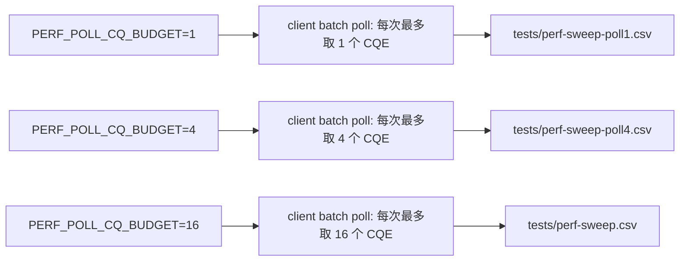
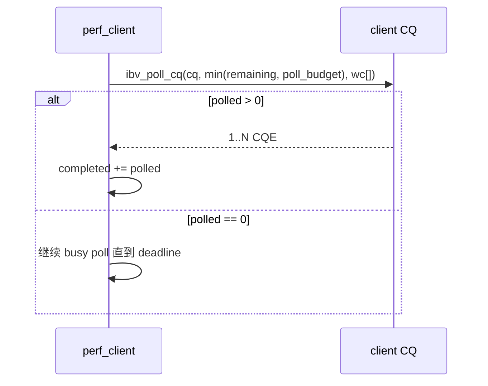

# CQ Polling Budget Design

## 1. 目标

在 `project-rdma-performance-tuning` 现有 single / batch / inline / selective / signal-interval 框架之上，补一个最小的新实验维度：`client` 侧 `SEND CQE` 的 `ibv_poll_cq()` 取回预算。

本阶段只比较 client 侧 polling，不把 server RECV polling、双机、NUMA、event channel 混进来。

## 2. 设计边界

本阶段只引入一个新环境变量：

- `PERF_POLL_CQ_BUDGET=<N>`

含义：

- `N=1`：每次 `ibv_poll_cq()` 最多取回 1 个 CQE，代表严格单条 polling。
- `N>1`：每次 `ibv_poll_cq()` 最多取回 `N` 个 CQE，代表 burst polling。
- 默认值保持当前行为等价：`16`，也就是不改变现有 batch 路径的默认收敛方式。

不引入的内容：

- 不做 `ibv_req_notify_cq()` / completion event。
- 不做 `sleep/usleep/backoff`。
- 不做 server 侧 polling 策略矩阵。
- 不改变 single SEND 与 batch SEND 的测量定义。

## 3. 架构方案

### 方案 A：只做 poll budget（推荐）

- 在 client 侧统一封装 “本次最多从 CQ 拿多少个 WC”。
- single 路径因为只等 1 个 CQE，所以 `budget` 只进入日志，不改变语义。
- batch 路径真正受到 `budget` 影响：每轮 `ibv_poll_cq()` 只拿 `min(remaining, budget)` 个 CQE。
- 复用现有 `sweep -> csv -> summary` 管线，新增一套 `poll budget` 矩阵脚本。

优点：

- 改动最小。
- 和现有 batch / inline / selective 结果天然可组合。
- 默认值能保持现有行为，历史结论不被破坏。

缺点：

- 只覆盖 `ibv_poll_cq()` 的 burst 行为，不涉及更复杂的 polling 优化。

### 方案 B：poll mode 做成枚举

- 例如 `one-by-one / burst / adaptive / sleep-backoff`。

优点：

- 扩展性强。

缺点：

- 会把当前阶段拉大，脚本与文档复杂度上升。
- adaptive/backoff 很快会混入调度噪声，收敛慢。

### 方案 C：同时改 client/server 两边

优点：

- 实验维度更完整。

缺点：

- 变量太多，单机 RXE 上很难快速解释结果。

结论：采用方案 A。

## 4. 代码修改点

### 4.1 `src/perf_common.h`

新增：

- `PERF_DEFAULT_POLL_CQ_BUDGET`
- `perf_get_poll_cq_budget()`
- `perf_poll_mode()`
- `perf_poll_batch()`

责任：

- 统一解析环境变量。
- 统一把 “默认行为” 定义为 `budget=16`。

### 4.2 `src/perf_client.c`

修改：

- `poll_success_quiet()`：打印 `poll_mode/poll_budget`，但 single 仍只等待 1 个 SEND CQE。
- `poll_batch_success()`：每次 `ibv_poll_cq()` 取回数从 `expected_cqes - completed` 改成 `min(remaining, poll_budget)`。
- `perf_config` / `perf_result` / `perf_throughput` / `perf_compare`：追加 `poll_mode`、`poll_budget` 字段。

### 4.3 `tests/perf_smoke_test.sh`

修改：

- 透传 `PERF_POLL_CQ_BUDGET`。
- grep `poll_budget=` marker。

### 4.4 `tests/export_perf_csv.sh`

修改：

- CSV 追加 `poll_mode`、`poll_budget` 列。

### 4.5 `tests/perf_mode_helpers.sh`

修改：

- 在现有 `inline` / `sig<N>` 后面追加可选 `-poll<N>` 后缀。
- 默认 `poll=16` 不追加后缀，保证历史路径不变。

### 4.6 sweep / summary 脚本

修改：

- `run_perf_sweep.sh`
- `summarize_sweep.sh`
- `check_sweep_csv.sh`
- `check_sweep_artifacts.sh`

新增：

- `run_poll_budget_sweep.sh`
- `summarize_poll_budget_sweep.sh`
- `check_poll_budget_summary.sh`

### 4.7 `Makefile`

新增最小入口：

- `POLL_CQ_BUDGETS ?= 1 2 4 8 16`
- `pollsweep`
- `inlinepollsweep`
- `pollsummary`
- `inlinepollsummary`
- `pollreport`
- `inlinepollreport`

## 5. 数据流

## 6. 测试与收口

### 小样本

- `PERF_POLL_CQ_BUDGET=1 make quickreport`
- `PERF_POLL_CQ_BUDGET=4 make quickreport`

### 阶段收口

- `make pollreport POLL_CQ_BUDGETS="1 2 4 8 16" SWEEP_ITERATIONS=1000 SWEEP_BATCH_SIZES="1 2 4 8 16"`
- `make inlinepollreport POLL_CQ_BUDGETS="1 2 4 8 16" SWEEP_ITERATIONS=1000 SWEEP_BATCH_SIZES="1 2 4 8 16"`

### 产物

- `tests/perf-poll-budget-sweep.csv`
- `tests/perf-poll-budget-summary.md`
- `tests/perf-poll-budget-inline-sweep.csv`
- `tests/perf-poll-budget-inline-summary.md`

## 7. 成功标准

- 默认不传 `PERF_POLL_CQ_BUDGET` 时，现有 smoke/sweep 逻辑保持兼容。
- `PERF_POLL_CQ_BUDGET=1` 与 `>1` 都能跑通。
- normal 与 inline 两套 polling matrix 都能生成 csv + summary。
- 文档明确说明：本阶段比较的是 client 侧 CQE “取回预算”，不是 event-driven completion。

## 8. 本阶段后续

如果这轮结果稳定，再进入下一专题：

1. server 侧 polling
2. 双机 latency
3. CPU affinity / NUMA
