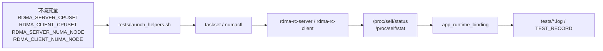
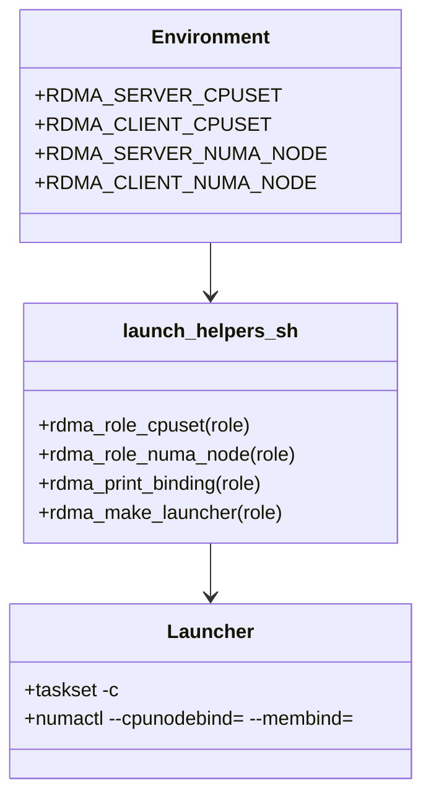
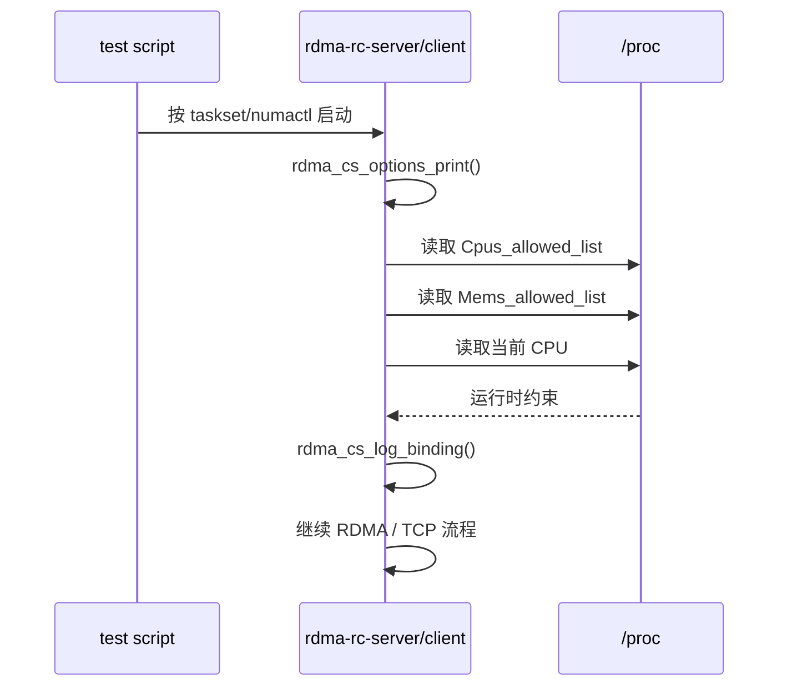

# AFFINITY_NUMA_RECORDING

## 1. 目标

这个文档说明 `project-rdma-rc-client-server` 为什么要补 CPU affinity / NUMA
记录层，以及这一层在代码、脚本、日志里的落点。

这一阶段的目标不是调优数值本身，而是先把“运行约束证据链”补完整：



## 2. 为什么不能只看脚本参数

如果日志里只有：

```text
taskset -c 0 ./build/rdma-rc-server ...
```

那我们只知道“脚本请求了绑核”，不知道：
- 进程是否真的被限制到那个 CPU
- NUMA 内存策略是否也被限制
- 当前这一瞬间进程实际跑在哪个 CPU 上

所以应用启动后还要自己读取：
- `/proc/self/status` 里的 `Cpus_allowed_list`
- `/proc/self/status` 里的 `Mems_allowed_list`
- `/proc/self/stat` 里的当前 CPU 字段

最终形成：

```text
app_runtime_binding role=server requested_cpuset=0 requested_numa_node=- current_cpu=0 cpus_allowed=0 mems_allowed=0
```

## 3. 脚本层设计

`tests/launch_helpers.sh` 做三件事：

1. 读取角色相关环境变量
2. 打印 `script_binding`
3. 生成统一 launcher 数组



这样做的好处是：
- 单机脚本和双机脚本共用同一套规则
- 后面迁移到 perf 项目时可以直接复用模式
- 测试脚本里不需要重复拼装 `taskset/numactl`

## 4. 应用层设计

应用层统一在 `rdma_cs_log_binding()` 里做运行时采样，然后在三种入口模式都打印：
- `control-plane-only`
- `dry-run`
- `full`



这一步要放在真正建链前面，因为：
- control-plane-only 失败时也要知道它跑在哪
- dry-run 失败时也要知道 MR/CQ/QP 创建发生在哪个约束下
- full 路径做双机复盘时，第一眼就能看到运行位置

## 5. 字段解释

### 5.1 `requested_cpuset`

来自环境变量，表示脚本想让该角色运行在哪些 CPU 上。

### 5.2 `requested_numa_node`

来自环境变量，表示脚本想让该角色的 CPU 和内存都限制到哪个 NUMA node。

### 5.3 `current_cpu`

进程打印日志这一瞬间实际跑在的 CPU。它可能在允许集合内变化，所以它是“当前观测点”，
不是长期唯一值。

### 5.4 `cpus_allowed`

内核实际允许该进程运行的 CPU 集合。这个字段最适合验证 `taskset` 是否生效。

### 5.5 `mems_allowed`

内核实际允许该进程分配内存的 NUMA 节点集合。这个字段最适合验证 `numactl --membind`
是否生效。

## 6. 失败模式

### 6.1 缺 `taskset`

脚本会直接报：

```text
missing_tool role=server tool=taskset requested_cpuset=0
```

### 6.2 缺 `numactl`

脚本会直接报：

```text
missing_tool role=client tool=numactl requested_numa_node=1
```

### 6.3 单 NUMA 机器

即使 `mems_allowed` 能打印出来，也不代表具备真实跨节点对比价值。此时记录层仍然有意义，
但只能证明“约束被观察到了”，不能证明“NUMA 差异已测出来”。

## 7. 对后续性能实验的价值

这套记录层最大的价值，是把后续所有性能现象都放回运行约束上下文里解释：

- single SEND vs batch SEND 对比时，先排除 server/client 抢同一个 CPU
- RTT 抖动时，先确认是否跨 socket / 跨 NUMA
- selective signaling 或 CQ polling 差异时，先确认进程绑核没漂移

所以它虽然不直接提升吞吐，但它显著提升了测试结果的可信度。
