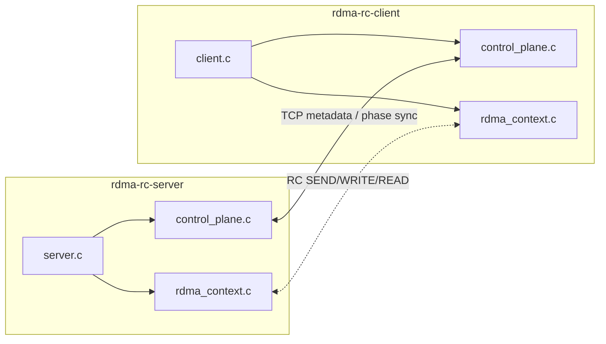
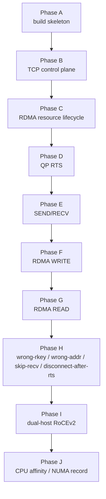
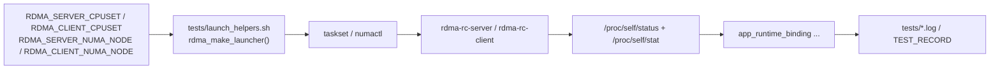
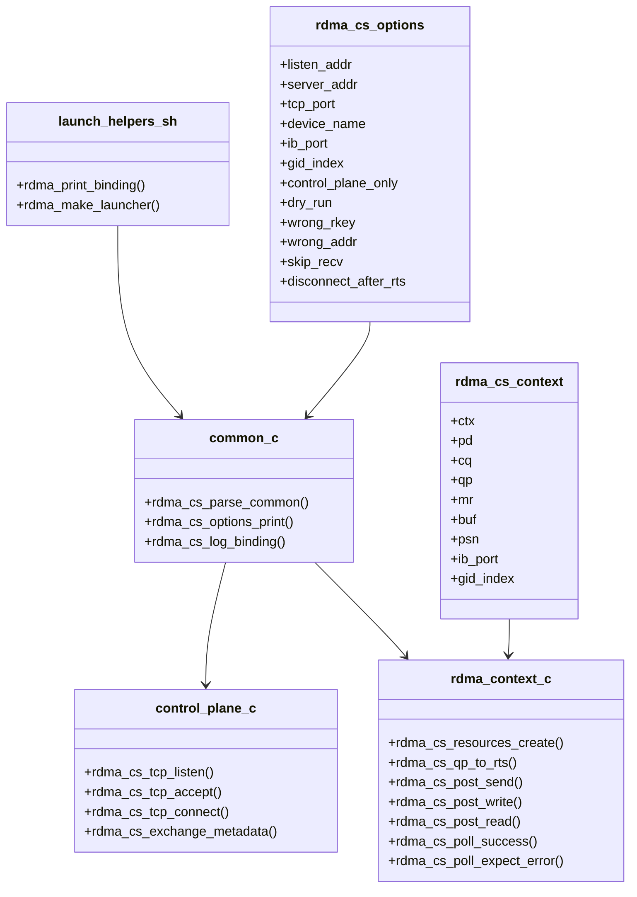
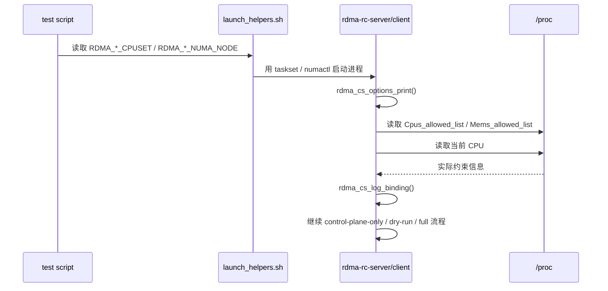

# ARCHITECTURE

## 1. 项目定位

`project-rdma-rc-client-server` 关注的是“把 verbs 实验写成真正的双进程程序”。
它不是单纯演示某个 API，而是把下面三层关系固定下来：

1. 控制面：TCP 负责交换建链 metadata 和阶段同步。
2. 数据面：RC QP 负责 SEND/RECV、WRITE、READ。
3. 观测面：日志、脚本、测试记录负责回答“当时到底是怎么跑的”。

## 2. 分阶段推进方式

项目按“先拆层，再闭环，再补边界”的顺序推进：

这样拆的原因很直接：如果一开始就把 socket、GID、QP 状态机、CQE、故障注入、
双机网络都揉在一起，失败时几乎没法快速定位。现在每一层都有独立入口和 marker，
排障成本会低很多。

## 3. CPU affinity / NUMA 记录链路

这一阶段新增的不是新的 verbs 语义，而是一条“启动约束 -> 进程实际状态 -> 日志证据”
的可追踪链路。

这里有两个关键原则：

- 脚本只负责“请求约束”，不声称自己一定成功。
- 进程启动后再从 `/proc/self/status` 和 `/proc/self/stat` 读取实际信息，
  用 `app_runtime_binding` 记录内核视角的结果。

所以日志里会同时出现：
- `requested_cpuset`
- `requested_numa_node`
- `current_cpu`
- `cpus_allowed`
- `mems_allowed`

这比只打印 `taskset -c 0` 更可靠，因为真正有价值的是“进程最后被约束成了什么”。

## 4. 关键模块职责

## 5. 启动时序

下面这个时序图描述的是“脚本给约束，应用打印实际绑定，再进入原有 RDMA/TCP 流程”：

这一步放在真正建链之前，是为了让任何失败日志都先带着运行时约束信息。

## 6. 为什么这一步值得做

### 6.1 为后续性能实验做地基

后面无论是 latency、throughput，还是 batch WR / CQ polling，对比结果都会受以下因素影响：
- server/client 是否抢同一个 CPU
- 是否落在同一个 NUMA node
- memory policy 是否被限制

如果这些约束没有写进日志，后续看到数据波动时很难确认是代码变化还是运行位置变了。

### 6.2 对当前项目也有直接价值

即使 `project-rdma-rc-client-server` 不是主 perf 项目，它依然是最清晰的“控制面 + 数据面”
样板工程。先在这里把观测链路做扎实，后续往更复杂项目迁移时会轻很多。

## 7. 当前结论

当前架构已经形成三条比较稳定的主线：

1. TCP 控制面负责交换 metadata 和阶段同步。
2. RC 数据面负责 verbs 行为与故障边界。
3. 观测面负责记录脚本请求和进程实际绑定。

这意味着后续无论是继续做双机，还是迁移到性能项目做更细的对比，基础证据链已经具备了。
