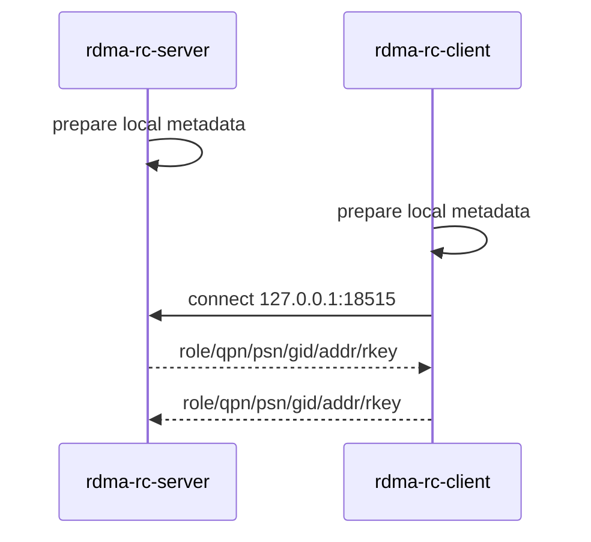
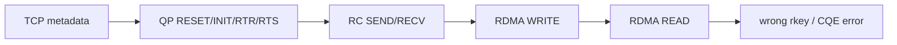

# CONTROL_AND_DATA_PLANE

## TCP 控制面

TCP 控制面只交换连接 RDMA RC QP 需要的元数据，不承载业务数据。



元数据格式：

```text
role=server qpn=123 psn=0x111111 gid_index=1 gid=00000000000000000000000000000000 addr=0x12345678 rkey=0xabcdef01
```

## 数据面后续阶段



RDMA 数据面不会通过 TCP 搬运 payload。TCP 只是让双方知道对方的 QPN、PSN、GID 和 MR 授权信息。

更详细的原理、状态机和测试命令见：

```text
DEEP_LEARNING.md
TEST_FLOW.md
```
