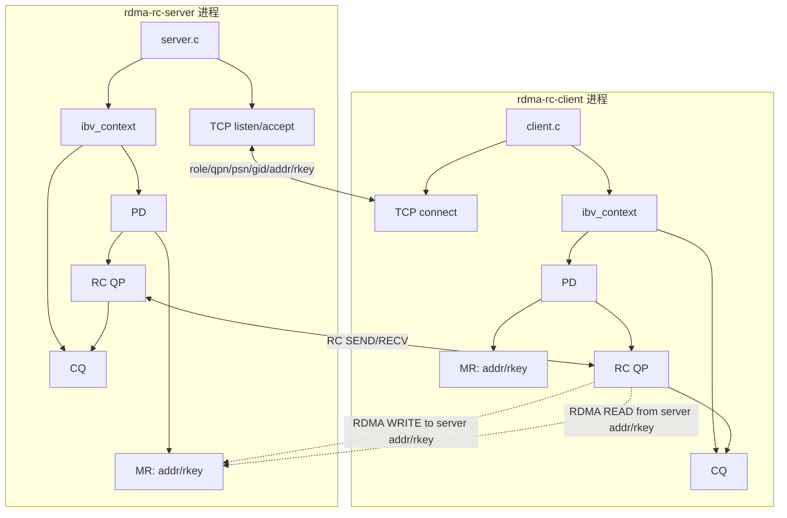
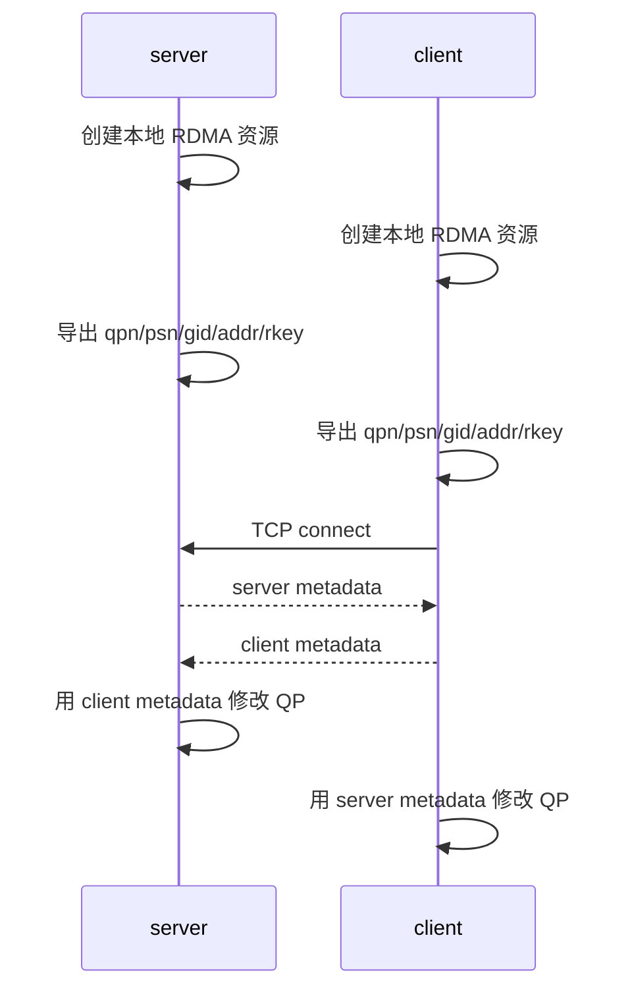
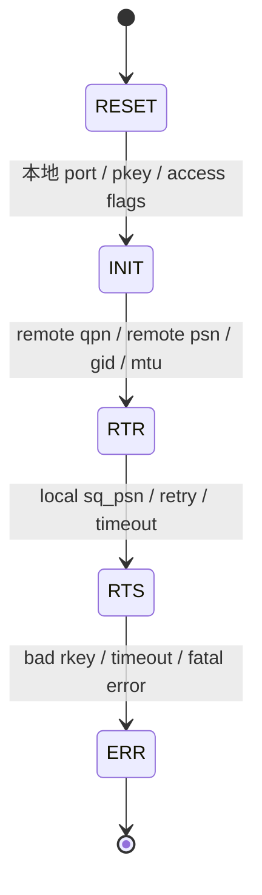
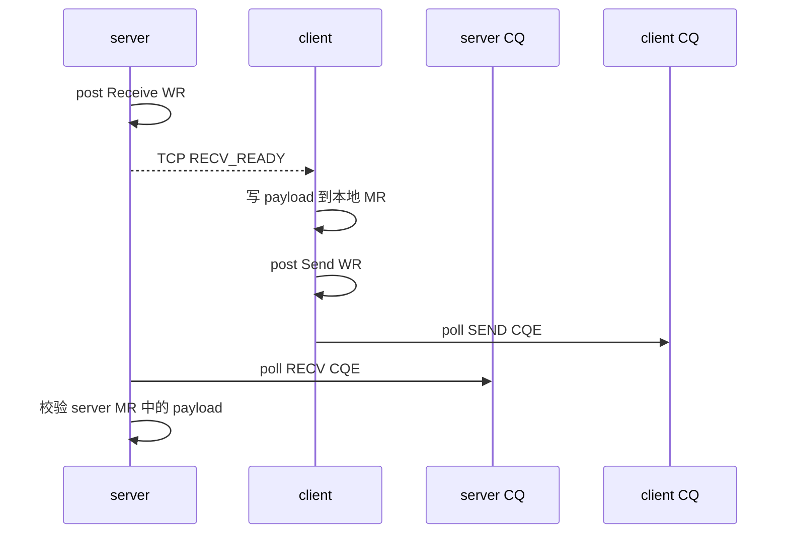
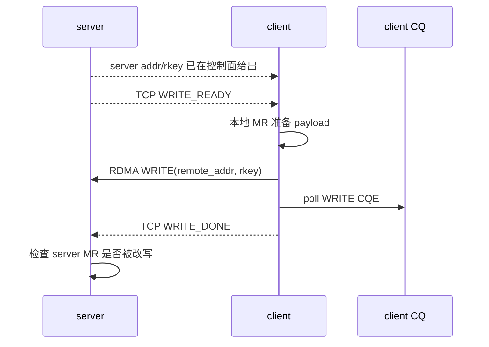
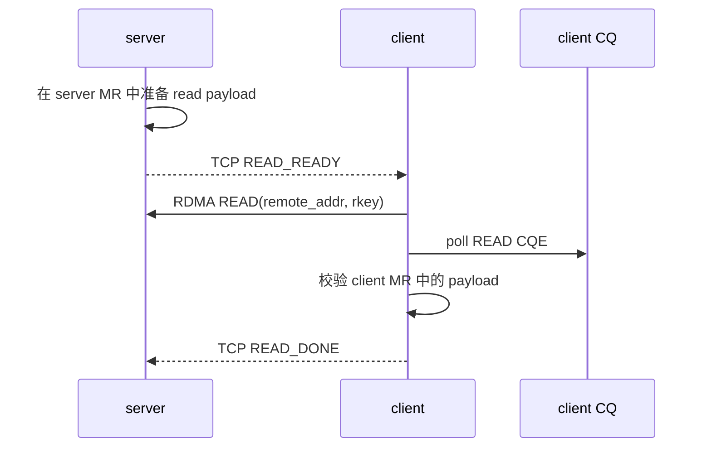
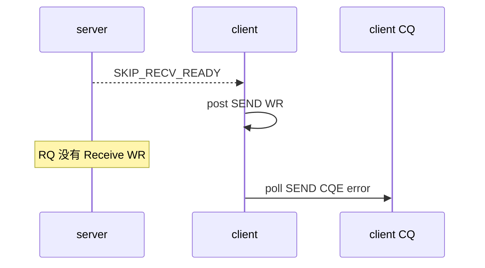
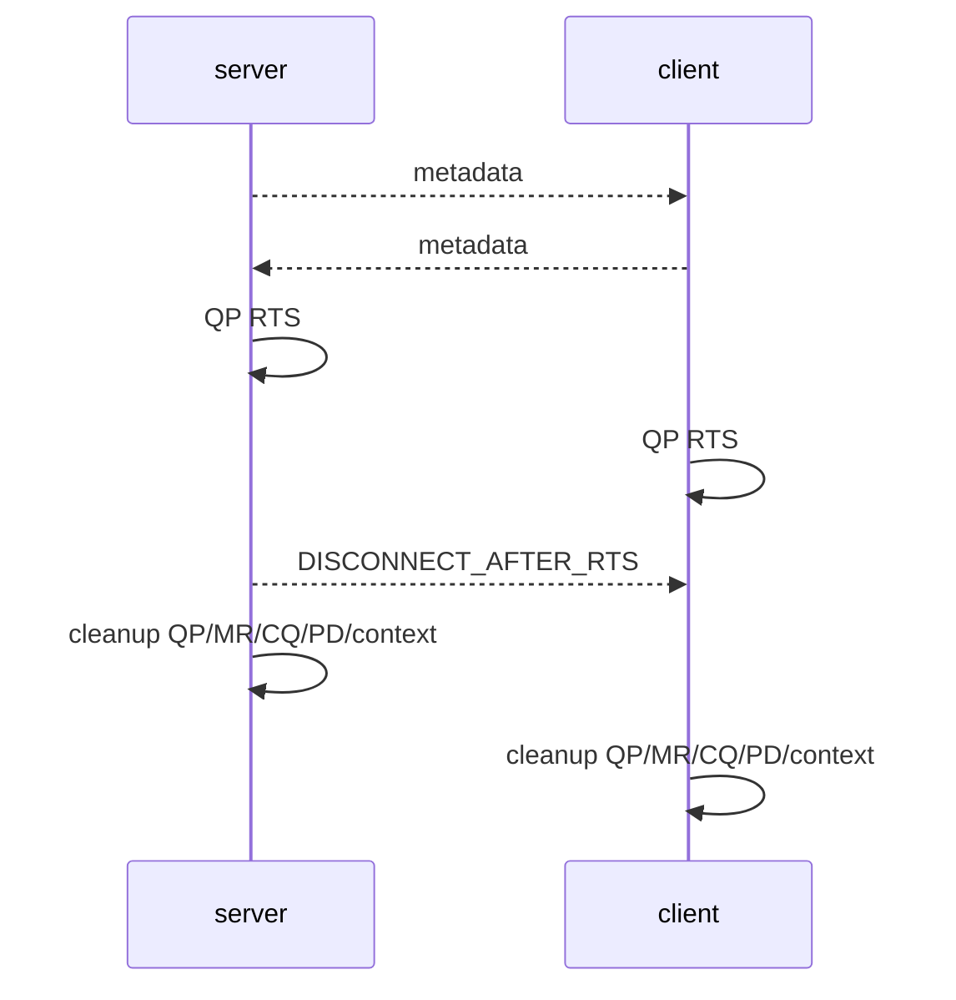

# DEEP_LEARNING

## 1. 这个项目到底在学什么

前面的 RDMA lab 主要是“在一个进程里创建两个 QP，然后手工互填参数”。这能学 verbs 对象和数据面语义，但它还不像真实工程。

真实 RDMA 程序通常是两个独立进程，甚至在两台机器上：

- 每个进程只能创建自己的 context、PD、MR、CQ、QP。
- 本进程看不到对端 QP 对象，只能通过控制面拿到对端元数据。
- QP 进入 RTR/RTS 依赖对端 `qpn/psn/gid`。
- RDMA READ/WRITE 依赖对端暴露的 `addr/rkey`。

所以本项目的学习重点不是“再写一个 ping-pong”，而是把 RDMA 程序拆成两条面：

```text
TCP control plane: 交换连接和授权元数据
RDMA data plane: 通过 QP/MR/CQ 搬运数据
```

## 2. 总体架构



核心边界：

- TCP socket 不传业务 payload，只传元数据和阶段同步信号。
- RDMA QP 不知道 socket 的存在，它只根据 QP 状态、WR、SGE、MR key 工作。
- MR 的 `rkey` 是远端访问授权，不是普通指针。

## 3. 控制面为什么必须存在

RC QP 不是 TCP socket。TCP connect 之后内核知道对端是谁；RDMA QP 不会自动知道。应用必须自己把对端信息告诉 QP。

本项目控制面交换一行文本：

```text
role=server qpn=19 psn=0x111111 gid_index=1 gid=fe800000000000000000000000000034 addr=0x606f8eda3000 rkey=0x463
```

字段含义：

| 字段 | 用途 |
| --- | --- |
| `role` | 日志中区分 server/client |
| `qpn` | 对端 QP number，RTR 必需 |
| `psn` | 对端起始 packet sequence number，RTR 必需 |
| `gid_index` | 本端查询 GID table 的 index |
| `gid` | RoCE GRH 使用的全局地址 |
| `addr` | 远端 MR 虚拟地址，READ/WRITE 必需 |
| `rkey` | 远端 MR 授权 key，READ/WRITE 必需 |

控制面时序：



## 4. QP 状态机

RC QP 必须经过状态迁移才能收发：



三个阶段分别回答不同问题：

| 状态迁移 | 回答的问题 |
| --- | --- |
| `RESET -> INIT` | 本端从哪个 port 出去，允许对端做什么访问 |
| `INIT -> RTR` | 我准备接收谁发来的包，对端 QPN/GID/PSN 是什么 |
| `RTR -> RTS` | 我的发送队列从哪个 PSN 开始，超时和重试策略是什么 |

本项目中如果 GID index 错了，常见表现是 QP 无法进入 RTR/RTS，或者后续 CQ polling 超时。

## 5. SEND/RECV 数据路径

SEND/RECV 是双边语义：发送端 post SEND，接收端必须提前 post RECV。



关键点：

- SEND WR 的 SGE 指向 client 本地 MR。
- RECV WR 的 SGE 指向 server 本地 MR。
- payload 最终落到接收方提前提供的 buffer。
- 两端都会有 CQE：client 看到 SEND completion，server 看到 RECV completion。

## 6. RDMA WRITE 数据路径

RDMA WRITE 是 one-sided 语义。server 不需要 post RECV，也不会有远端 CQE。



关键点：

- client WR 里同时包含本地 `addr/lkey` 和远端 `remote_addr/rkey`。
- server CPU 不参与数据搬运。
- server 通过检查自己的 MR 内容验证 WRITE 是否生效。

## 7. RDMA READ 数据路径

RDMA READ 也是 one-sided。client 从 server MR 拉取数据到 client MR。



关键点：

- READ completion 只在 client CQ 出现。
- server 没有 READ CQE。
- `IBV_ACCESS_REMOTE_READ` 是 server MR 必须授权的能力。

## 8. wrong-rkey 为什么重要

`rkey` 是远端访问授权边界。对端即使知道了 `addr`，没有正确 `rkey` 也不能 READ/WRITE 这段 MR。

本项目故意把 `rkey` 翻转一位：

```text
wr.wr.rdma.rkey = remote->rkey ^ 1
```

实际结果：

```text
client_wrong_rkey_cqe cqe_wr_id=5001 status=remote access error opcode=0 byte_len=0
wrong_rkey_detected=pass
WRONG_RKEY_BOUNDARY_PASS
```

这说明：

- provider 拒绝了错误授权。
- 错误不是通过 TCP 返回的，而是通过 RDMA CQE 返回的。
- 业务程序必须检查 CQE `status`，不能只看 `ibv_post_send()` 是否返回 0。

## 9. wrong-addr、skip-recv 和 disconnect 边界

`rkey` 不是唯一边界。one-sided 操作实际依赖这一组三元组：

```text
remote_addr + rkey + length
```

本项目新增 `wrong-addr` case，故意把 `remote_addr` 偏移到 server MR 之外：

```text
remote_addr = remote->addr + RDMA_CS_BUFFER_SIZE * 4
```

预期行为也是 CQE error。这个 case 用来说明：知道 rkey 还不够，地址和长度也必须落在被授权的 MR 范围内。

`skip-recv` case 验证 SEND/RECV 的双边语义。server 不 post Receive WR，client 仍然 post Send WR：



这个 case 的学习点：

- SEND/RECV 不是“只要发送端 post send 就行”。
- 接收端必须提前准备 RQ。
- RNR 或 retry exceeded 是 RC 可靠传输的一部分，业务程序必须能识别。

`disconnect-after-rts` case 在 QP 进入 RTS 后立即结束控制面并清理资源：



它验证的是资源生命周期：即使业务在 RTS 后提前结束，也必须按依赖顺序销毁 QP、MR、CQ、PD 和 context。

## 10. GID index 和 Soft-RoCE 边界

本测试机使用 `ens34` 创建 RXE：

```bash
sudo ip -6 addr add fe80::34/64 dev ens34 2>/dev/null || true
sudo rdma link delete rxe0 2>/dev/null || true
sudo rdma link add rxe0 type rxe netdev ens34
```

重建后 GID table 中：

```text
GID[0] = fe80::20c:29ff:fef8:f678
GID[1] = fe80::34
```

本项目选择 `gid-index 1`，因为它对应显式配置的 `fe80::34`。如果只看到全 0 GID，或者 GID index 与当前 netdev 地址不匹配，QP 可能无法进入 RTR/RTS。

## 11. 当前结论和下一步

当前单机 Soft-RoCE 已经证明：

- 双进程 RDMA 工程骨架可行。
- TCP 控制面能交换 QP/MR 元数据。
- RC QP 能进入 RTS。
- SEND/RECV、WRITE、READ 数据面语义成立。
- wrong-rkey 能触发 remote access error。
- wrong-addr 能验证远端地址边界。
- skip-recv 能验证 RNR/接收队列边界。
- disconnect-after-rts 能验证控制面提前断开后的资源清理。

尚未证明：

- 双机 RoCEv2 网络路径。
- UDP 4791 抓包。
- 真实 RNIC DMA/offload 性能。
- PFC/ECN、拥塞、MTU、NUMA、CPU affinity。
