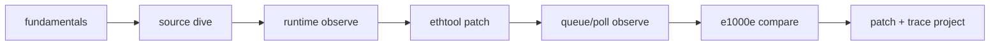

# track-real-driver

真实 Linux 网络驱动源码、运行期观测与最小 patch 学习主线。该 track 位于教学 netdev 之后、虚拟化网络之前，负责把自写驱动模型映射到 `virtio_net` 与 `e1000e` 的工程实现。

## 第一次进入先读这里

不要直接打开几千行的 `virtio_net.c`。先阅读 [docs/fundamentals/README.md](docs/fundamentals/README.md)，按“驱动模型 -> bus match -> 生命周期 -> net_device -> DMA/ring -> RX/TX -> virtqueue/e1000e -> 控制面 -> 并发 -> 阅读/观测/patch”建立完整模型。

知识层状态：`REAL_DRIVER_FUNDAMENTALS_COMPLETE`。

快速入口：

```text
START_HERE.md
  -> docs/fundamentals/README.md
  -> lab-virtio-net-source-dive
  -> runtime/queue observation
  -> minimal ethtool patch
  -> e1000e comparison
  -> patch-and-trace capstone
```

## 项目矩阵

| 顺序 | Lab/Project | 定位 | 状态 |
|---:|---|---|---|
| 1 | `lab-virtio-net-source-dive/` | virtio_net 架构、probe、TX/RX、feature 源码阅读 | Round 1-3 已完成 |
| 2 | `lab-virtio-net-runtime-observe/` | idle/ping workload 与运行期 trace/stats 对照 | 已测试 |
| 3 | `lab-virtio-net-ethtool-stats-mini-patch/` | ethtool stats 最小 patch 与 before/after | 已测试 |
| 4 | `lab-virtio-net-queue-poll-observe/` | callback、NAPI poll、协议栈事件链 | 已测试 |
| 5 | `lab-e1000e-source-compare/` | virtio_net 与传统 PCI NIC 对照阅读 | 已形成对照证据 |
| 6 | `project-virtio-net-patch-and-trace/` | poll_count patch、trace、风险与报告收尾 | patch 已生成 |

## 学习路线



### Phase 0：统一知识层

- 16 个文档，覆盖设备模型、总线、生命周期、数据路径、控制面、并发、阅读和验证；
- Mermaid/UML 图把对象、状态机、TX/RX、ownership 与项目路线连起来；
- 自动检查文件、篇幅、链接、代码围栏、入口 marker；
- 完整命令见 `tests/TEST_FLOW.md` 与对应测试记录。

### Phase 1：virtio_net 源码

- Round 1：driver model、probe、netdev、queue、NAPI；
- Round 2：TX submit/completion、RX callback/poll/refill；
- Round 3：feature negotiation、ethtool、XDP、教学 stage 映射。

### Phase 2：运行期证据

- 固定 driver/interface/config identity；
- idle、ping、iperf 分级 workload；
- stats、tracepoint、function trace 互相印证；
- 记录 hook 不可用、接口差异和环境边界。

### Phase 3：最小 patch

- 在明确语义点增加统计；
- 检查 per-queue 状态、并发与 stats 导出顺序；
- 完成编译、部署、before/after、回滚；
- 不以“能编译”代替行为验证。

### Phase 4：跨驱动对照

通过 e1000e 补齐 PCI BAR、硬件 descriptor、MSI-X、PHY/link、interrupt moderation 视角，区分 Linux netdev 共性与设备特性。

## 已有运行结果摘要

| 项目 | 已记录结果 |
|---|---|
| runtime observe | idle RX +6；ping 20 次 RX +21、0% loss |
| ethtool patch | ping 10 次 RX +11、TX +11 |
| queue/poll observe | ping 窗口 63 个 trace events，RX +21、TX +22 |
| capstone | `virtio_net_poll_count.patch` 与 before/after 记录已生成 |

这些是历史项目记录，不等于当前所有内核/设备已复验。以各项目 `records/`、`reports/` 和测试日期为准。

## 验证入口

```bash
cd linux-driver-lab/track-real-driver
bash tests/check_fundamentals.sh
bash tests/software_regression.sh
bash tests/runtime_regression.sh
```

测试流程：[tests/TEST_FLOW.md](tests/TEST_FLOW.md)。

本次知识层实测记录：[tests/TEST_RECORD_20260714_REAL_DRIVER_FUNDAMENTALS.md](tests/TEST_RECORD_20260714_REAL_DRIVER_FUNDAMENTALS.md)。

当前路线：[ROADMAP.md](ROADMAP.md)。
