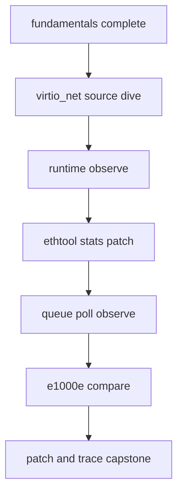

# START HERE：真实驱动学习入口

## 1. 先建立知识底座

按顺序阅读：

```text
docs/fundamentals/README.md
  -> 00-03：心智模型、内核位置、bus、生命周期
  -> 04-07：net_device、ring/DMA、RX、TX
  -> 08-11：virtqueue、e1000e、offload、并发
  -> 12-14：源码阅读、运行观测、patch 验证
```

## 2. 再进入项目



## 3. 开始前自检

你应能解释：

- bus match、probe、open、stop、remove 的职责；
- `net_device`、bus device、driver private 的关系；
- RX 中断到 NAPI/GRO 的状态推进；
- TX skb ownership、descriptor completion 与 queue wake；
- virtqueue kick 与 e1000e tail register 的对应关系；
- feature/stats patch 的并发与 before/after 验证。

## 4. 自动审计

Windows 本地：

```powershell
cd linux-driver-lab/track-real-driver
py tests/check_fundamentals.py
```

Linux：

```bash
cd linux-driver-lab/track-real-driver
bash tests/check_fundamentals.sh
bash tests/software_regression.sh
```

通过 marker：

```text
REAL_DRIVER_DOC_AUDIT_PASS
REAL_DRIVER_FUNDAMENTALS_COMPLETE
REAL_DRIVER_SOFTWARE_REGRESSION_PASS
REAL_DRIVER_RUNTIME_REGRESSION_PASS or SKIP
```

## 5. 证据边界

fundamentals 审计只证明知识层结构完整、链接有效。源码提取需要可用 kernel source；运行期 trace、module deployment、unbind/reset 必须在安全 Linux 实验环境单独验证。
