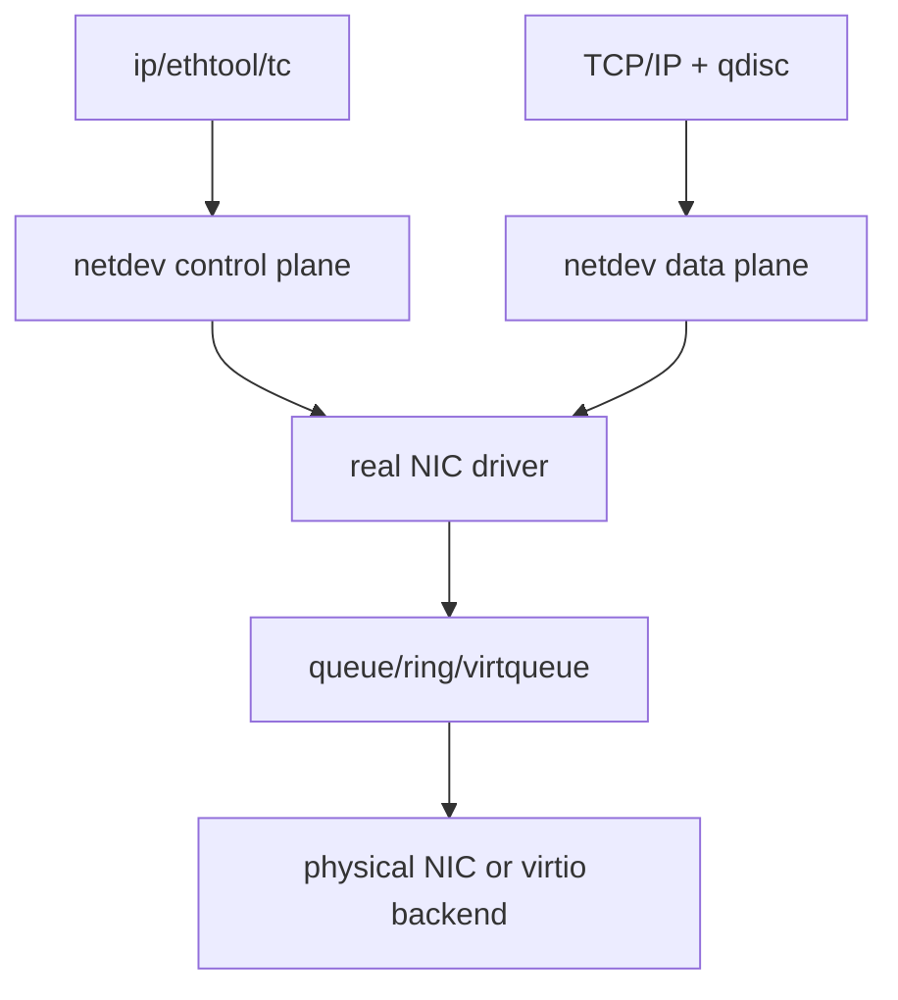
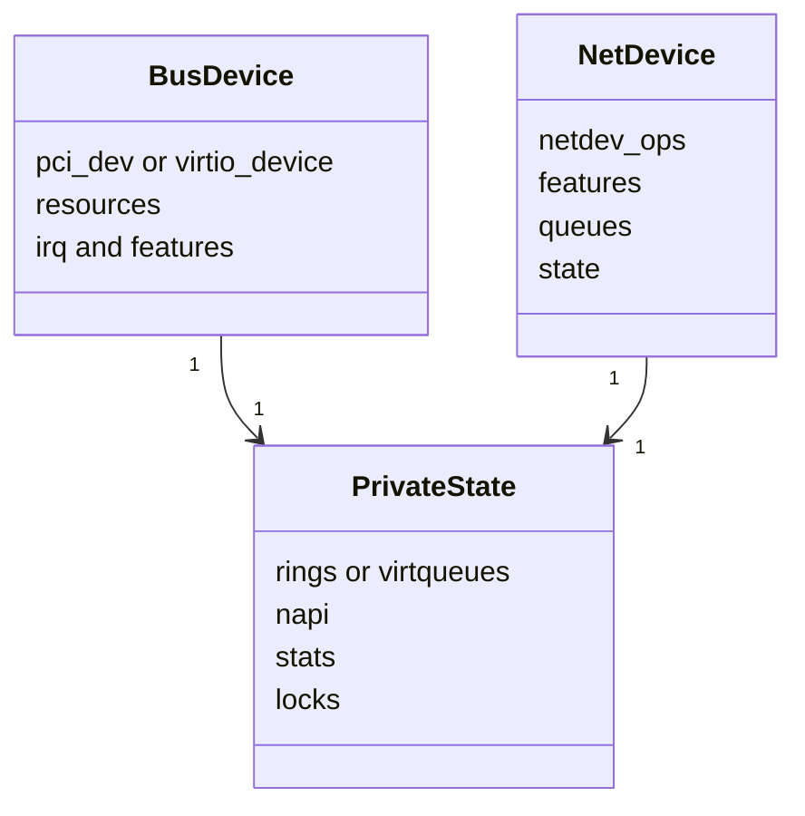
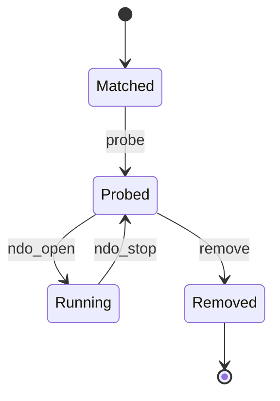
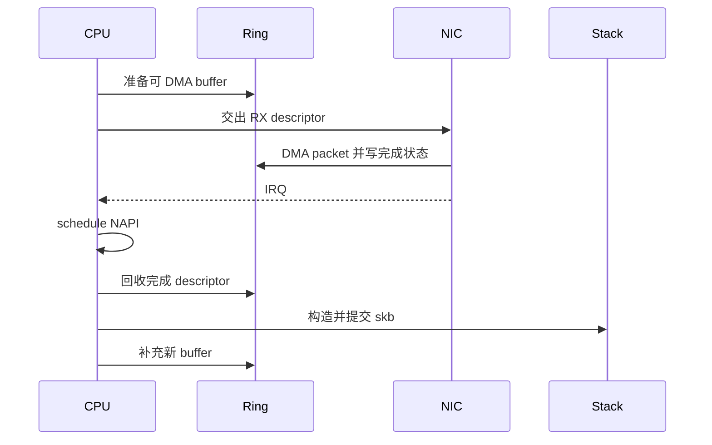
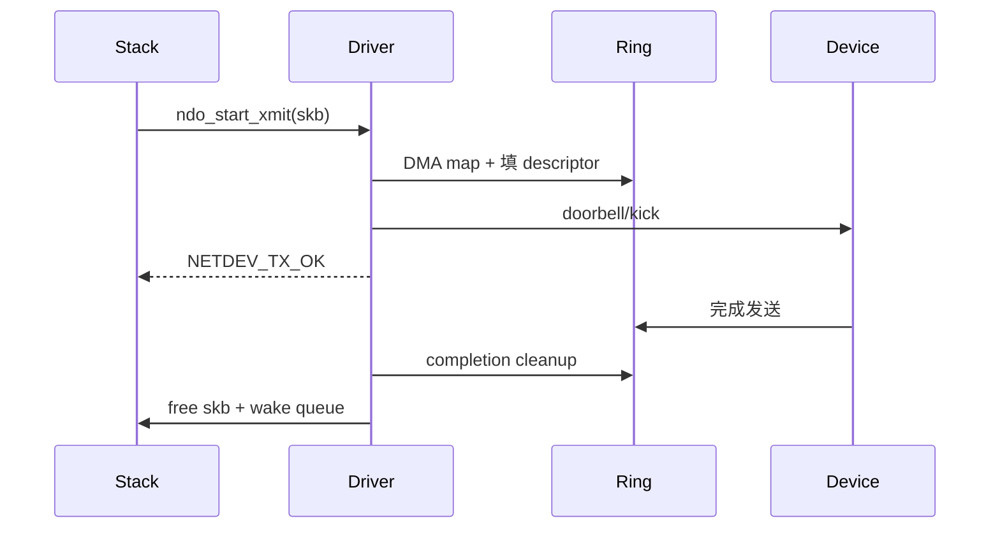

# 00 真实网卡驱动的 15 分钟心智模型

## 1. 驱动不是“收包函数”

真实网卡驱动同时协调五个世界：

1. Linux 设备模型：谁发现设备、谁匹配驱动、何时释放；
2. netdev 抽象：协议栈通过哪些 ops 使用设备；
3. DMA 与队列：CPU 和设备如何共享 descriptor 与 packet buffer；
4. 中断/NAPI/并发：何时抢占、何时批处理、谁拥有队列；
5. 控制面：MTU、offload、RSS、统计、link state 如何配置和暴露。

把驱动想成机场塔台更准确：它不亲自运输每位乘客，而是维护跑道状态、登机队列、交接规则和异常恢复。包只是“乘客”，descriptor 才是交接单。

## 2. 三层对象先分清

- 总线设备对象描述“设备从哪里来”；
- `struct net_device` 描述“网络栈如何看它”；
- 私有结构描述“这个驱动如何实现它”。

阅读源码时，先找这三个对象在哪里绑定，后面的函数才有坐标。

## 3. 生命周期与数据路径正交

`probe()` 建立长期对象，`open()` 启动可反复开关的数据面。执行 `ip link set dev eth0 down/up` 不应重新探测 PCI/virtio 设备。

## 4. RX 的核心是 ownership

每一步都要回答“现在谁可以写这个对象”。设备还拥有 descriptor 时，CPU 不能当作完成包读取；CPU 未同步并交还前，设备不能覆盖。

## 5. TX 的核心是提交与完成分离

`ndo_start_xmit()` 返回成功只表示驱动接管 skb，不表示线缆上已经发送完成。真正释放 skb 通常发生在完成回收路径。

## 6. virtio 与 e1000e 的共同骨架

| 维度 | virtio_net | e1000e |
|---|---|---|
| 总线 | virtio bus | PCI bus |
| 队列 | virtqueue | hardware descriptor ring |
| 通知设备 | kick/notify | MMIO doorbell/tail register |
| 完成通知 | virtqueue callback | MSI/MSI-X interrupt |
| 后端 | hypervisor/vhost/device | 真实 NIC 硬件 |
| Linux 上层 | net_device + NAPI + skb | net_device + NAPI + skb |

## 7. 阅读任何驱动的七问

1. 注册在哪种 bus，ID table 在哪里？
2. `probe()` 创建了哪些长期对象？
3. `ndo_open()` 申请 IRQ、启用 NAPI 和队列的顺序是什么？
4. TX 从 `ndo_start_xmit` 到通知设备经过哪些函数？
5. RX 从 IRQ/callback 到 GRO/协议栈经过哪些函数？
6. 完成、超时、reset 和 remove 如何回收资源？
7. 能用哪些 tracepoint、stats 和 before/after 证明结论？

## 8. 一句话记忆

真实网卡驱动的本质是：**把 Linux 网络栈的 skb/queue 语义，可靠地翻译成设备的 descriptor/notification 语义，并在并发和异常下维护 ownership。**
