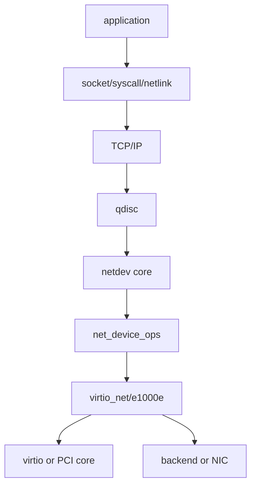
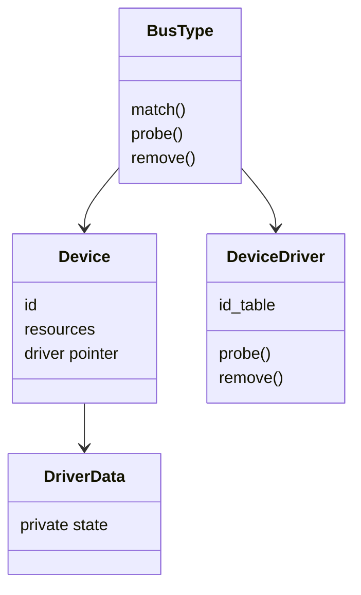
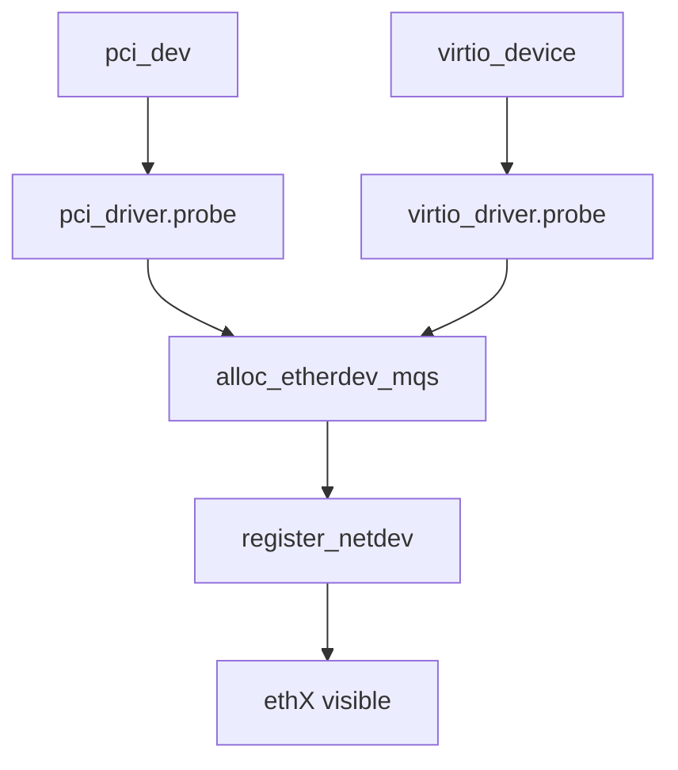
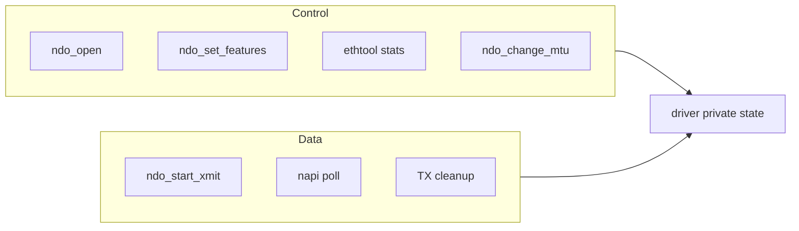

# 01 Linux 驱动模型与内核位置

## 1. 从用户命令看到硬件

`ip link`、`ethtool` 和 socket 不直接调用某个驱动函数。它们经过系统调用、rtnetlink/netdev core，再由 `net_device_ops` 或 `ethtool_ops` 分派。



驱动处于“设备机制”和“Linux 网络语义”的边界。向上不能泄漏硬件细节，向下必须精确遵守寄存器或 virtqueue 协议。

## 2. 设备模型的四个角色



- bus 负责枚举和匹配；
- device 表示被发现的实例；
- driver 提供匹配表和回调；
- driver data 保存每个实例的私有状态。

## 3. 为什么需要统一 driver model

统一模型让 sysfs、power management、hotplug、bind/unbind、deferred probe 和资源生命周期具有一致语义。否则每种驱动都要自己发明设备发现与卸载机制。


## 4. netdev core 是第二层框架

总线完成设备绑定后，网络驱动还要注册 `struct net_device`。因此一个网卡驱动同时参与两套框架：

1. bus/device/driver 模型处理“设备存在”；
2. net_device 模型处理“设备能作为网络接口工作”。



## 5. 源码坐标

常见目录不是绝对规则，但足以建立导航：

| 内容 | 常见位置 |
|---|---|
| netdev core | `net/core/`、`include/linux/netdevice.h` |
| virtio core/ring | `drivers/virtio/`、`include/linux/virtio*.h` |
| virtio_net | `drivers/net/virtio_net.c` |
| e1000e | `drivers/net/ethernet/intel/e1000e/` |
| PCI core | `drivers/pci/`、`include/linux/pci.h` |
| ethtool | `net/ethtool/`、`include/linux/ethtool.h` |

不要背行号。内核版本变化会移动代码；应记住对象、回调名和目录边界，再用 `rg` 定位。

## 6. 数据面和控制面



控制面低频但可睡眠场景较多，数据面高频且受软中断、锁和 cache locality 约束。阅读时混在一起会误判锁语义与性能影响。

## 7. 模块和内建驱动

驱动可以编译为模块，也可以内建。`module_init()` 只是注册 driver，真正针对某个设备的初始化发生在匹配后的 `probe()`。这解释了为什么加载模块成功不等于设备已经正常工作。

验证链应区分：

```text
module loaded -> driver registered -> device matched -> probe success
-> netdev registered -> interface opened -> carrier/queue ready
```

## 8. 阅读检查点

- 找到 driver 结构和 ID table；
- 找到 `probe/remove`；
- 找到 `alloc_etherdev*` 与 `register_netdev`；
- 找到 `netdev_ops`、`ethtool_ops`；
- 找到设备对象、netdev、私有结构的互相引用；
- 找到 error label 和 remove 的逆序释放链。
