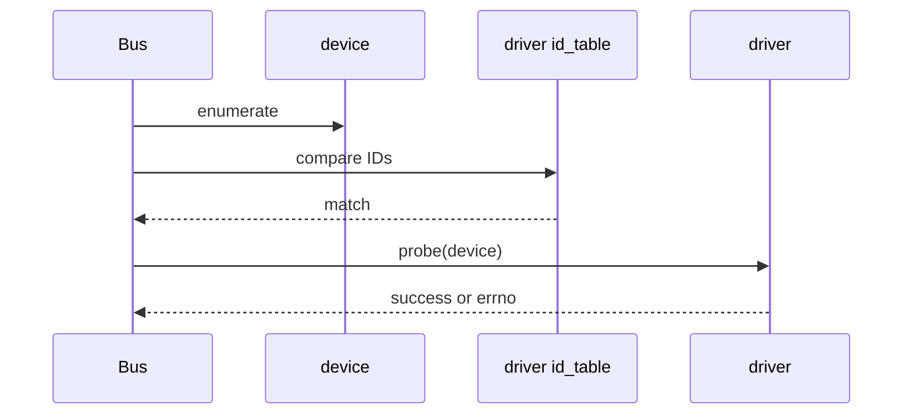
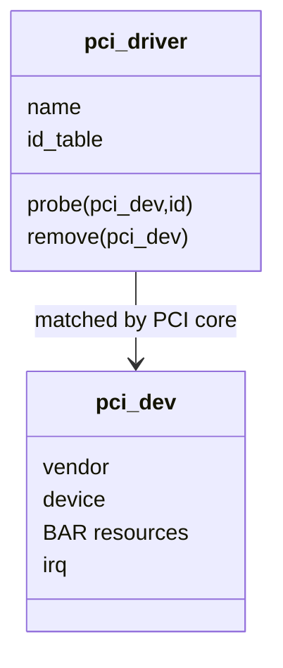
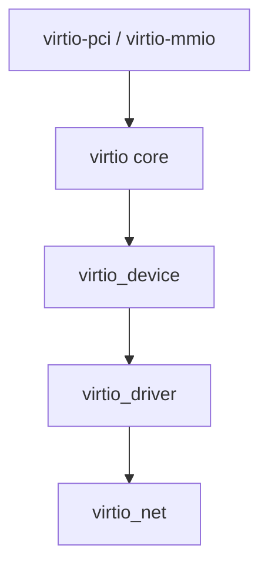
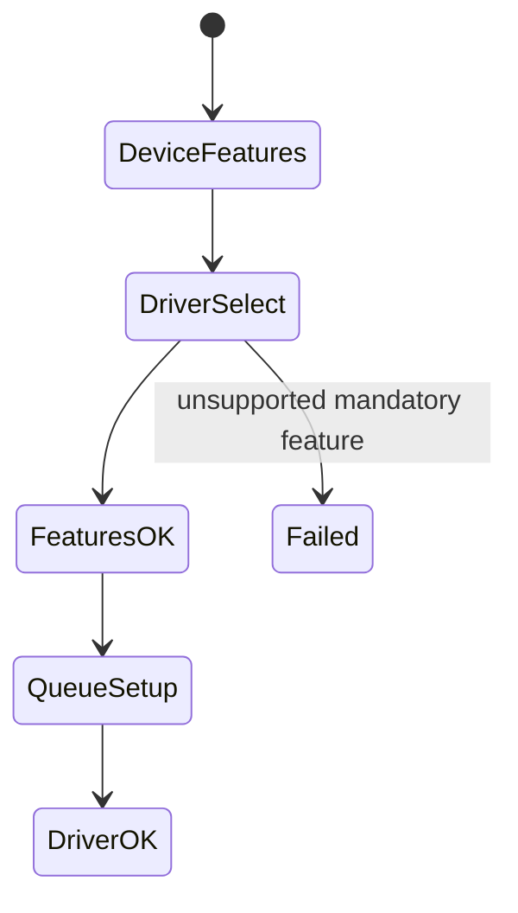
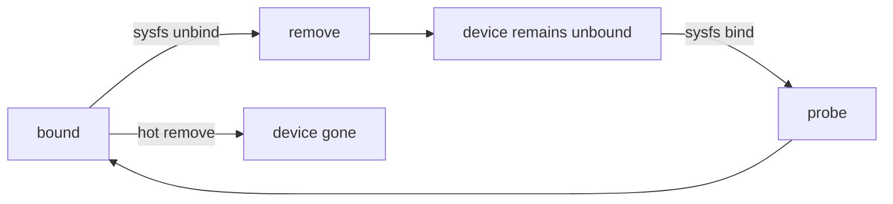

# 02 PCI 与 virtio 总线匹配

## 1. 匹配发生在 probe 之前

驱动不会主动遍历所有设备调用自己的 `probe()`。bus 根据设备 ID 与 driver ID table 决定是否绑定，匹配成功后框架调用 probe。



## 2. PCI 匹配模型

PCI 设备提供 vendor/device/subsystem/class 等标识。`struct pci_driver` 通过 `pci_device_id` 表匹配，probe 收到 `struct pci_dev` 和匹配项。



典型 probe 还会执行：enable device、request regions、设置 DMA mask、映射 BAR、申请 netdev、初始化 adapter、注册 netdev。顺序失败时必须逆序回滚。

## 3. virtio 匹配模型

virtio 是一套标准化半虚拟设备接口。transport 可以是 PCI、MMIO 或其他形式，但 `virtio_net` 面向 `virtio_device`，不直接处理具体 transport 的 BAR 布局。



这是一层解耦：virtio transport 解决“如何访问虚拟设备”，virtio_net 解决“如何把网络语义映射到 virtqueue”。

## 4. feature negotiation 属于绑定协议

virtio device 宣告 feature bits，driver 接受自己理解且支持的子集。未协商成功的能力不能擅自使用。



feature negotiation 不只是性能开关，也影响 header 布局、队列数量、控制 virtqueue 和 mergeable buffer 等协议语义。

## 5. PCI 物理设备初始化与 virtio 初始化对照

| 阶段 | e1000e/PCI | virtio_net |
|---|---|---|
| 发现 | PCI enumeration | virtio transport enumeration |
| 匹配 | vendor/device ID | virtio device ID |
| 资源 | BAR、DMA、IRQ | virtqueue、feature、config ops |
| 通知 | MMIO register | virtqueue notify/kick |
| 配置 | device registers/PHY | virtio config space/control VQ |
| reset | hardware reset sequence | virtio reset/status protocol |

## 6. bind、unbind 与 hotplug



unbind 是极有价值的生命周期测试，但会中断网络。必须在可恢复的实验环境执行，并确保管理连接不依赖目标接口。

## 7. 错误码为什么重要

probe 返回值决定 bind 是否成功：

- `0`：设备已被驱动接管；
- `-ENODEV`：设备或配置不适用；
- `-ENOMEM`：资源分配失败；
- `-EPROBE_DEFER`：依赖未就绪，框架稍后重试；
- 其他错误：记录真实失败原因，且已分配资源必须回滚。

## 8. 源码阅读命令

```bash
rg -n "struct (pci_driver|virtio_driver)" drivers/net drivers/virtio
rg -n "\.probe|\.remove|id_table" drivers/net/virtio_net.c \
  drivers/net/ethernet/intel/e1000e
rg -n "pci_enable_device|pci_request_regions|dma_set_mask" \
  drivers/net/ethernet/intel/e1000e
```

不要先搜所有 `probe`。限定目录和对象类型，才能看到当前驱动的注册链而不是全内核噪声。
