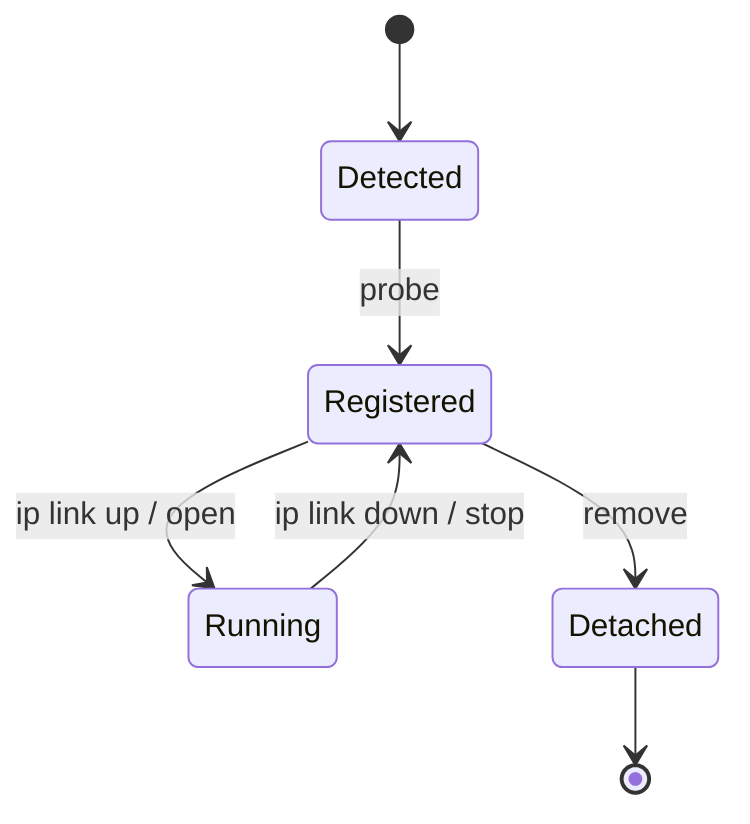
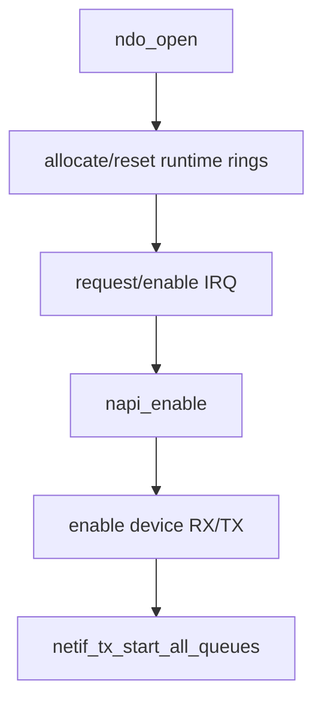
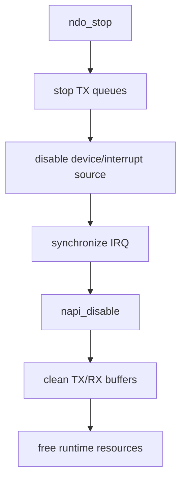
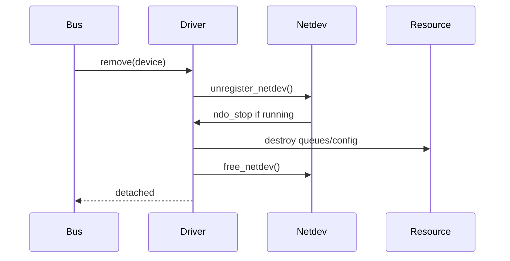
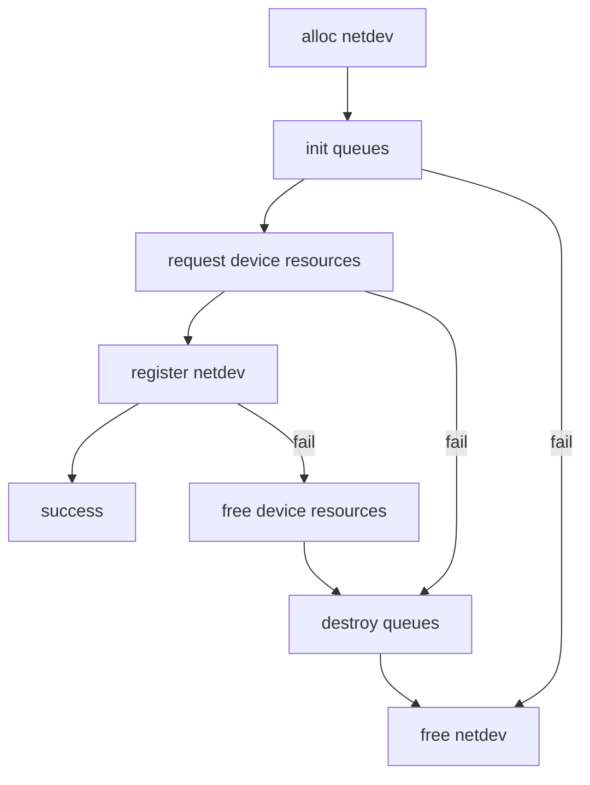

# 03 probe、open、stop、remove 生命周期

## 1. 四个回调解决四类问题

| 回调 | 触发者 | 目标 | 是否可重复 |
|---|---|---|---|
| `probe()` | bus core | 建立设备实例和 netdev | 每次 bind 一次 |
| `ndo_open()` | netdev core | 启动数据面 | 可多次 up |
| `ndo_stop()` | netdev core | 停止数据面 | 与 open 对称 |
| `remove()` | bus core | 销毁实例 | 每次 unbind 一次 |

## 2. probe 创建长期对象

probe 通常完成：

1. 建立 DMA 和设备访问能力；
2. 分配 `net_device` 与私有结构；
3. 读取能力并设置 ops/features；
4. 建立队列元数据；
5. 注册 netdev；
6. 保存 device 与 netdev 的双向关联。

不一定在 probe 中启动 IRQ 和 packet queue，因为接口可能保持 administratively down。

## 3. open 启动可运行资源

实际顺序依设备而异，但原则是：任何事件源被打开前，处理该事件所需的数据结构必须已就绪。

## 4. stop 的顺序为何敏感

停止时先阻止新工作，再等待在途工作，再释放资源。

若先释放 ring 再关闭 IRQ，迟到中断可能访问已释放内存。若只关 IRQ 不停止 DMA，设备仍可能写入 buffer。

## 5. remove 是 probe 的逆操作

`unregister_netdev()` 可能触发关闭路径，因此 remove 不能假定设备已经 down，也不能重复释放由 stop 管理的资源。

## 6. error label 是生命周期文档

真实 probe 常有多个 `goto err_*`。它们不是坏味道本身，而是在 C 中表达分阶段资源所有权。

审查时检查每个失败点是否只释放已经成功获得的资源，并与正常 remove 路径一致。

## 7. reset、suspend 与异常恢复

真实驱动还可能有 reset、freeze/restore、AER、config changed 等路径。它们经常复用 open/stop 的局部步骤，但状态前提不同。

不要看到同一个 cleanup helper 被多个路径调用就认为重复。先列出每条路径进入时：

- 数据面是否 running；
- IRQ/NAPI 是否 enabled；
- device 是否还能访问；
- netdev 是否已注册；
- 是否允许睡眠。

## 8. 生命周期验证矩阵

| 场景 | 观察点 |
|---|---|
| 模块加载/设备 bind | probe 成功、接口出现 |
| `ip link up/down` 循环 | open/stop 对称、无泄漏/告警 |
| traffic 中 down | 队列停止、在途 skb 正确回收 |
| bind/unbind | remove 完整、再次 probe 成功 |
| feature/MTU 变更 | 必要 reset 后状态恢复 |
| 故障注入 | error label 无 double free/leak |

## 9. 记忆方法

`probe/remove` 管“设备实例的出生与死亡”，`open/stop` 管“网络数据面的营业与打烊”。把两组生命周期混起来，是驱动资源泄漏和 use-after-free 的常见根源。
