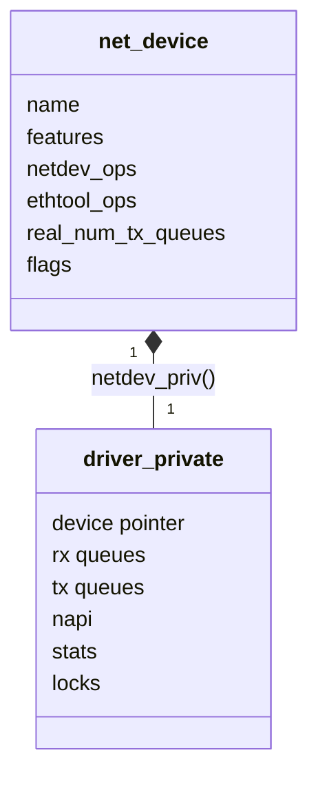
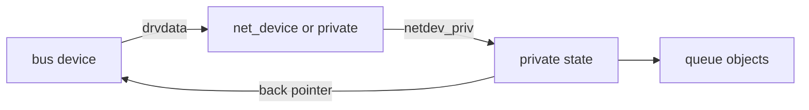
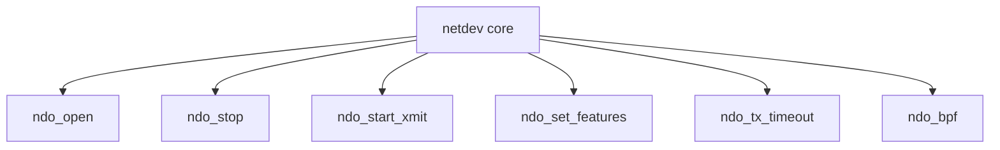
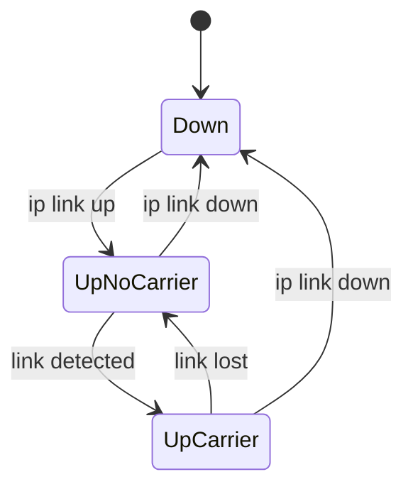

# 04 net_device、私有状态与 ops

## 1. net_device 是协议栈看到的设备

`struct net_device` 不是硬件寄存器镜像。它是网络子系统的统一接口对象，包含接口状态、feature、队列、地址、ops 等公共语义。

驱动私有状态通常随 `alloc_etherdev_mqs(sizeof(private), txq, rxq)` 一起分配，可用 `netdev_priv()` 取得。

## 2. 三种指针关系

阅读时要确认 `dev_set_drvdata`、`pci_set_drvdata`、`virtio_set_drvdata` 保存的究竟是 netdev 还是 private。误判会让 remove 和 config callback 的调用链看起来断裂。

## 3. net_device_ops 是数据面与管理入口

常见回调：

| 回调 | 语义 |
|---|---|
| `ndo_open` / `ndo_stop` | 启停接口数据面 |
| `ndo_start_xmit` | 接管待发送 skb |
| `ndo_set_rx_mode` | 更新单播/组播/混杂模式 |
| `ndo_change_mtu` | 修改 MTU 并校验设备约束 |
| `ndo_set_features` | 应用 feature/offload 变化 |
| `ndo_tx_timeout` | TX watchdog 超时恢复入口 |
| `ndo_bpf` | XDP 程序装载或 XSK 配置 |

ops 是“框架调用驱动”的边界。不要直接从函数名猜调用者，应回到 ops 表确认它是否是回调、helper 还是内部阶段。

## 4. ethtool_ops 是专门控制面

```mermaid
sequenceDiagram
    participant User as ethtool
    participant NL as netlink/ioctl
    participant Core as ethtool core
    participant Drv as ethtool_ops
    User->>NL: query/set
    NL->>Core: normalized request
    Core->>Drv: get/set callback
    Drv-->>Core: capabilities/stats/result
    Core-->>User: response
```

统计字符串数量、名称和数据数组必须保持稳定对应，否则用户空间会把某个计数解释成另一个字段。

## 5. queue 对象不等于硬件 queue

Linux 有 `netdev_queue`、subqueue、traffic class 等软件队列；驱动内部还有 TX/RX ring 或 virtqueue。两者通常按 queue index 映射，但不是同一个对象。

停止软件 subqueue 是反压协议栈，不等于停止设备 DMA。reset/stop 时两层都要处理。

## 6. 注册前后边界

`register_netdev()` 之后，其他 CPU 和用户空间可能开始看到接口并调用回调。于是：

- ops 和 features 必须已设置；
- private state 必须处于合法初始状态；
- error path 必须使用 `unregister_netdev()` 后才能释放可见对象；
- remove 要先撤销对外可见性，再释放内部资源。

## 7. 状态位与 carrier

administrative up、carrier、TX queue running 是不同维度：

接口 up 不保证链路 ready；`netif_carrier_on/off` 表示介质或后端连接状态，`netif_tx_start/stop_queue` 表示发送调度是否接受新 skb。

## 8. 阅读检查表

- private struct 的定义与生命周期；
- bus device/netdev/private 如何互相定位；
- `net_device_ops` 和 `ethtool_ops` 表；
- queue 数量何时决定、何时调整；
- features 在注册前如何初始化；
- register 后哪些异步 callback 可能发生。
