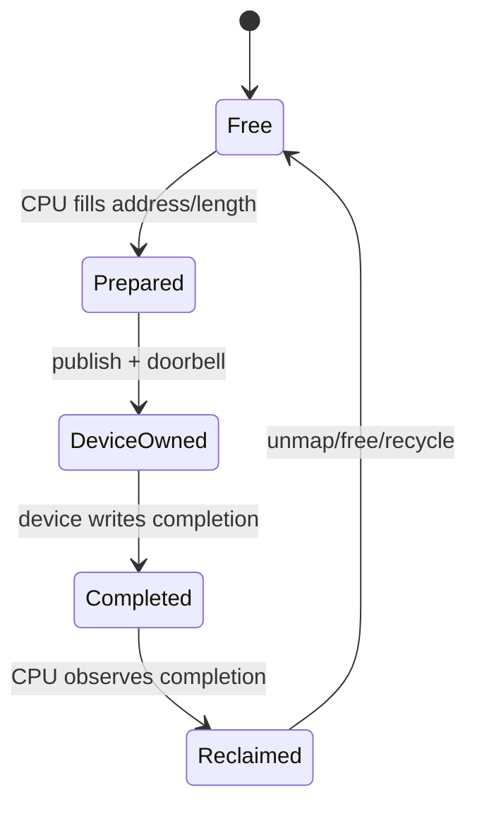
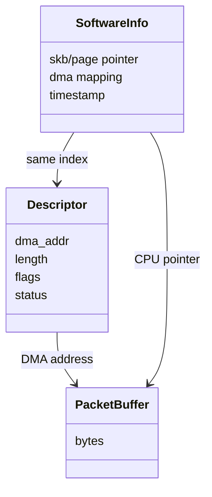
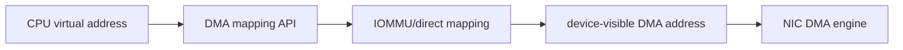
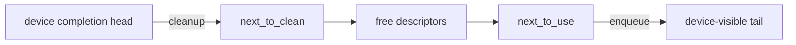
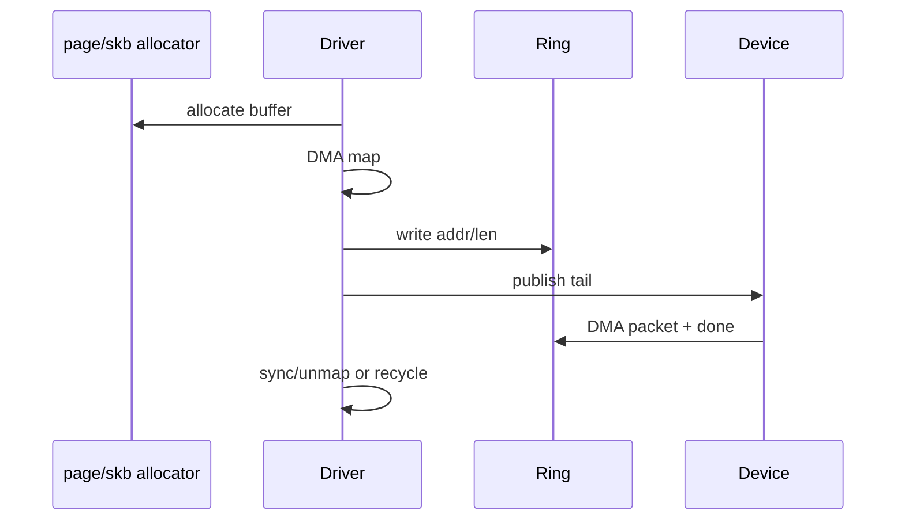
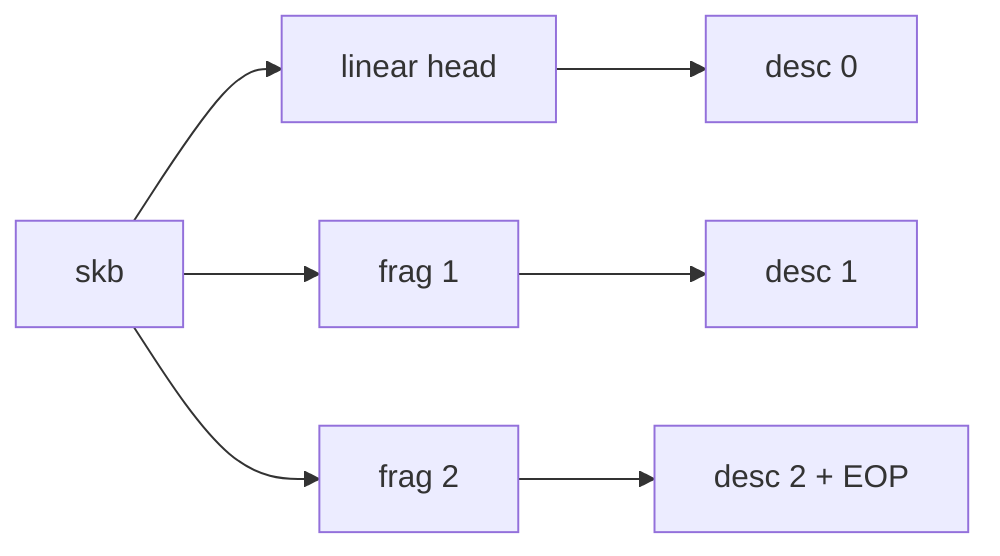
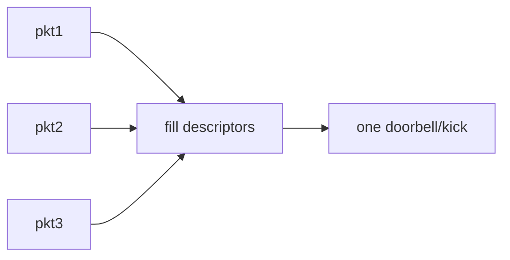

# 05 queue、ring、DMA 与 ownership

## 1. 为什么必须从 ownership 读 ring

ring 是循环使用的 descriptor 数组。索引只是位置，真正决定能否访问的是所有权和状态协议。

任何跳步都危险：未完全填充就 publish，设备可能 DMA 到错误地址；未确认完成就 unmap，设备可能继续访问已释放页。

## 2. descriptor 与 packet buffer 分层

descriptor 给设备看，software info 给驱动回收时看。两者常按 index 对齐，但字段布局和可见性不同。

## 3. DMA 地址不是 CPU 指针

`dma_map_single/page()` 建立设备可访问地址，返回 `dma_addr_t`。驱动应按 DMA API 的方向和生命周期使用，不应假设物理地址等于 DMA 地址。

## 4. coherent 与 streaming mapping

| 类型 | 典型用途 | 关键规则 |
|---|---|---|
| coherent | descriptor ring、共享控制结构 | CPU/设备长期共享，仍需顺序屏障 |
| streaming | skb data、page fragment | map/unmap 或 sync 表达所有权转换 |

coherent 解决 cache coherence，不自动保证“先写 descriptor 再写 doorbell”的程序顺序。

## 5. producer/consumer 索引

环空间必须保留明确判定：使用计数、phase bit 或空槽规则区分 full 与 empty。只比较 head==tail 而没有额外状态，会产生歧义。

## 6. RX buffer 补充

性能驱动常用 page_pool 或 buffer reuse 减少分配与 DMA mapping 开销，但 ownership 规则没有消失，只是由 helper 编码。

## 7. TX scatter-gather

一个 skb 可能包含 linear data 和多个 fragments，因此一个 packet 占用多个 descriptors。空间检查必须按 descriptor 数而不是 packet 数。

若中间 mapping 失败，要逆序 unmap 已成功片段，且 skb 所有权仍需符合 `ndo_start_xmit` 返回值。

## 8. doorbell batching

每填一个 descriptor 就通知设备简单但昂贵。驱动可用 `xmit_more`、批量提交或事件抑制减少 MMIO/kick。

批处理提升吞吐，却可能增加低负载延迟。读代码时要同时追踪“何时填充”和“何时真正通知”。

## 9. 常见故障

| 现象 | 可能机制 |
|---|---|
| TX queue 永久停止 | completion 未回收或 wake 条件错误 |
| RX 丢包增长 | refill 不及时、ring 空、NAPI budget 饱和 |
| 数据损坏 | DMA direction/sync/length/ownership 错误 |
| 偶发 hang | memory ordering 或 doorbell 丢失 |
| unmap warning | mapping 生命周期与 descriptor 完成不一致 |

## 10. 一句话检查法

对每个索引写下：谁推进、依据什么完成位、推进前需要什么屏障、失败后谁回收。能回答这四问，才算真正读懂 ring。
