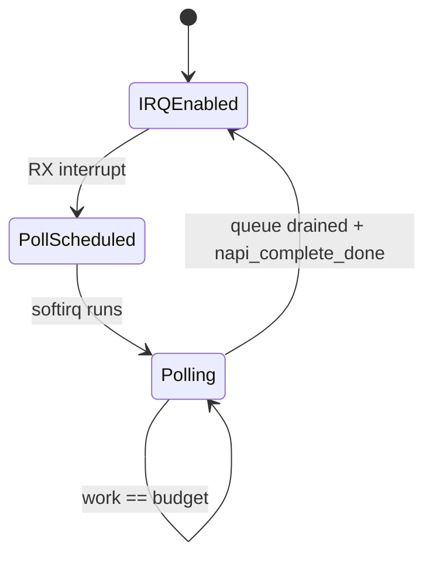
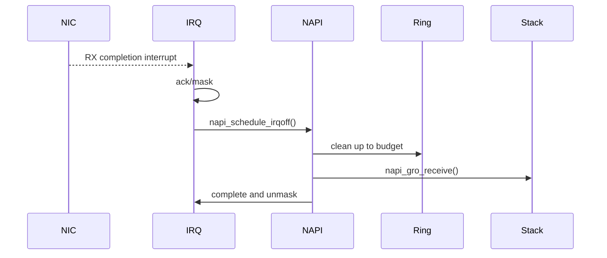
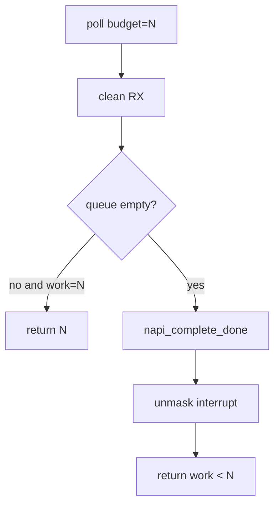
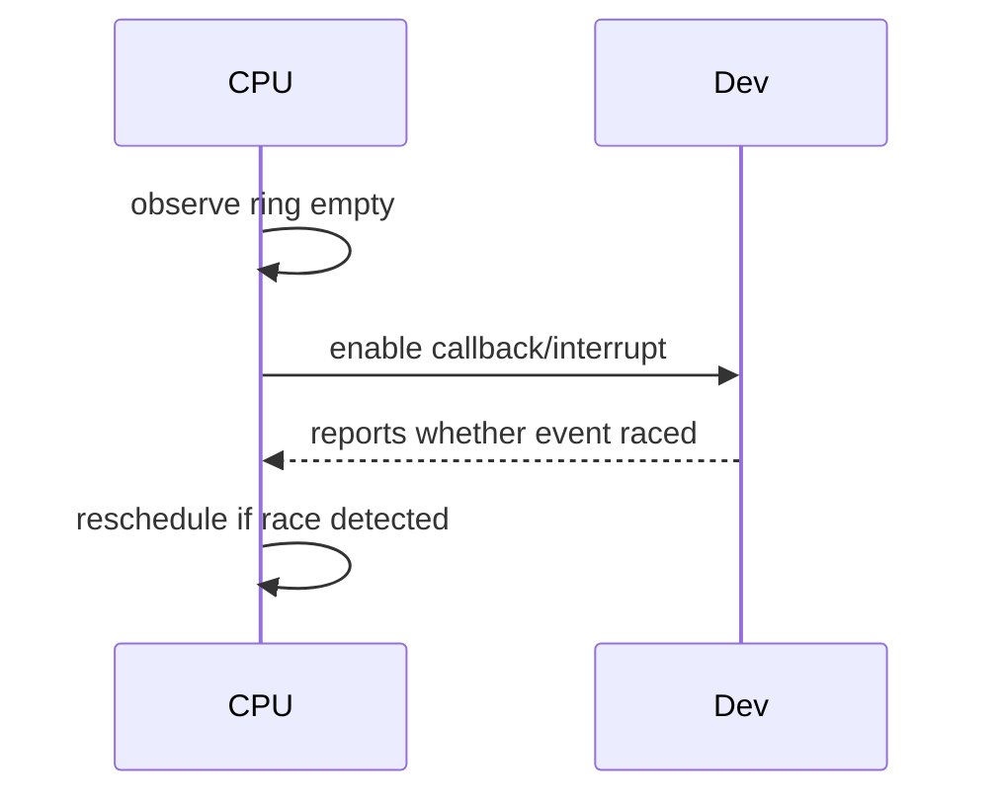
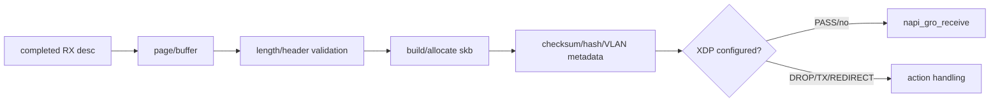
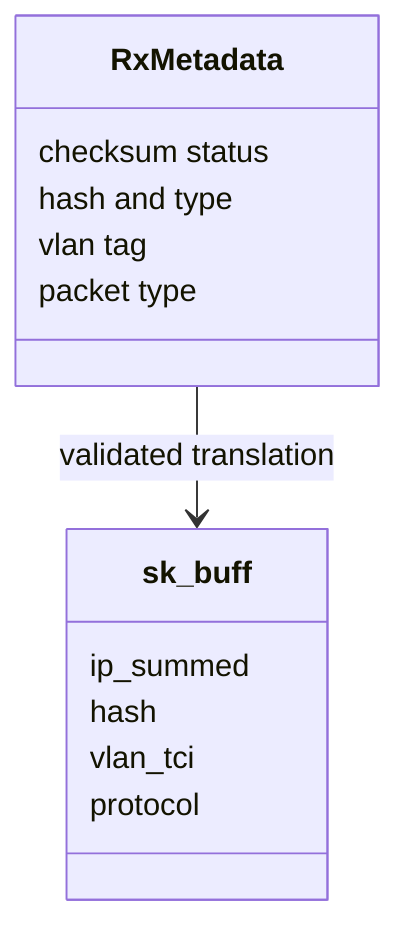
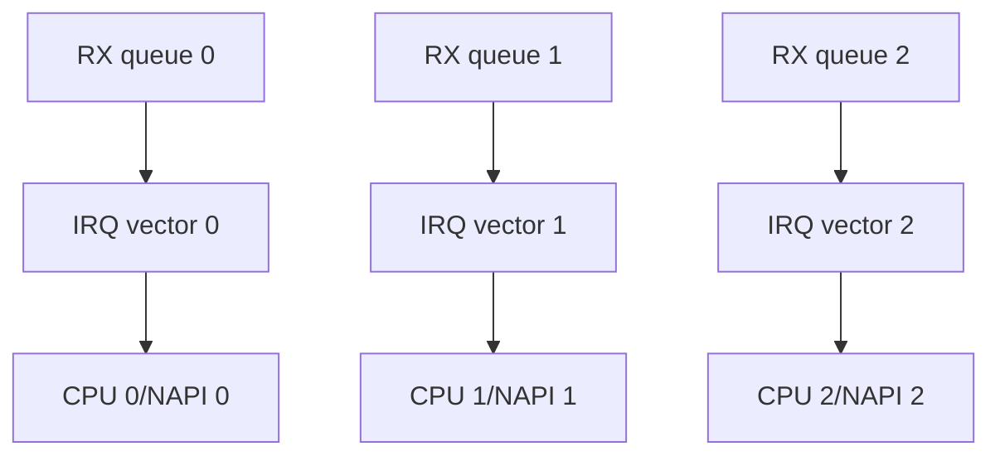

# 06 RX：IRQ、NAPI 与 buffer 生命周期

## 1. 为什么不是每包一个完整中断

高包速下，纯中断会产生 interrupt livelock。NAPI 采用“中断唤醒，poll 批处理”的混合模型。

## 2. 中断处理函数应短

典型 RX IRQ/callback：确认事件、屏蔽或抑制同队列中断、schedule NAPI，然后尽快返回。真正 descriptor 清理、skb 构造和 GRO 在 poll 中完成。

## 3. budget 是公平性协议

poll 返回处理数量。若达到 budget，NAPI core 认为可能仍有工作，会继续调度；若队列已清空，驱动调用 complete 并恢复中断。

错误地在仍有包时 complete，可能依赖新中断才能继续；错误地永不 complete，会让队列长期处于 polling 状态。

## 4. lost wakeup 窗口

“确认 ring 空”和“重新打开中断”之间可能到新包。硬件/virtqueue 协议通常提供重新检查或事件索引机制避免丢唤醒。

阅读 virtqueue callback enable/disable 返回值时，重点看这个 race，而不是把它当普通开关。

## 5. 从 descriptor 到 skb

零拷贝程度取决于 buffer 模型。即使 `build_skb()` 不复制 payload，也要处理 headroom、alignment、shared info 和 page recycling。

## 6. checksum、GRO 与 metadata

设备或后端可能提供 checksum verified、RSS hash、VLAN tag、GSO type 等元数据。驱动必须把它们翻译成 skb 字段，错误标记会导致协议栈跳过必要校验或错误合并。

## 7. 多队列和 CPU 亲和性

RSS、IRQ affinity、RPS/XPS、NUMA 和 application CPU placement 共同决定 cache locality。观察单个 poll 函数不足以解释跨 CPU 性能。

## 8. virtio_net 与 e1000e 差异

| 维度 | virtio_net | e1000e |
|---|---|---|
| 完成来源 | used virtqueue/callback | RX descriptor done + IRQ |
| buffer header | virtio net header | hardware descriptor metadata |
| 通知恢复 | virtqueue callback protocol | interrupt register/mask |
| queue 组织 | 通常 per receive queue NAPI | 依硬件/驱动版本组织 |

## 9. 观测指标

- IRQ 次数与每次 NAPI work；
- `work == budget` 比例；
- RX packets/bytes/drops/no-buffer；
- GRO input/merge/output；
- softirq CPU 与队列亲和；
- refill failure、allocation failure；
- ring occupancy 或完成积压。

## 10. 排障顺序

先确认设备有 completion，再确认 IRQ/callback 到达，再确认 NAPI 被 schedule，再确认 poll 读取 descriptor，最后确认 skb 进入 GRO/协议栈。按层验证比只看 `rx_packets` 更快定位断点。
