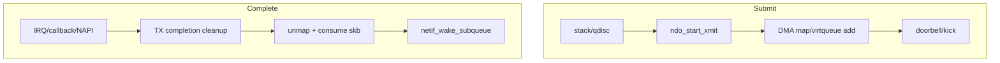
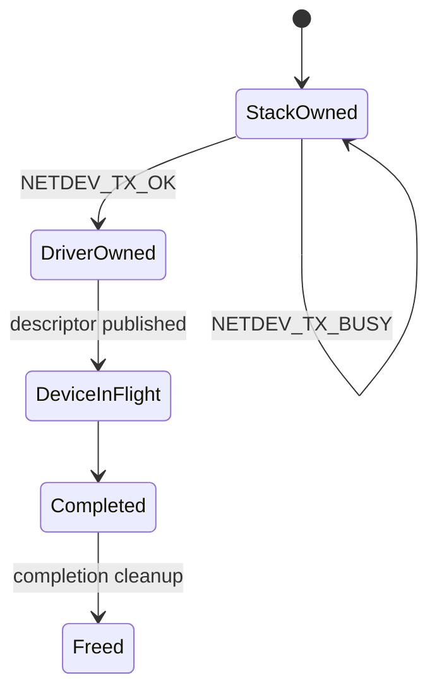
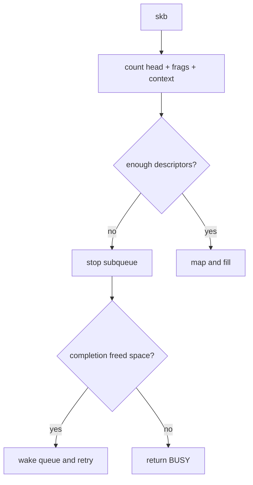
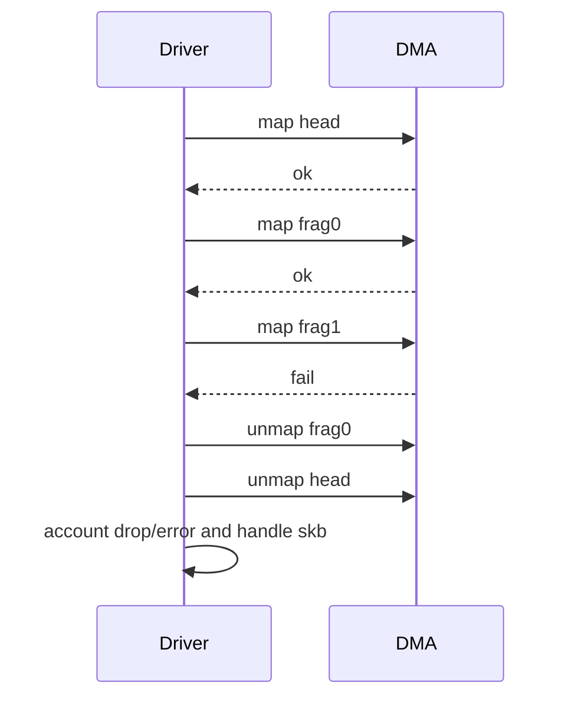
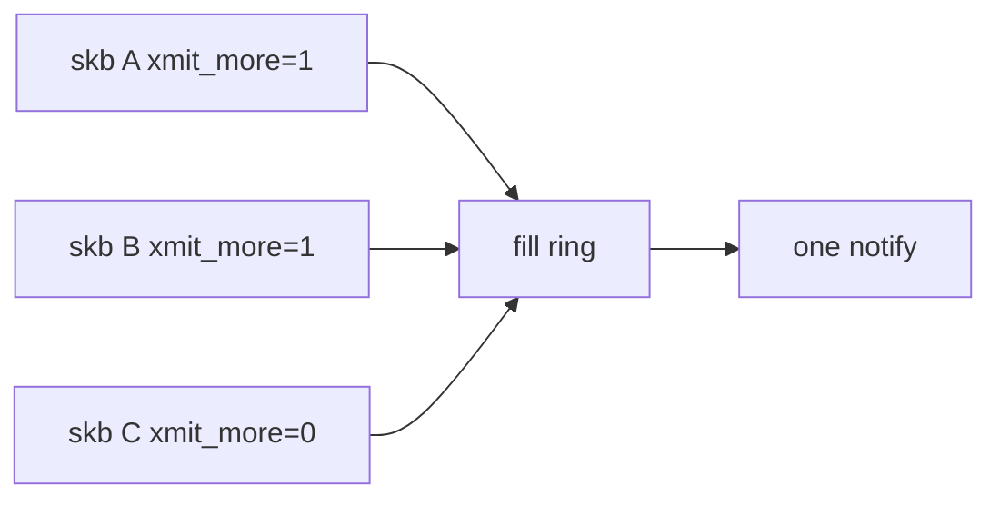
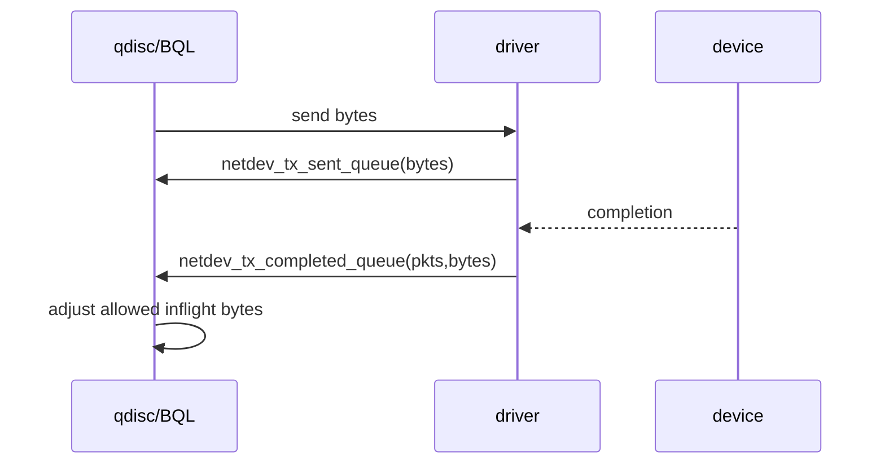
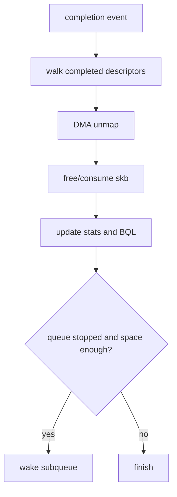
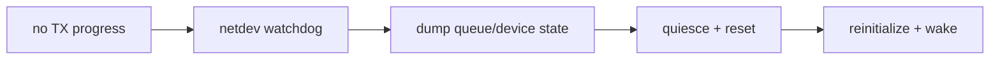

# 07 TX：xmit、completion 与流控

## 1. TX 有两条路径

发送提交和发送完成通常不在同一调用栈：

只读 `ndo_start_xmit` 会漏掉 skb 最终释放、BQL 完成、queue wake 和错误统计。

## 2. skb ownership 与返回值

如果返回 `NETDEV_TX_BUSY`，驱动不能已经消费、修改到不可重试或释放 skb。更好的驱动通常在进入 xmit 前通过 queue stop 避免频繁 BUSY。

## 3. descriptor 空间预估

stop 后必须重新检查空间，避免 completion 正好发生在 stop 窗口，导致队列已经有空间却永远没有人 wake。

## 4. mapping 失败回滚

一个 skb 可能映射多个段：

不能把半成品 descriptor 暴露给设备。软件索引也要恢复到提交前一致状态。

## 5. doorbell/kick 与 xmit_more

`netdev_xmit_more()` 给驱动批量提示，但驱动仍要在队列将满、特殊 timestamp 或 flush 条件下及时通知。

## 6. BQL 与软件排队

Byte Queue Limits 根据已发送和已完成字节动态限制驱动队列中的在途数据，减少 bufferbloat。

提交和完成记账必须成对，否则 BQL 会错误地压制或放大队列。

## 7. TX completion 清理

清理通常批量进行。过少会增加中断/锁开销，过多可能占用 NAPI budget 或影响 RX 公平性。

## 8. watchdog 与 timeout

netdev watchdog 发现队列长时间无进展时调用 `ndo_tx_timeout`。timeout 是症状入口，不应只重置统计。

恢复前应保存足够证据：producer/consumer index、queue stop 状态、interrupt status、device state 和最近 completion 时间。

## 9. virtio 与物理 NIC 通知对照

| 步骤 | virtio_net | e1000e |
|---|---|---|
| 添加 buffer | virtqueue add APIs | 填 TX descriptor |
| 通知 | `virtqueue_kick*` | 写 tail/doorbell register |
| 完成 | used ring | descriptor done bit |
| 回收 | detach/consume skb | unmap software info + skb |

## 10. TX 排障链

1. 协议栈是否调用 xmit；
2. queue 是否 stopped；
3. descriptor 是否填充并发布；
4. doorbell/kick 是否发生；
5. device 是否推进完成；
6. IRQ/NAPI 是否清理；
7. skb/BQL/stats 是否完成记账；
8. queue 是否在空间恢复后 wake。
