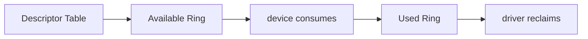
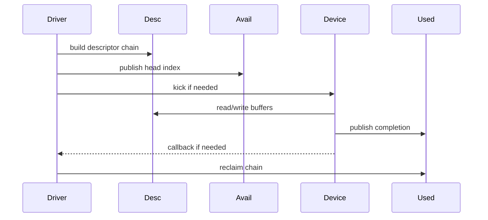
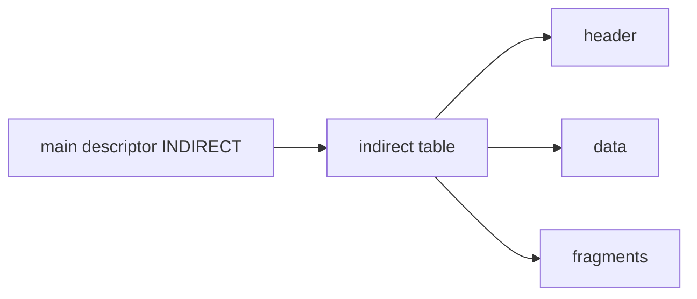
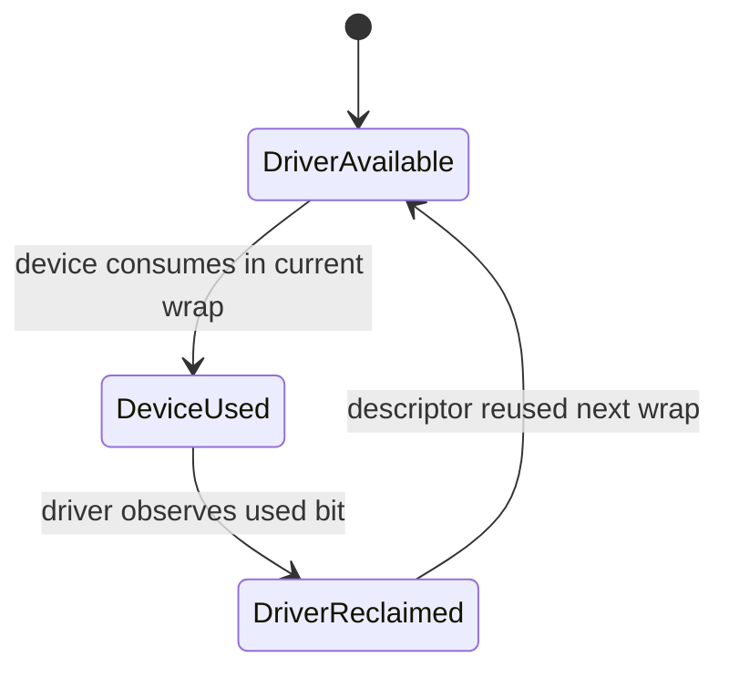
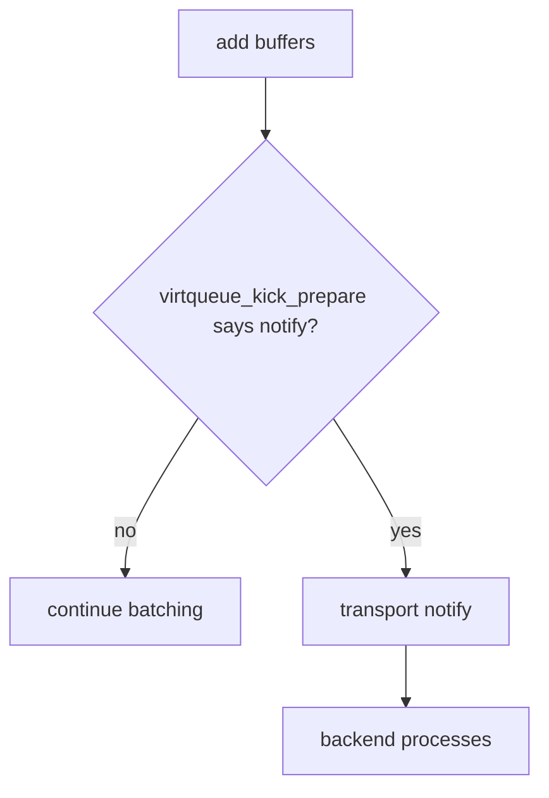
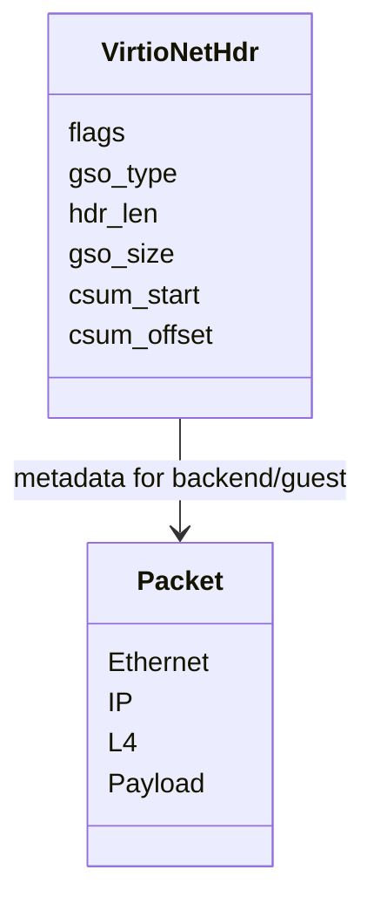
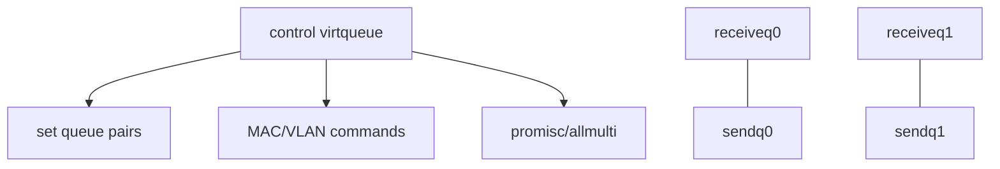

# 08 virtqueue、feature negotiation 与布局

## 1. virtio 的边界

virtio 不是“没有硬件的假网卡”，而是 guest driver 与 device/backend 之间的标准协议。`virtio_net` 使用 virtqueue 交换 buffer，用 config/status/feature 协商能力。

## 2. split virtqueue 三个区域

- descriptor table 描述 buffer 链；
- avail ring 由 driver 发布可用 head；
- used ring 由 device 发布已消费 head 和长度。

## 3. ownership 与索引

`avail->idx` 与 `used->idx` 都会回绕。读取 used 前、发布 avail 后的内存序由 virtqueue helper 和 transport 规则共同保证，不应绕过 helper 随意访问。

## 4. indirect descriptor

scatter-gather 很多时，主 descriptor 可以指向一张间接表，减少主 ring 槽位消耗。

是否可用取决于 feature negotiation。间接表本身也有 DMA/释放生命周期。

## 5. packed virtqueue

packed ring 把 descriptor、avail/used 状态压到同一环，并通过 wrap counter 区分轮次，目标是改善 cache locality、减少内存访问。

不要用 split ring 的三个数组心智模型机械解释 packed ring；共同点仍是 descriptor ownership 和通知抑制。

## 6. event suppression

每次 add 都 kick、每次 used 都 interrupt 会产生高 VM-exit/通知成本。event index 或 packed event structure 允许对方指定“推进到哪里再通知”。

通知抑制必须处理竞态：对方可能在关闭通知与检查 ring 之间新增工作。

## 7. virtio_net header

网络 buffer 前通常带 virtio net header，传递 checksum、GSO、分段和 receive hash 等信息。

协商 feature 会改变 header 语义或附加字段，因此 buffer layout 必须与最终 features 一致。

## 8. 多队列和 control virtqueue

data virtqueue 承担包，control virtqueue 承担低频配置。控制命令也有 descriptor 提交、设备响应和超时语义。

## 9. config change 与 link state

backend 可以通知 config change，driver 读取 status 并更新 carrier。callback 可能在异步上下文，读取配置与 netdev 状态更新要遵守框架要求。

## 10. 读 virtio_net 的定位法

先按五组函数分类：

1. probe/feature/queue discovery；
2. receive buffer refill 与 RX poll；
3. start_xmit/add/kick 与 TX reclaim；
4. control virtqueue、config callback；
5. freeze/restore/remove/reset。

这样可以把大文件拆成协议阶段，而不是按源码行序阅读。
