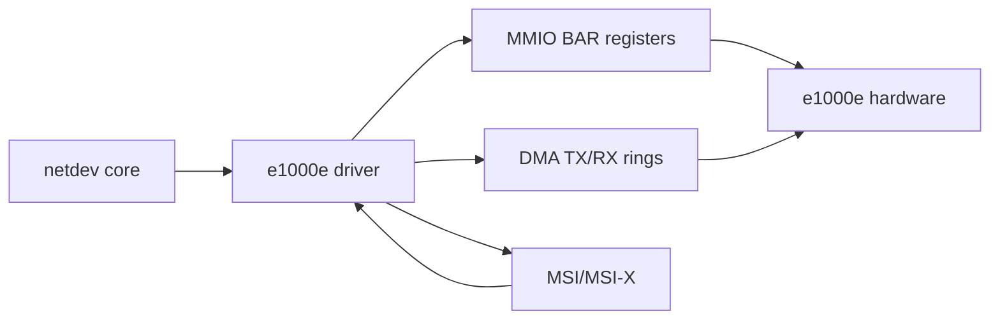
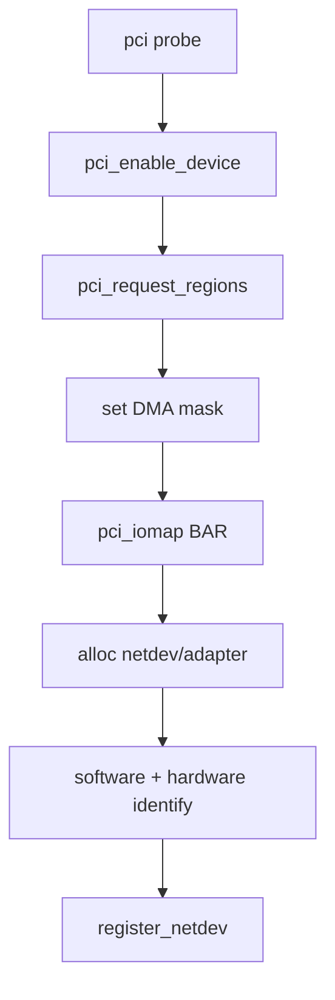
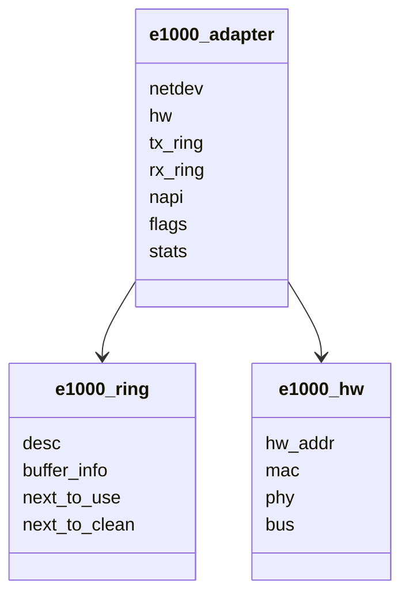
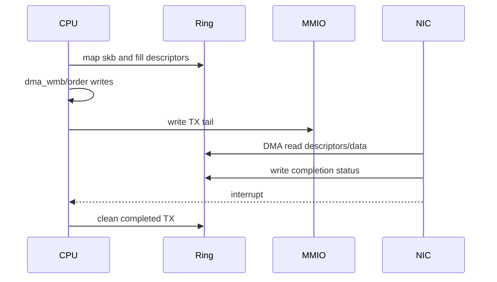
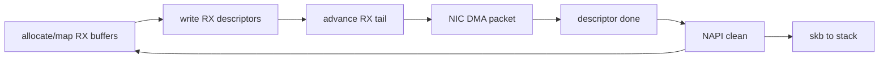
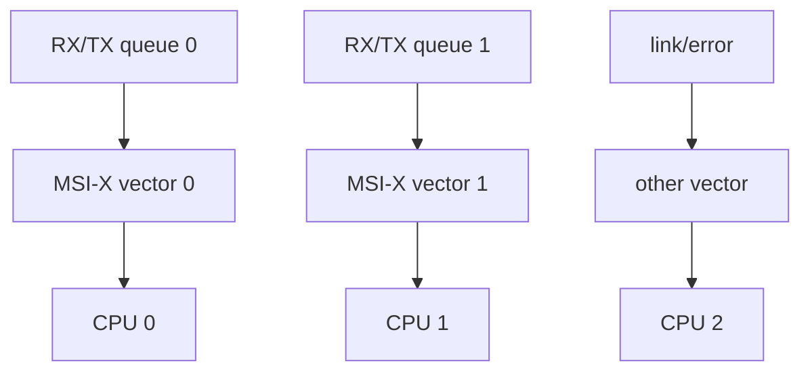
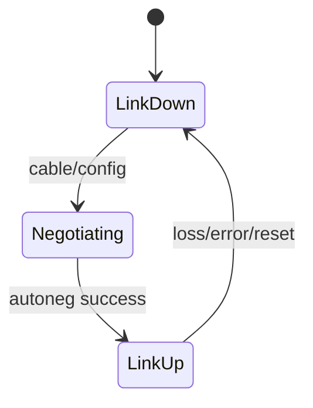

# 09 e1000e 硬件路径、寄存器与中断

## 1. 为什么在 virtio_net 后读 e1000e

virtio_net 展示标准化虚拟设备协议，e1000e 展示传统 PCI NIC 的 BAR、DMA descriptor、PHY、interrupt moderation 和 reset。二者对照能分离 Linux 共性与硬件特性。

## 2. PCI probe 的资源链

每步都可能失败，error path 必须逆序释放。BAR 映射成功不等于硬件已开启收发。

## 3. adapter、ring 与 hardware state

`adapter` 是驱动级聚合对象，`hw` 封装寄存器/芯片族差异，ring 保存数据面队列状态。

## 4. TX descriptor 与 tail register

写 tail 是 doorbell。若 descriptor 写入尚未对设备可见就写 tail，NIC 可能读取半成品。

## 5. RX descriptor 与 refill

RX ring 耗尽意味着硬件没有可写 buffer。此时链路可能仍是 up，但包会在 NIC 侧丢弃。

## 6. legacy、MSI 与 MSI-X

| 模式 | 特点 | 队列扩展性 |
|---|---|---|
| legacy INTx | 共享、level triggered、需确认来源 | 低 |
| MSI | message interrupt，通常较少向量 | 中 |
| MSI-X | 多向量、可做 queue/other 分离 | 高 |

具体 e1000e 硬件队列数量和向量组织受芯片与驱动版本限制，不要把现代高端 NIC 的 per-queue 模式强套到所有 e1000e。

## 7. interrupt moderation

更高 moderation 减少 IRQ、提高吞吐，但增加完成延迟。动态 ITR 会根据流量调整，性能测试必须记录配置。

## 8. PHY、link 与 watchdog

物理 NIC 还要管理 PHY、autoneg、link speed/duplex、EEE 等。link 状态可能由中断、定时任务或 watchdog 更新，不一定在 fast path。

## 9. reset 不是简单清零

reset 需要：停止 queue 和 DMA、屏蔽中断、等待在途访问、重置硬件、重新编程 ring/register、恢复 filter/feature/link state，最后再开放数据面。

## 10. 对照阅读问题

- e1000e 的 tail register 对应 virtio 的哪个 notify 概念？
- descriptor done 对应 used ring 的哪个阶段？
- BAR/register 访问在 virtio_net 中被哪层 transport 隐藏？
- 物理 PHY/link 管理在 virtio backend 中由谁提供？
- 两者的 NAPI 与 netdev queue 语义为什么仍相同？
