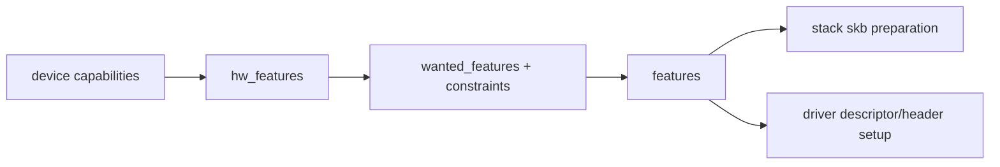
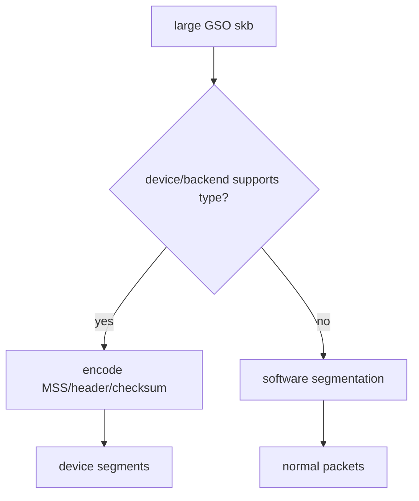
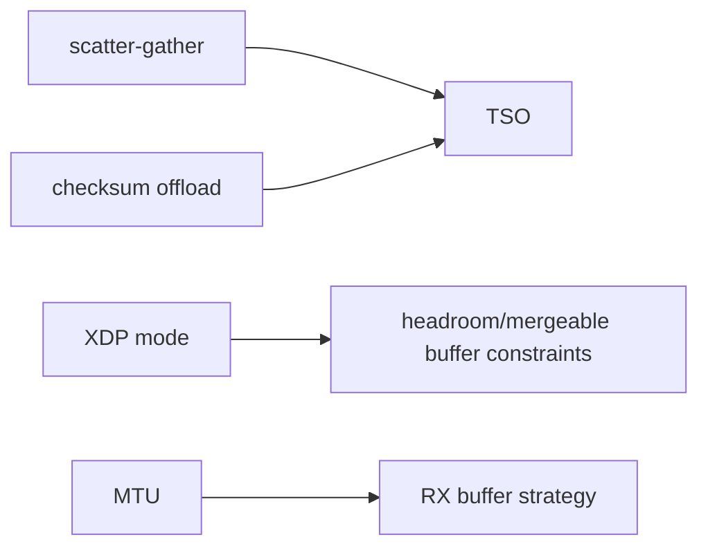
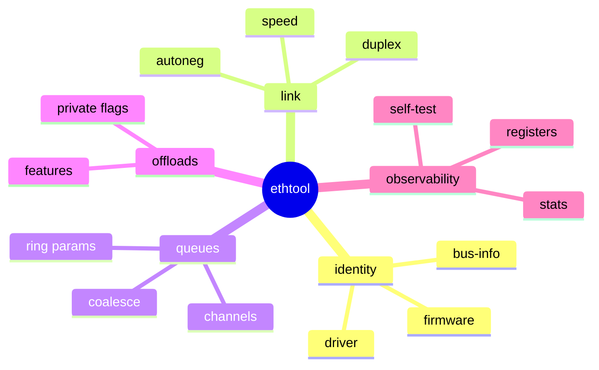
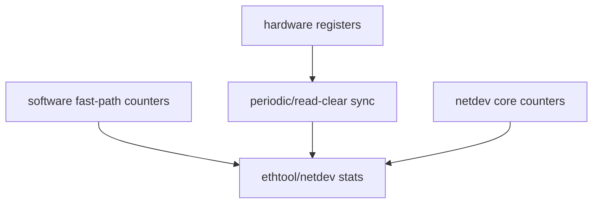
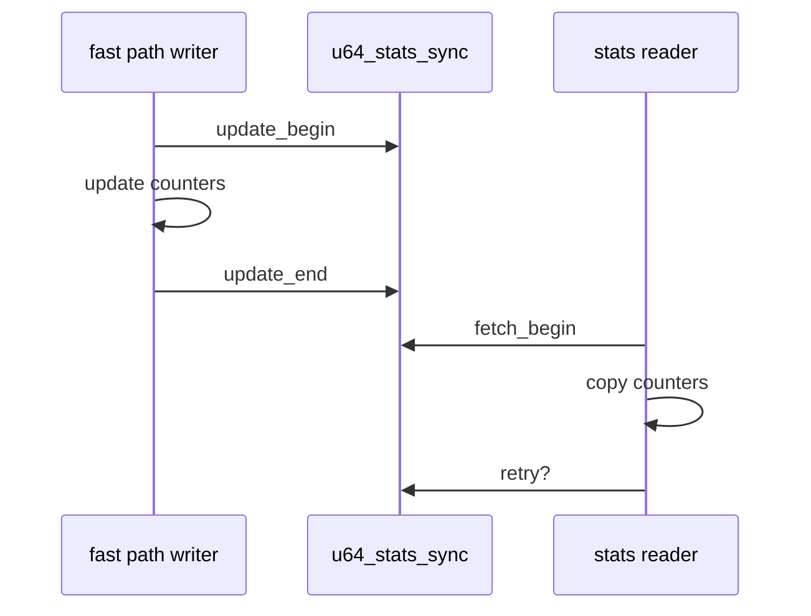
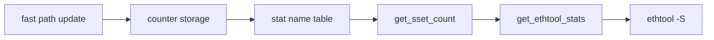
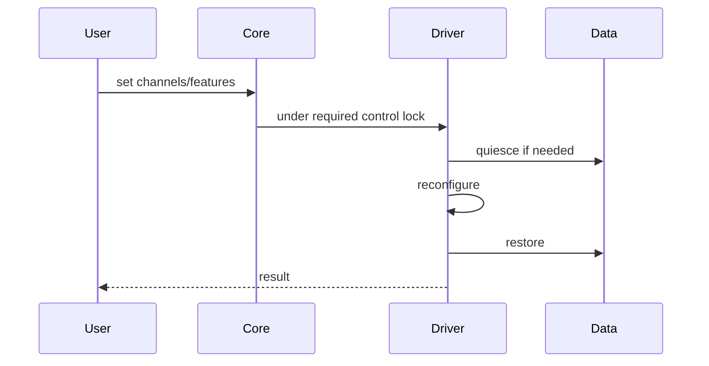

# 10 offload、ethtool、stats 与控制面

## 1. feature 是端到端契约

offload 不是驱动单方面声明。协议栈根据 `net_device` features 决定可以交给驱动什么形态的 skb，驱动再翻译给设备。

## 2. 常见 offload

| 能力 | TX/RX | 驱动责任 |
|---|---|---|
| checksum offload | 双向 | 正确编码/翻译 checksum metadata |
| TSO/GSO | TX | 描述 header、MSS、分段类型 |
| GRO/LRO | RX | 正确提交合并条件与结果 |
| VLAN offload | 双向 | 插入/剥离并设置 skb tag |
| RX hash | RX | 报告 hash 值与 hash type |
| scatter-gather | TX | 映射 skb frags 与 descriptor chain |

## 3. feature dependency

某些 features 互相依赖或与 MTU、XDP、header layout 冲突。

因此 `ndo_fix_features` 用于修正不合法组合，`ndo_set_features` 用于把变化应用到设备。

## 4. ethtool 的能力面

不同驱动支持集合不同。用户工具显示“不支持”可能是硬件缺失、驱动未实现或接口版本差异，不能只凭一条命令判断。

## 5. stats 三层来源

硬件计数可能是 read-clear、有限位宽或异步更新。驱动常在 watchdog 中累加到 64 位软件统计。

## 6. per-CPU 与 u64_stats_sync

32 位平台上读取 64 位计数可能撕裂；高频路径也不适合全局锁。常见方案是 per-CPU/per-queue 计数配合 `u64_stats_sync` 一致读取。

## 7. 添加统计项的完整改动面

一个看似简单的 `poll_count` 需要保持：

1. 私有/per-queue 结构新增字段；
2. 正确位置更新，避免改变 hot path 语义；
3. stats descriptor/name 数组新增名称；
4. count 回调返回数量同步；
5. data 回调按同一顺序导出；
6. reset、reconfigure、queue resize 语义明确；
7. before/after 验证能证明计数对应真实事件。

## 8. stats 不等于 trace

stats 回答累计多少，trace 回答何时、哪个 CPU、哪条调用链。排障时二者互补：

| 问题 | 优先工具 |
|---|---|
| 是否发生过 RX drop | stats |
| drop 发生在哪个函数/CPU | trace/eBPF |
| patch 是否增加 poll 次数 | before/after stats |
| 单次 poll 处理多少包 | trace histogram |

## 9. 控制面并发

feature、ring size、channel、MTU 变化可能要求停止数据面或设备 reset。处理时要遵守 RTNL、driver mutex 和 queue state 规则，不能在 fast path 任意重配置 ring。

## 10. 验证原则

每次控制面 patch 至少验证：默认值、合法边界、非法输入、接口 down/up、流量中变更、stats 名称与数值对应、失败回滚和再次执行。
