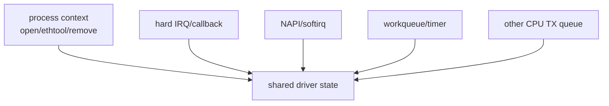
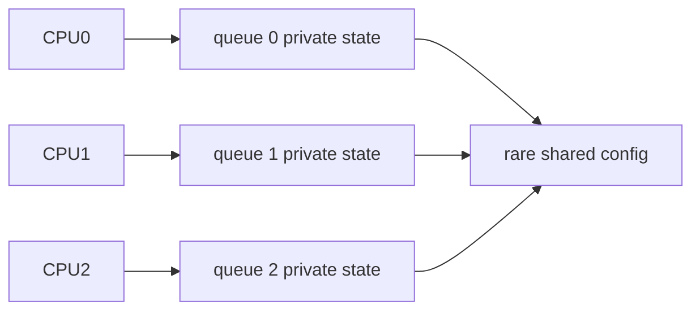
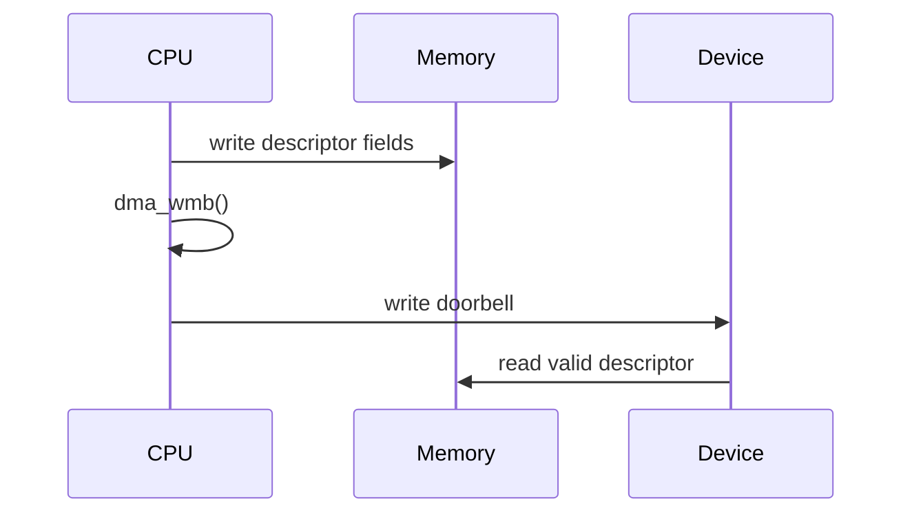
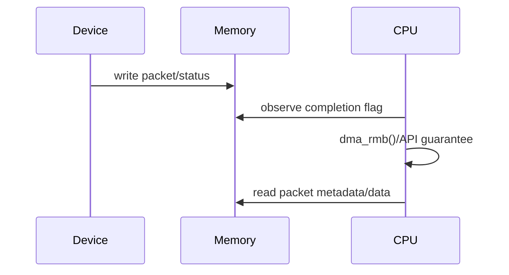
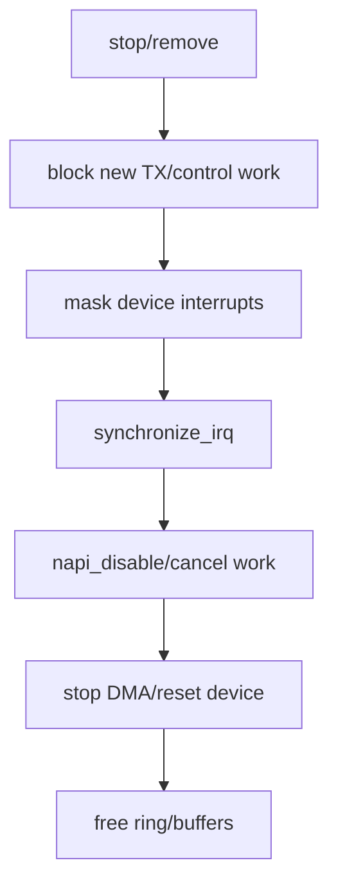
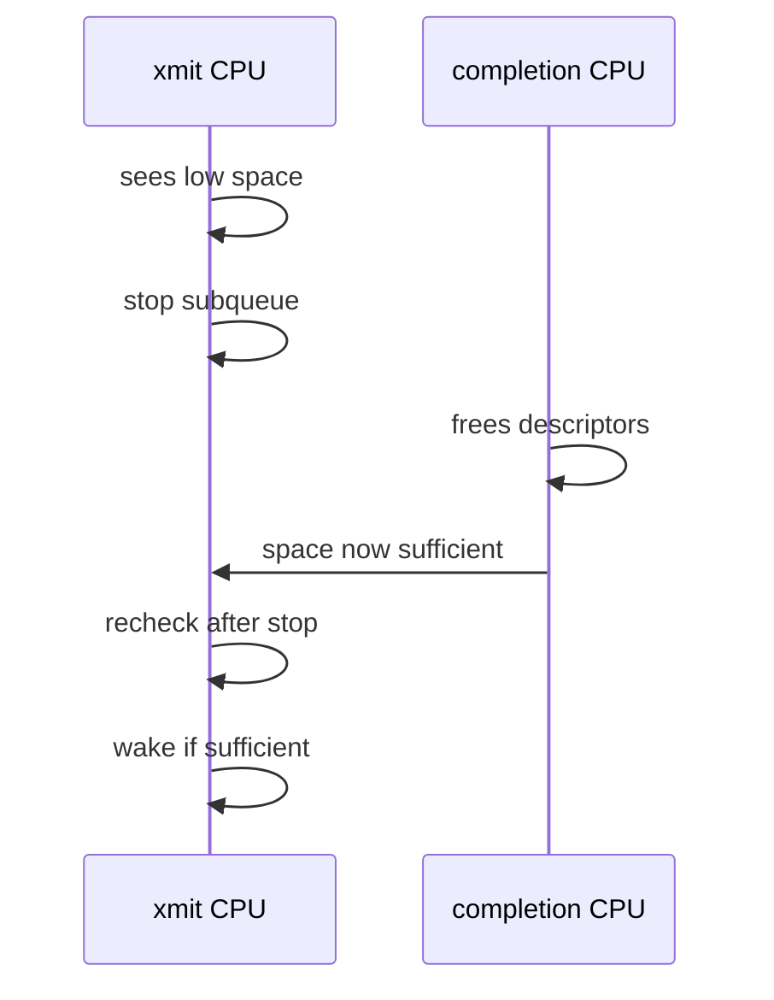
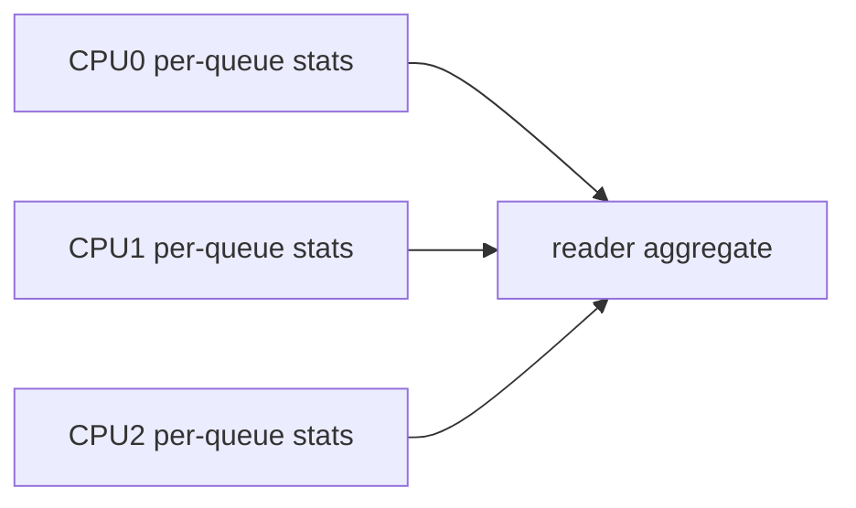
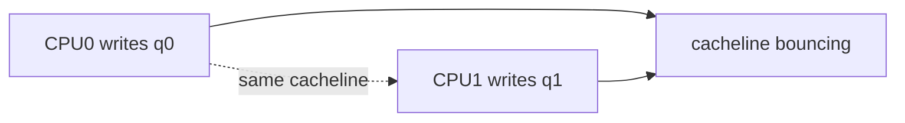

# 11 并发、锁与内存序

## 1. 驱动同时运行在哪些上下文

先标上下文，再谈锁。一个函数能否睡眠、是否可被同 CPU/其他 CPU 并发、是否持有 RTNL，决定可用同步原语。

## 2. queue ownership 优先于大锁

高性能驱动通常让每个 TX/RX queue 由固定 CPU 或明确路径拥有，减少共享。锁应保护真正共享状态，而不是把所有 fast path 串成单锁。

## 3. 常见同步工具

| 工具 | 适用场景 | 不能解决 |
|---|---|---|
| spinlock | 短临界区、不可睡眠上下文 | DMA 可见性、长操作 |
| mutex | process context 配置路径 | IRQ/NAPI 直接使用 |
| atomic/per-CPU | 计数或简单状态 | 多字段事务一致性 |
| NAPI ownership | 同队列 poll 串行化 | 控制面并发 |
| `synchronize_irq` | 等待在途 IRQ 结束 | 停止设备 DMA |
| `napi_disable` | 阻止/等待 NAPI poll | 关闭硬件事件源 |
| RCU | 读多写少指针发布 | 任意对象立即释放 |

## 4. memory barrier 与锁不是一回事

设备通过 DMA/MMIO 与 CPU 通信。即使没有 CPU 间 data race，也要保证 descriptor 与 doorbell 的顺序。

屏障类型取决于 coherent/streaming mapping、读写方向和架构。优先使用 DMA API、virtqueue helper 和现有驱动模式，不凭 x86 现象省略。

## 5. completion 读取顺序

若先读取数据再确认完成或缺少必要 acquire 语义，弱内存序架构上可能看到旧字段。

## 6. stop/remove 的并发栅栏

具体顺序需按设备调整，但释放之前必须证明所有可能访问者都已退出。

## 7. queue stop/wake race

stop 后 recheck 是经典模式。没有 recheck，completion 可能恰好发生在 stop 前后，之后不再有新 completion 触发 wake。

## 8. 统计并发

高频计数优先 per-queue/per-CPU，读取时接受瞬时近似或用 sequence helper 保证单个 counter pair 一致。不要为“精确瞬时总数”给 fast path 加全局锁。

## 9. cacheline 与 false sharing

不同 CPU 高频写相邻字段会导致 cacheline 抖动。队列结构、stats 和 producer/consumer index 常需要按 cacheline 组织。

优化前先用 perf/c2c 或实际指标证明 false sharing，避免只凭结构体外观过度 padding。

## 10. 审查问题

1. 当前函数运行上下文是什么？
2. 哪个对象可能被其他 CPU、IRQ、NAPI、workqueue 访问？
3. 锁保护的是字段一致性还是生命周期？
4. device DMA 可见性由哪个 API/屏障保证？
5. stop/remove 如何等待所有读者退出？
6. queue stop/wake 是否处理竞态？
7. patch 新增字段是否引入 false sharing 或 torn read？
