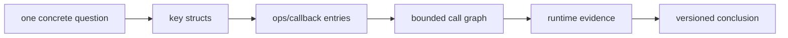
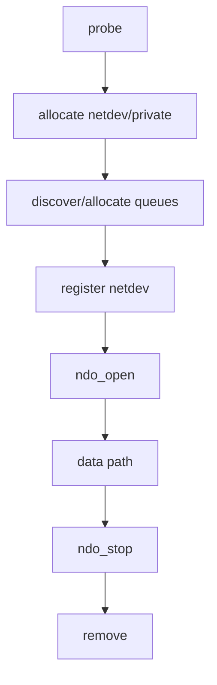
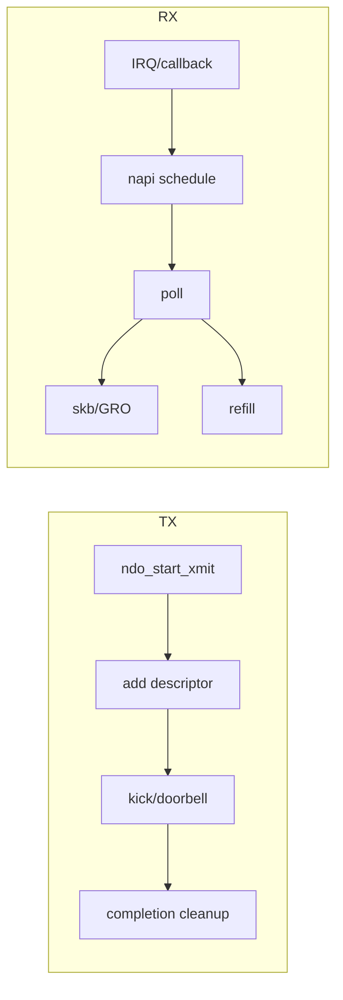
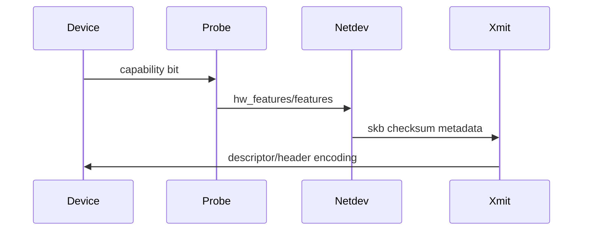
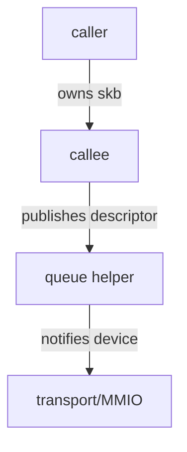
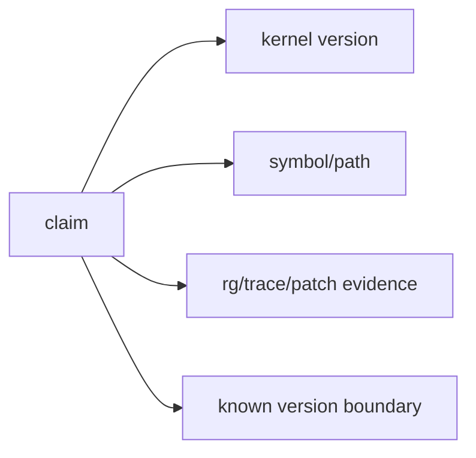

# 12 真实驱动源码阅读与调用图工作流

## 1. 不要线性通读大文件

真实驱动包含芯片兼容、历史路径、控制面、错误恢复和条件编译。线性阅读会把主路径淹没。更有效的方法是先建立对象和入口，再沿一条问题链扩张。



## 2. 第一轮：只找骨架

目标不是理解函数体，而是回答：

- driver 结构与 ID table；
- probe/remove；
- netdev/ethtool ops；
- 私有结构与 queue 结构；
- NAPI poll、xmit、IRQ/callback；
- reset/workqueue/timer。

```bash
rg -n "struct (pci_driver|virtio_driver)|id_table" <driver-dir>
rg -n "net_device_ops|ethtool_ops|napi_struct" <driver-dir>
rg -n "ndo_start_xmit|\.poll|request_irq|virtqueue" <driver-dir>
```

## 3. 第二轮：按生命周期画图



在每个节点记录“新增了什么资源”和“由谁释放”，error labels 会自然成为图的一部分。

## 4. 第三轮：分别追 TX 与 RX



不要把 TX completion 忽略，也不要只追 RX 到构造 skb 而忘记 refill 和 callback re-enable。

## 5. 第四轮：选择一个 feature

feature 适合验证你是否真正理解跨层关系。例如 checksum offload：



从能力发现、对外声明、运行时编码到统计/回退必须闭环。

## 6. 调用图只画有语义的边



比“函数 A 调函数 B”更有价值的是标记边上的状态变化：取得锁、转移 ownership、允许睡眠、关闭中断、发布 descriptor。

## 7. 版本差异管理

驱动函数名、结构字段和 API 会随内核变化。记录结论时必须附带：

- kernel commit/tag；
- 文件路径；
- symbol/function，不依赖固定行号；
- config 与主要 feature；
- 与其他版本差异是否经过验证。



## 8. 用 git 理解设计原因

```bash
git log --oneline -- drivers/net/virtio_net.c
git blame -L <start>,<end> drivers/net/virtio_net.c
git show <commit> --stat --oneline
```

`blame` 用于找到引入 commit，不用于判断作者责任。commit message 和 mailing list 讨论常解释 race、兼容性或性能取舍。

## 9. 笔记模板

| 字段 | 内容 |
|---|---|
| 问题 | 本轮只回答一个可验证问题 |
| 入口 | ops/callback/symbol |
| 对象 | 输入、输出、私有状态 |
| 前置状态 | 锁、上下文、queue/device state |
| 状态变化 | ownership/index/feature/lifecycle |
| 下游 | 关键 helper 与异步完成路径 |
| 证据 | 源码、trace、stats、patch |
| 边界 | 内核版本、设备、未验证假设 |

## 10. 高效阅读顺序


这个顺序与本 track 的项目路线一致。每轮都产生可审查笔记，不把“看过源码”当作成果。

## 11. 常见误区

- 搜到同名函数就当成当前版本调用链；
- 只读 happy path，不读 error/remove/reset；
- 只看函数体，不看 ops 注册和调用上下文；
- 用固定行号描述长期知识；
- 看到 atomic/lock 就假定并发安全；
- 从静态源码直接推出运行时频率；
- patch 能编译就宣称行为正确。
