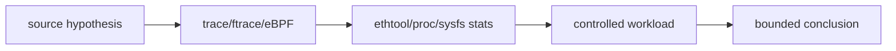
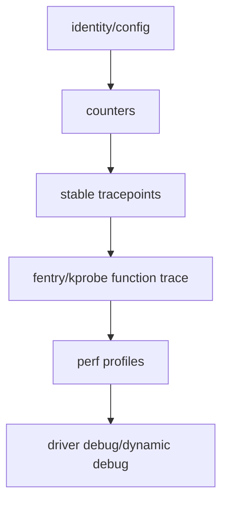
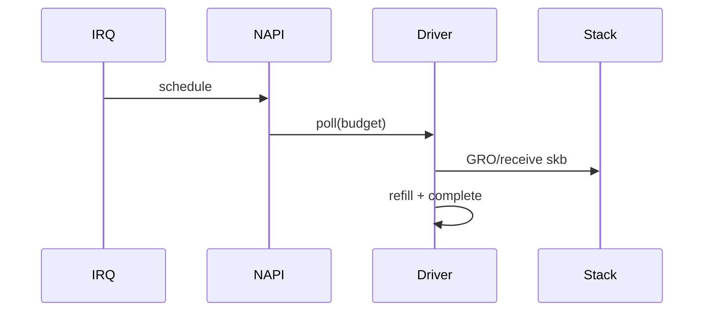
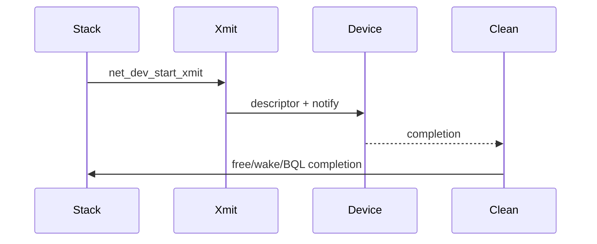
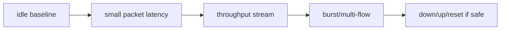
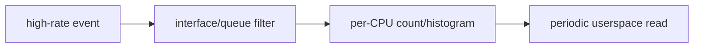
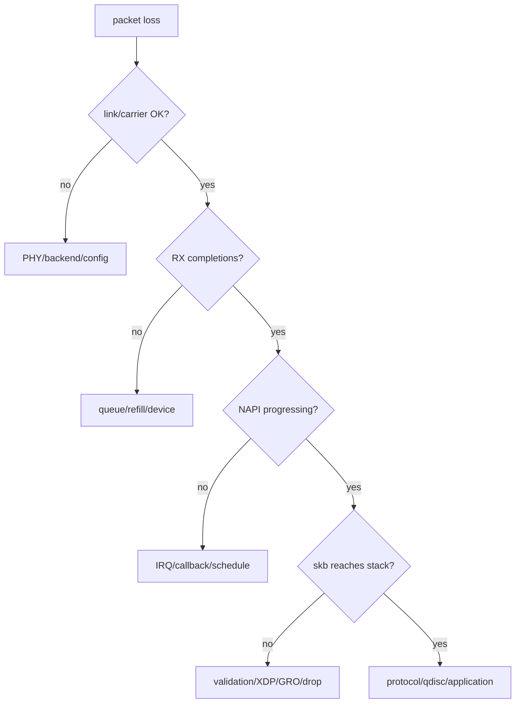
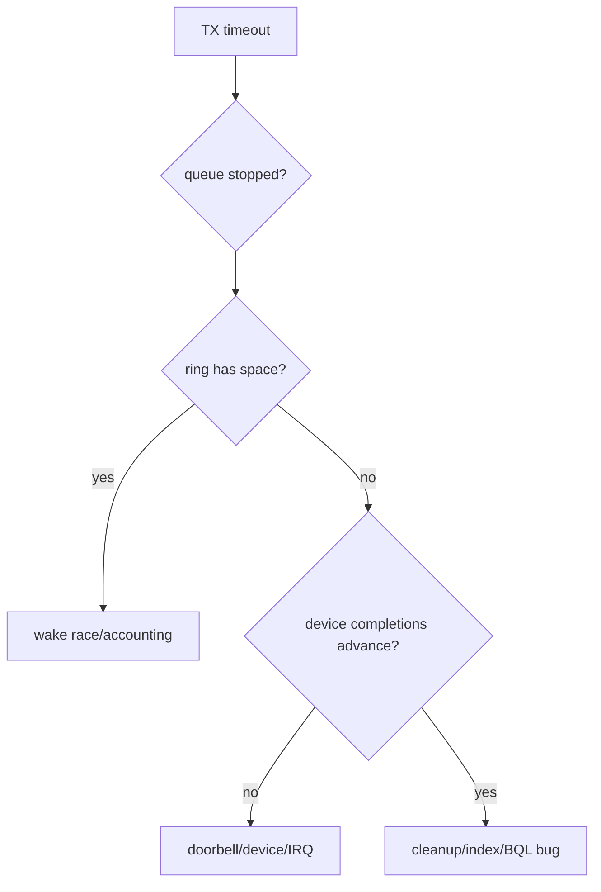

# 13 运行期观测与故障定位

## 1. 静态调用图不等于运行路径

条件分支、feature、队列模式、内核版本和流量形态决定实际路径。运行期证据用于回答“这次真的走了哪里、频率是多少、在哪个 CPU”。



## 2. 先建立设备身份

```bash
ip -details link show dev <ifname>
ethtool -i <ifname>
ethtool -k <ifname>
ethtool -l <ifname>
ethtool -S <ifname>
readlink /sys/class/net/<ifname>/device/driver
```

必须确认接口、driver、bus、queue 数和 feature，避免在 vmxnet3/e1000e 接口上解释 virtio_net 代码。

## 3. 观测层次



从低开销稳定层开始，只有前一层无法回答时才增加侵入性。

## 4. RX 证据链



可观测点包括 IRQ 计数、`napi_poll` tracepoint、driver poll symbol、`netif_receive_skb`、`napi_gro_receive_entry` 和 RX stats。

## 5. TX 证据链



tracepoint `net_dev_queue`、`net_dev_start_xmit` 能证明进入 netdev 层，但 device completion 往往需要 driver symbol、NAPI/IRQ 和 stats 共同证明。

## 6. workload 必须可控



每次只改变一个变量，并记录包大小、并发、CPU affinity、offload、queue 数和持续时间。

## 7. before/after 矩阵

| 维度 | Before | After | 判定 |
|---|---|---|---|
| driver/module identity | 固定 | 固定 | 不允许换驱动 |
| config/features | 记录 | 记录 | 非目标项保持一致 |
| workload | 固定 | 固定 | 命令与时长一致 |
| functional result | 成功 | 成功 | 无回归 |
| target counter/trace | baseline | expected delta | 符合语义 |
| errors/drops/warnings | baseline | 不恶化 | 安全边界 |

## 8. 低开销采样



不要把每包字段打印到终端作为长期观测。优先内核聚合计数、直方图和采样，避免观测本身改变调度与 cache。

## 9. 常见故障树



## 10. TX hang 故障树



## 11. 安全边界

- 不在远程管理接口做 unbind/reset/down；
- 不在生产环境开启高频 function graph 全量跟踪；
- 先限定 PID/CPU/interface/queue/duration；
- tracefs/debugfs 操作记录恢复命令；
- 运行前后保存 dmesg warning、drop 和 error counter；
- 无法证明 hook 存在时，标记 capability boundary，不伪造 PASS。

## 12. 证据优先级

最强结论来自多源一致：源码说明可能路径，trace 证明实际调用，stats 证明累计影响，workload 证明业务结果，before/after 排除配置漂移。
