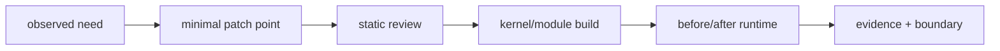
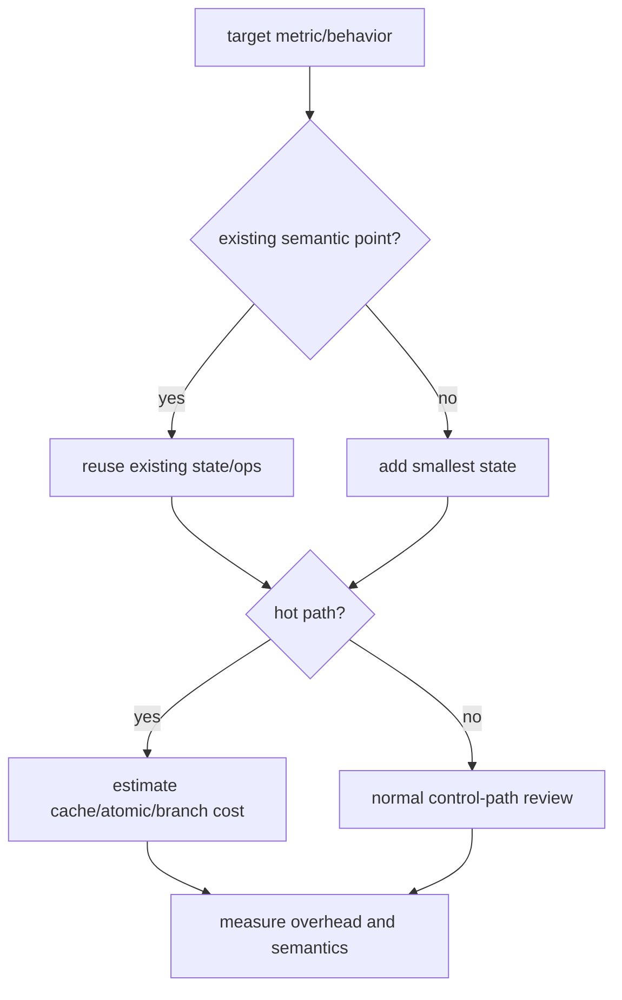
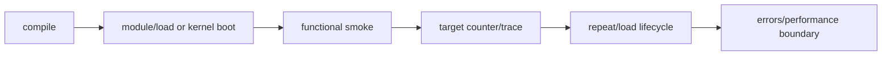
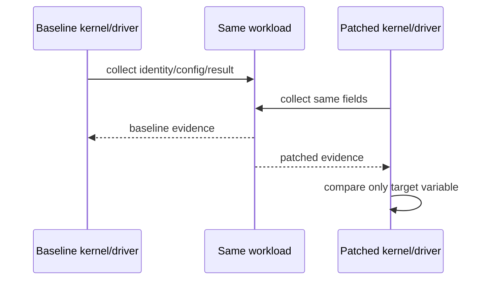
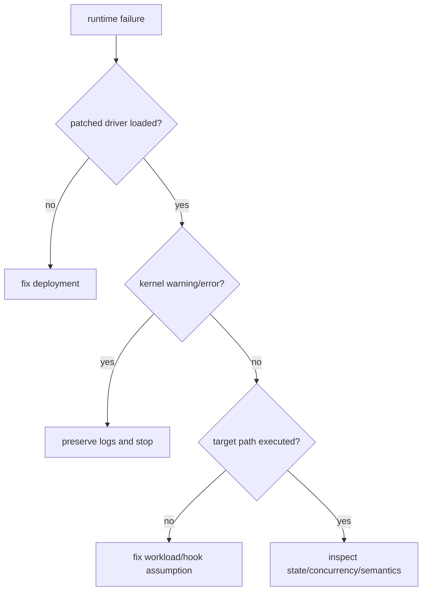
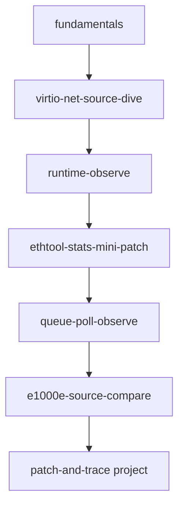
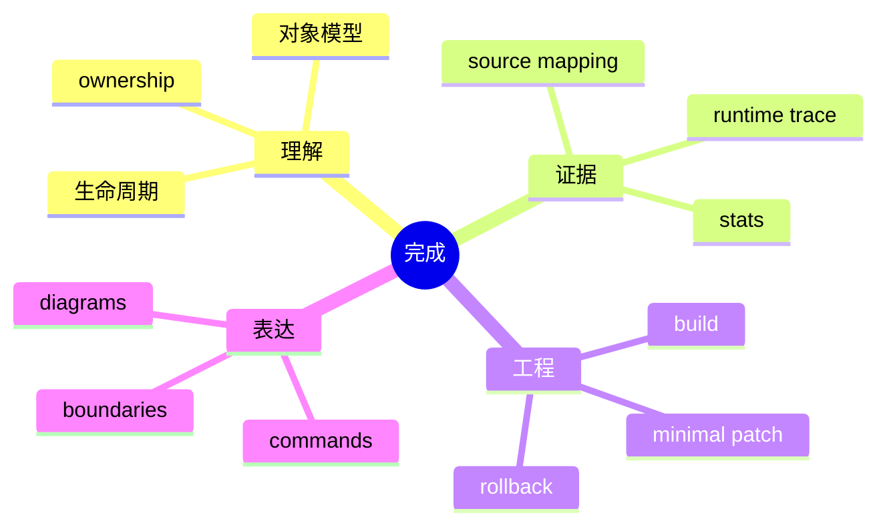

# 14 patch 验证、上游习惯与项目映射

## 1. 最小 patch 的目标

学习型 patch 不追求代码量，而追求完整证据链：动机明确、改动局部、并发语义正确、失败可恢复、行为可测量。

## 2. patch 点选择

统计 patch 应在事件语义最明确处更新，不能为了方便放在“差不多会被调用”的 helper。

## 3. 静态审查清单

- 新字段是否位于正确的 per-device/per-queue/per-CPU 对象；
- 更新上下文是否允许当前同步方式；
- 64 位计数在目标架构是否需要 `u64_stats_sync`；
- stats 名称、数量、导出顺序是否一致；
- queue resize/reset/open/stop 后语义是否明确；
- hot path 是否新增锁、分支、cacheline 写竞争；
- error/remove 是否需要新增回收；
- 代码风格与现有 driver 模式一致。

## 4. 编译不是验证终点

编译只能证明语法、类型和部分静态约束，不能证明 race、ownership、统计语义或设备行为。

## 5. before/after 实验设计

记录 kernel release、module build ID、driver version、设备 ID、feature、queue、CPU affinity 和完整命令，避免“after 实际跑了另一套环境”。

## 6. patch 提交说明的结构

即使不真正发 upstream，也按上游习惯写：

1. 现象和问题；
2. 根因或缺口；
3. 为什么选择该修复；
4. 行为变化与兼容性；
5. 测试环境、命令和结果；
6. 风险与未覆盖边界。

不要只写“add stats”或“fix bug”。commit message 应让读者不打开 patch 也知道为什么改。

## 7. runtime 失败处理

先排除“根本没加载新模块”和“流量未走目标接口”，再分析 patch 逻辑。

## 8. 六个项目如何使用本知识层

| 项目 | 重点知识 | 预期证据 |
|---|---|---|
| `lab-virtio-net-source-dive` | 01-08、12 | 对象图、probe/TX/RX/feature 调用图 |
| `lab-virtio-net-runtime-observe` | 06、07、13 | identity、workload、trace、stats |
| `lab-virtio-net-ethtool-stats-mini-patch` | 10、11、14 | patch、before/after、统计对应关系 |
| `lab-virtio-net-queue-poll-observe` | 06、11、13 | callback→NAPI→stack 证据链 |
| `lab-e1000e-source-compare` | 02、05、09、12 | virtio/e1000e 对照矩阵 |
| `project-virtio-net-patch-and-trace` | 全部 | 可复现 patch + trace + 风险边界 |

## 9. 项目完成标准

“读过驱动”不是完成标准。必须能把静态结构、运行证据和最小改动连接起来。

## 10. 调试速查

| 症状 | 首查 |
|---|---|
| 接口不存在 | bus match、probe、register_netdev |
| up 失败 | ndo_open、IRQ/queue allocation、device state |
| RX 为 0 | buffer refill、completion、IRQ、NAPI |
| TX timeout | stop/wake、doorbell、completion cleanup |
| stats 不变 | patch driver 是否加载、路径是否执行、导出顺序 |
| unload hang | IRQ/NAPI/work/DMA quiesce 顺序 |
| 性能下降 | IRQ moderation、queue affinity、offload、cacheline |

## 11. 最终边界声明

学习环境的 virtio/e1000e 结论不能自动推广到 mlx5、ice、bnxt 等现代多队列驱动。可迁移的是分析方法：对象、生命周期、ownership、并发、证据；具体寄存器、queue model 和 offload 必须回到目标驱动重新验证。
