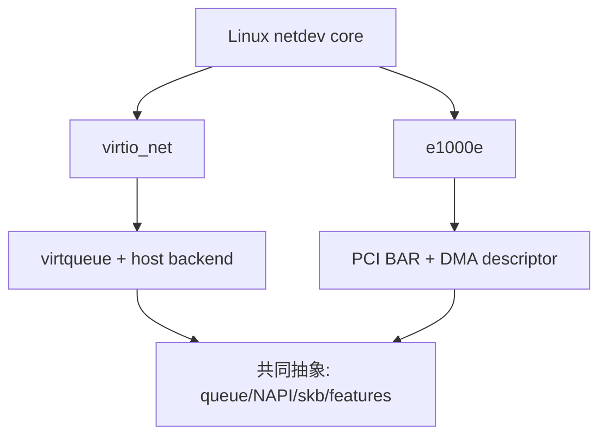

# track-real-driver 项目前知识层

这里不是项目说明书，而是进入 `virtio_net`、`e1000e` 源码前的统一知识底座。目标是让你看到任意真实网卡驱动时，先识别结构，再追踪数据，最后验证假设，而不是从几万行源码第一行开始硬读。

## 推荐顺序

| 顺序 | 文档 | 要回答的问题 |
|---:|---|---|
| 1 | [00_15_MINUTE_MENTAL_MODEL.md](00_15_MINUTE_MENTAL_MODEL.md) | 真实驱动到底在协调什么 |
| 2 | [01_DRIVER_MODEL_AND_KERNEL_POSITION.md](01_DRIVER_MODEL_AND_KERNEL_POSITION.md) | 驱动位于设备、总线和协议栈哪里 |
| 3 | [02_BUS_MATCHING_PCI_AND_VIRTIO.md](02_BUS_MATCHING_PCI_AND_VIRTIO.md) | PCI 与 virtio 如何匹配驱动 |
| 4 | [03_LIFECYCLE_PROBE_OPEN_STOP_REMOVE.md](03_LIFECYCLE_PROBE_OPEN_STOP_REMOVE.md) | probe/open/stop/remove 为什么不能混为一谈 |
| 5 | [04_NET_DEVICE_PRIVATE_STATE_AND_OPS.md](04_NET_DEVICE_PRIVATE_STATE_AND_OPS.md) | net_device、私有结构和 ops 如何连接 |
| 6 | [05_QUEUE_RING_DMA_AND_OWNERSHIP.md](05_QUEUE_RING_DMA_AND_OWNERSHIP.md) | ring、descriptor、DMA、ownership 如何推进 |
| 7 | [06_RX_IRQ_NAPI_AND_BUFFER_LIFECYCLE.md](06_RX_IRQ_NAPI_AND_BUFFER_LIFECYCLE.md) | 包如何从设备进入协议栈 |
| 8 | [07_TX_XMIT_COMPLETION_AND_FLOW_CONTROL.md](07_TX_XMIT_COMPLETION_AND_FLOW_CONTROL.md) | skb 如何发送、完成和唤醒队列 |
| 9 | [08_VIRTQUEUE_FEATURE_NEGOTIATION_AND_LAYOUT.md](08_VIRTQUEUE_FEATURE_NEGOTIATION_AND_LAYOUT.md) | virtio_net 的虚拟队列为什么不同于物理 ring |
| 10 | [09_E1000E_HARDWARE_PATH_AND_INTERRUPTS.md](09_E1000E_HARDWARE_PATH_AND_INTERRUPTS.md) | 传统 PCI NIC 如何用寄存器、descriptor 与 MSI-X 工作 |
| 11 | [10_OFFLOAD_ETHTOOL_STATS_AND_CONTROL_PLANE.md](10_OFFLOAD_ETHTOOL_STATS_AND_CONTROL_PLANE.md) | feature、offload、ethtool、stats 如何形成控制面 |
| 12 | [11_CONCURRENCY_LOCKING_AND_MEMORY_ORDERING.md](11_CONCURRENCY_LOCKING_AND_MEMORY_ORDERING.md) | 并发、屏障和队列状态为何容易出错 |
| 13 | [12_SOURCE_READING_AND_CALL_GRAPH_WORKFLOW.md](12_SOURCE_READING_AND_CALL_GRAPH_WORKFLOW.md) | 如何高效阅读真实驱动源码 |
| 14 | [13_RUNTIME_OBSERVABILITY_AND_FAULT_LOCALIZATION.md](13_RUNTIME_OBSERVABILITY_AND_FAULT_LOCALIZATION.md) | 如何用证据定位 IRQ/NAPI/TX/RX 问题 |
| 15 | [14_PATCH_VALIDATION_UPSTREAM_AND_PROJECT_MAP.md](14_PATCH_VALIDATION_UPSTREAM_AND_PROJECT_MAP.md) | 如何把阅读变成可验证 patch 与项目成果 |

## 总体学习闭环

## 两条对照主线

学习时始终做两组对照：

1. 自写 `netdev` stage 与真实驱动对照，确认抽象如何被工程化；
2. `virtio_net` 与 `e1000e` 对照，区分 Linux 网络驱动共性和具体设备机制。

## 进入项目的门槛

在进入第一个 lab 前，至少能够口头回答：

- `probe()` 为什么不能代替 `ndo_open()`；
- `net_device` 与驱动私有结构分别保存什么；
- RX 中断为何通常只负责 schedule NAPI；
- TX 返回 `NETDEV_TX_BUSY` 前为什么不能消费 skb；
- descriptor 的 CPU 所有权与设备所有权如何转换；
- virtqueue kick 与物理 NIC doorbell 有什么相似和差异；
- feature negotiation、`hw_features`、`features` 分别解决什么问题；
- patch 如何证明没有破坏 fast path 和资源回收。

## 项目入口

- [virtio_net 源码阅读](../../lab-virtio-net-source-dive/README.md)
- [virtio_net 运行期观测](../../lab-virtio-net-runtime-observe/README.md)
- [ethtool stats 最小 patch](../../lab-virtio-net-ethtool-stats-mini-patch/README.md)
- [queue/poll 证据链](../../lab-virtio-net-queue-poll-observe/README.md)
- [virtio_net 与 e1000e 对照](../../lab-e1000e-source-compare/README.md)
- [patch + trace 收尾项目](../../project-virtio-net-patch-and-trace/README.md)

完整测试流程见 [tests/TEST_FLOW.md](../../tests/TEST_FLOW.md)。

知识层完成 marker：`REAL_DRIVER_FUNDAMENTALS_COMPLETE`。
