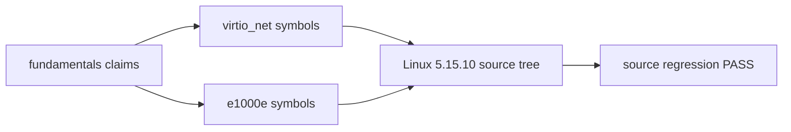
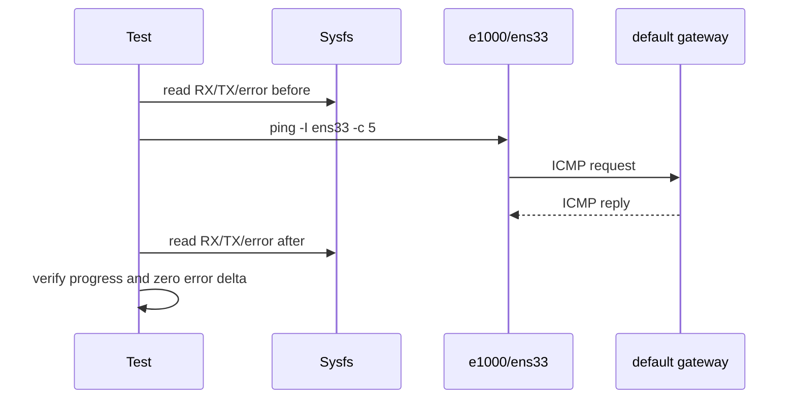

# track-real-driver 基础知识层测试记录（2026-07-14）

## 1. 测试目标

本次收口验证以下内容：

1. `docs/fundamentals/` 是否形成进入真实驱动项目前的完整知识层；
2. README、START_HERE、ROADMAP、主题文档之间是否可导航且无断链；
3. track 内现有 shell 脚本是否仍能通过 Bash 语法解析；
4. kernel source 中是否存在文档使用的 virtio_net/e1000e 核心 symbol；
5. 135 上目标驱动接口是否能完成非破坏性 RX/TX 最小运行回归。

## 2. 环境

| 项目 | 值 |
|---|---|
| 本地工作区 | Windows PowerShell，文档审计与同步 |
| Linux 主机 | `192.168.65.135` |
| 运行内核 | `6.8.0-124-generic` |
| Python | `3.10.12` |
| Bash | `5.1.16` |
| ethtool | `5.16` |
| 默认接口 | `ens33` |
| 运行驱动 | `e1000` |
| PCI 地址 | `0000:02:01.0` |
| 阅读源码树 | `kernel-src/linux-5.15.10/src` |
| 源码版本边界 | 目录没有 Git metadata，按路径标记为 5.15.10 |

注意：运行内核 6.8 与阅读源码树 5.15.10 不同。运行测试证明 135 当前 e1000 数据路径可工作；源码 symbol 测试证明 5.15.10 学习树中的入口存在，二者不能合并成“6.8 源码验证”。

## 3. 本地文档审计

```powershell
cd linux-driver-lab/track-real-driver
py tests/check_fundamentals.py
py -m py_compile tests/check_fundamentals.py
```

结果：

```text
REAL_DRIVER_DOC_AUDIT_PASS files=16 lines=2197 mermaid=104 links=26
REAL_DRIVER_FUNDAMENTALS_COMPLETE
```

审计范围包括：必需文件、每篇最小 70 行、总篇幅、Mermaid 数量、相对链接、Markdown fence，以及 README/START_HERE/ROADMAP marker。

## 4. Linux 软件回归

```bash
cd /home/wq7/workspace/driver-lab/linux-driver-lab/track-real-driver
chmod +x tests/*.sh
bash tests/software_regression.sh \
  > /tmp/real-driver-software.log 2>&1
grep -E 'REAL_DRIVER_.*(PASS|COMPLETE|FAIL|SKIP)' \
  /tmp/real-driver-software.log
```

结果：

```text
REAL_DRIVER_SHELL_SYNTAX_PASS scripts=68
REAL_DRIVER_SOFTWARE_REGRESSION_PASS
```

软件回归没有执行历史实验脚本，只对 68 个 `*.sh` 做 `bash -n`，避免自动修改网络、tracefs 或 kernel source。

## 5. kernel source symbol 回归

```bash
bash tests/source_regression.sh
```

结果：

```text
REAL_DRIVER_SOURCE_SYMBOL_PASS symbol=virtnet_probe
REAL_DRIVER_SOURCE_SYMBOL_PASS symbol=virtnet_poll
REAL_DRIVER_SOURCE_SYMBOL_PASS symbol=start_xmit
REAL_DRIVER_SOURCE_SYMBOL_PASS symbol=e1000_probe
REAL_DRIVER_SOURCE_SYMBOL_PASS symbol=e1000e_poll
REAL_DRIVER_SOURCE_SYMBOL_PASS symbol=e1000_clean_rx_irq
REAL_DRIVER_SOURCE_REGRESSION_PASS kernel=.../kernel-src/linux-5.15.10/src
```



该测试不依赖固定行号，只验证跨版本相对稳定的主入口，避免文档绑定一次性的源码位置。

## 6. runtime capability 与最小数据路径

先确认身份：

```bash
bash tests/runtime_capability.sh
```

结果：

```text
REAL_DRIVER_RUNTIME_IDENTITY iface=ens33 driver=e1000 bus=0000:02:01.0
REAL_DRIVER_RUNTIME_CAPABILITY_PASS iface=ens33 driver=e1000
```

执行完整最小回归：

```bash
bash tests/runtime_regression.sh \
  > /tmp/real-driver-runtime.log 2>&1
grep -E 'REAL_DRIVER_.*(PASS|COMPLETE|DELTA|FAIL|SKIP)' \
  /tmp/real-driver-runtime.log
```

运行脚本读取默认接口及网关，在固定接口上发送 5 个 ICMP 包，比较 sysfs RX/TX packet/error counter：

```text
REAL_DRIVER_RUNTIME_DELTA iface=ens33 driver=e1000 target=192.168.65.2 rx=8 tx=8 rx_err=0 tx_err=0
REAL_DRIVER_RUNTIME_REGRESSION_PASS iface=ens33 driver=e1000
```

本次最终样本的 RX/TX 增量均为 8，其中包含 ICMP 之外的背景报文。本测试不把增量硬编码为 ping 数，只要求 RX/TX 都前进且 error counter 不增长。



## 7. 首次失败与修复

首次源码回归输出：

```text
REAL_DRIVER_SOURCE_REGRESSION_FAIL reason=e1000e_source_not_found
```

原因不是 e1000e 源码缺失，而是自动探测先命中 `kernel-src/linux-5.15.10/`：该目录只有单独的 `drivers/net/virtio_net.c` 副本，完整源码在 `kernel-src/linux-5.15.10/src/`。

修复后，候选目录必须同时包含：

```text
drivers/net/virtio_net.c
drivers/net/ethernet/intel/e1000e/netdev.c
```

并加入 `src/` 候选。重新执行后 6 个 symbol 全部通过。

## 8. 结果矩阵

| 检查项 | 结果 |
|---|---|
| 16 个 fundamentals 文件 | PASS |
| 2197 行、104 个 Mermaid 图 | PASS |
| 26 个相对链接 | PASS |
| Python 编译 | PASS |
| 68 个 shell 脚本语法 | PASS |
| virtio_net 三个核心 symbol | PASS（5.15.10 source） |
| e1000e 三个核心 symbol | PASS（5.15.10 source） |
| e1000 runtime identity | PASS（6.8 runtime） |
| 5 次 ICMP RX/TX 推进 | PASS |
| RX/TX error 增量 | 0 / 0 |

## 9. 未覆盖边界

- 135 当前没有运行 `virtio_net`，因此 virtio_net 只做源码级验证；
- 没有重新编译、加载或替换 e1000/e1000e/virtio_net module；
- 没有执行 driver unbind、reset、接口 down/up 或 feature 修改；
- 没有复验历史 `poll_count` patch 在当前 6.8 内核的 clean apply/build；
- 没有做 NAPI budget、IRQ affinity、interrupt moderation 和高负载性能矩阵；
- 运行内核与学习源码树版本不同，源码细节结论必须标注版本。

这些边界留给各 lab/project 的专项测试，本知识层收口不伪造跨版本或跨驱动结论。
